# Attribute-based access control end-to-end guide

Use Attribute-based access control on Adobe Experience Platform to give yourself and other multi-brand privacy-conscious customers greater flexibility to manage user access. Access to individual objects, such as schema fields and segments, can be granted with policies based on the object's attributes and role. This feature lets you grant or revoke access to individual objects for specific Platform users in your organization.

This functionality allows you to categorize schema fields, segments, and so on with labels that define organizational or data usage scopes. You can apply these same labels to journeys, Offers, and other objects in Adobe Journey Optimizer. In parallel, administrators can define access policies surrounding Experience Data Model (XDM) schema fields and better manage which users or groups (internal, external, or third-party users) can access those fields.

>[!NOTE]
>
>This document focuses on the use case of access control policies. If you are trying to set up policies to govern the **use** of data rather than which Platform users have access to it, see the end-to-end guide on [data governance](../../data-governance/e2e.md) instead.

## Getting started

This tutorial requires a working understanding of the following Platform components:

* [[!DNL Experience Data Model (XDM)] System](../../xdm/home.md): The standardized framework by which Experience Platform organizes customer experience data.
  * [Basics of schema composition](../../xdm/schema/composition.md): Learn about the basic building blocks of XDM schemas, including key principles and best practices in schema composition.
  * [Schema Editor tutorial](../../xdm/tutorials/create-schema-ui.md): Learn how to create custom schemas using the Schema Editor UI.
* [Adobe Experience Platform Segmentation Service](../../segmentation/home.md): The segmentation engine within [!DNL Platform] used to create audience segments from your customer profiles based on customer behaviors and attributes.

### Use case overview

You will go through an example attribute-based access control workflow where you will create and assign roles, labels, and policies to configure whether your users can or cannot access specific resources in your organization. This guide uses an example of restricting access to sensitive data to demonstrate the workflow. This use case is outlined below:

You are a healthcare provider and want to configure access to resources in your organization.

* Your internal marketing team should be able to access **[!UICONTROL PHI/ Regulated Health Data]** data.
* Your external agency should not be able to access **[!UICONTROL PHI/ Regulated Health Data]** data.

In order to do this, you must configure roles, resources, and policies.

You will:

* [Label the roles for your users](#label-roles): Use the example of a healthcare provider (ACME Business Group) whose marketing group works with external agencies.
* [Label your resources (schema fields and segments)](#label-resources): Assign the **[!UICONTROL PHI/ Regulated Health Data]** label to schema resources and segments.
* * [Activate the policy that will link them together: ](#policy): Enable the default policy to prevent access to schema fields and segments by connecting the labels on your resources to the labels in your role. Users with matching labels will then be given access to the schema field and segment across all sandboxes.

## Permissions

[!UICONTROL Permissions] is the area of Experience Cloud where administrators can define user roles and policies to manage permissions for features and objects within a product application.

Through [!UICONTROL Permissions], you can create and manage roles and assign the desired resource permissions for these roles. [!UICONTROL Permissions] also allow you to manage the labels, sandboxes, and users associated with a specific role.

Contact your system administrator to gain access if you do not have admin privileges.

Once you have admin privileges, go to [Adobe Experience Cloud](https://experience.adobe.com/) and sign in using your Adobe credentials. Once logged in, the **[!UICONTROL Overview]** page appears for your organization you have admin privileges for. This page shows the products your organization is subscribed to, along with other controls to add users and admins to the organization. Select **[!UICONTROL Permissions]** to open the workspace for your Platform integration.

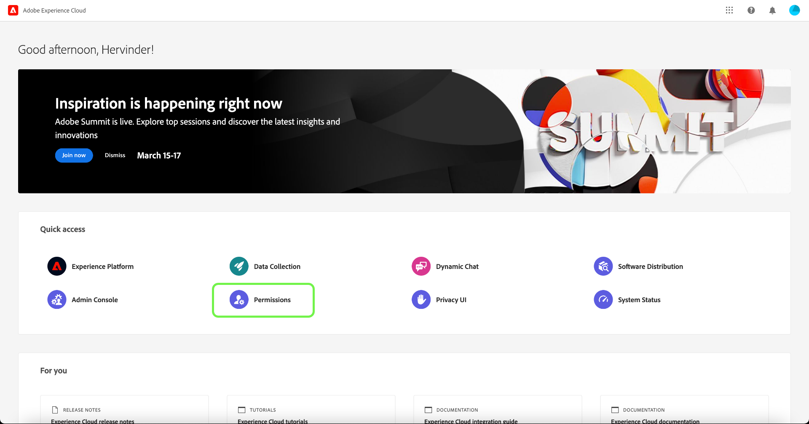

The Permissions workspace for Platform UI appears, opening on the **[!UICONTROL Roles]** page.

## Apply labels to a role {#label-roles}

>[!CONTEXTUALHELP]
>id="platform_permissions_labels_about"
>title="What are labels?"
>abstract="Labels allow you to categorize datasets and fields according to usage policies that apply to that data. Platform provides several Adobe-define "core" data usage labels, which cover a wide variety of common restrictions applicable to data governance. For example, Sensitive "S" labels such as RHD (Regulated Health Data) allow you to categorize data that refers to Protected Health Information (PHI). You can also define your own custom labels that fit your organization's needs."
>additional-url="https://experienceleague.adobe.com/docs/experience-platform/data-governance/labels/overview.html#understanding-data-usage-labels" text="Data usage labels overview"

>[!CONTEXTUALHELP]
>id="platform_permissions_labels_about_create"
>title="Create new label"
>abstract="You can create your own custom labels to fit the needs of your organization. Custom labels can be used to apply both data governance and access control configurations to your data."
>additional-url="https://experienceleague.adobe.com/docs/experience-platform/data-governance/labels/overview.html#manage-labels" text="Manage custom labels"

>[!CONTEXTUALHELP]
>id="platform_permissions_roles_about"
>title="What are roles?"
>abstract="Roles are ways to categorize the types of users that are interacting with your Platform instance and are building blocks of access control policies. A role has a given set of permissions and members of your organization can be assigned to one or more roles, depending on the scope of view or write access they need."
>additional-url="https://experienceleague.adobe.com/docs/experience-platform/access-control/abac/permissions-ui/roles.html" text="Manage roles"

>[!CONTEXTUALHELP]
>id="platform_permissions_roles_about_create"
>title="Create new role"
>abstract="You can create a new role to better categorize users that are accessing your Platform instance. For example, you can create a role for an Internal Marketing Team and apply the RHD label to that role, allowing your Internal Marketing Team to access Protected Health Information (PHI). Alternatively, you can also create a role for an External Agency and deny that role access to PHI data by not applying the RHD label to that role."
>additional-url="https://experienceleague.adobe.com/docs/experience-platform/access-control/abac/permissions-ui/roles.html#create-a-new-role" text="Create a new role"

>[!CONTEXTUALHELP]
>id="platform_permissions_roles_details"
>title="Role overview"
>abstract="The role overview dialog displays the resources and sandboxes that a given role is permitted to access."

Roles are ways to categorize the types of users interacting with your Platform instance and are building blocks of access control policies. A role has a given set of permissions, and members of your organization can be assigned to one or more roles, depending on the scope of access they need.

To get started, select **[!UICONTROL ACME Business Group]** from the from the **[!UICONTROL Roles]** page.

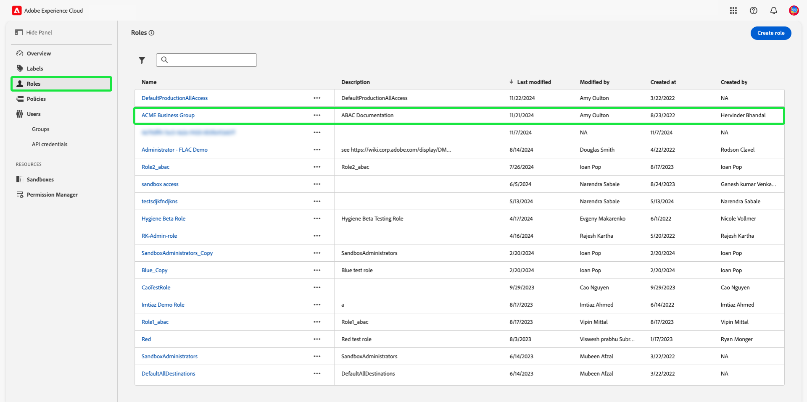

Next, select **[!UICONTROL Labels]** and then select **[!UICONTROL Add Labels]**.

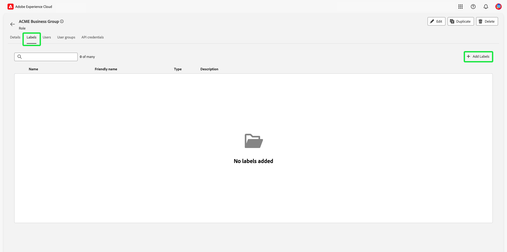

A list of all labels in your organization appears. Select **[!UICONTROL RHD]** to add the label for **[!UICONTROL PHI/Regulated Health Data]**. Allow for a few moments for a blue check mark to appear beside the label, and then select **[!UICONTROL Save]**.

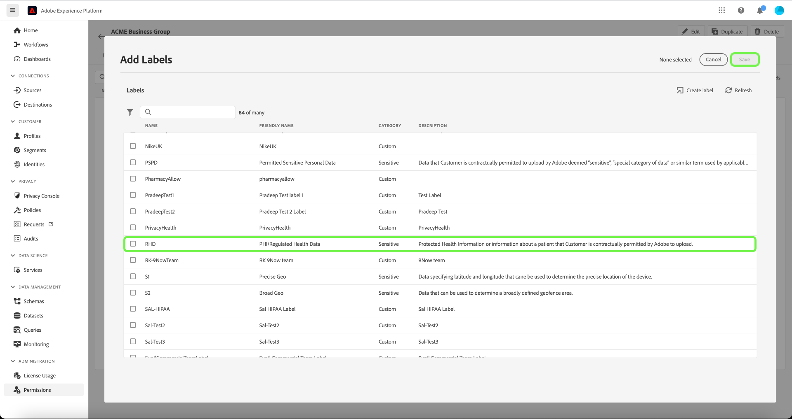

>[!NOTE]
>
>When adding an organization group to a role, all users in that group will be added to the role. Any changes to the organization group (users removed or added) will be automatically updated within the role.

## Apply labels to schema fields {#label-resources}

Now that you have configured a user role with the [!UICONTROL RHD] label, the next step is to add that same label to the resources that you want to control for that role.

Select **[!UICONTROL Schemas]** from the left navigation and then select **[!UICONTROL ACME Healthcare]** from the list of schemas that appear.

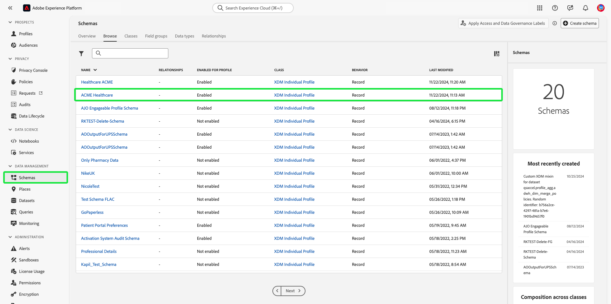

Next, select **[!UICONTROL Labels]** to see a list that displays the fields associated with your schema. From here, you can assign labels to one or multiple fields at once. Select the **[!UICONTROL BloodGlucose]** and **[!UICONTROL InsulinLevel]** fields, and then select **[!UICONTROL Apply access and data governance labels]**.

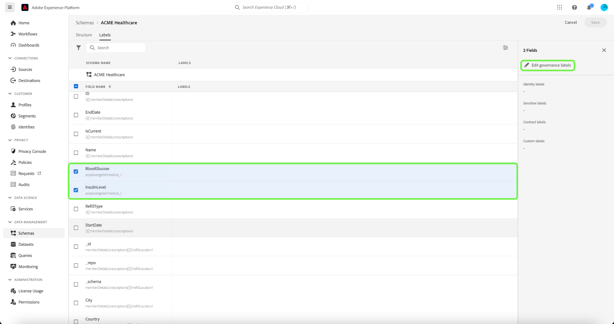

The **[!UICONTROL Edit labels]** dialog appears, allowing you to choose the labels that you want to apply to the schema fields. For this use case, select the **[!UICONTROL PHI/ Regulated Health Data]** label, then select **[!UICONTROL Save]**.

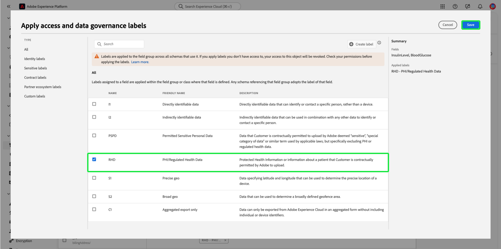

>[!NOTE] 
>
>When a label is added to a field, that label is applied to the parent resource of that field (either a class or a field group). If the parent class or field group is employed by other schemas, those schemas will inherit the same label.

## Apply labels to segments

>[!NOTE]
>
>Any segment that utilizes a labeled attribute must likewise be labeled if you want the same access restrictions to apply to it.

Once you have completed labeling your schema fields, you can now begin labeling your segments.

Select **[!UICONTROL Segments]** from the left navigation. A list of segments available in your organization is displayed. In this example, the following two segments are to be labeled as they contain sensitive health data:

* Blood Glucose >100
* Insulin <50

Select **[!UICONTROL Blood Glucose >100]** to start labeling the segment.

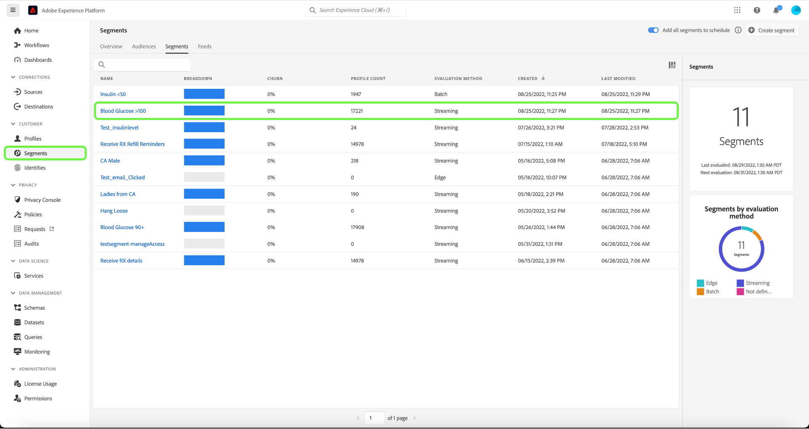

The segment **[!UICONTROL Details]** screen appears. Select **[!UICONTROL Manage Access]**.

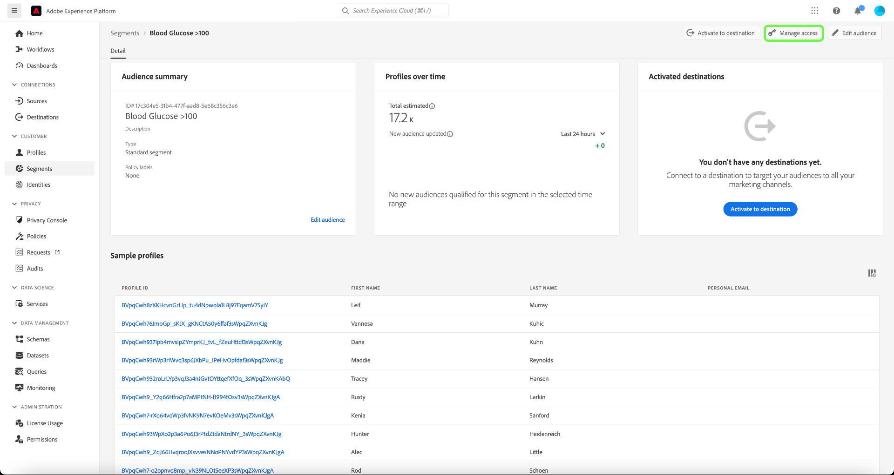

The **[!UICONTROL Edit labels]** dialog appears, allowing you to choose the labels that you want to apply to the segment. For this use case, select the **[!UICONTROL PHI/ Regulated Health Data]** label, then select **[!UICONTROL Save]**.

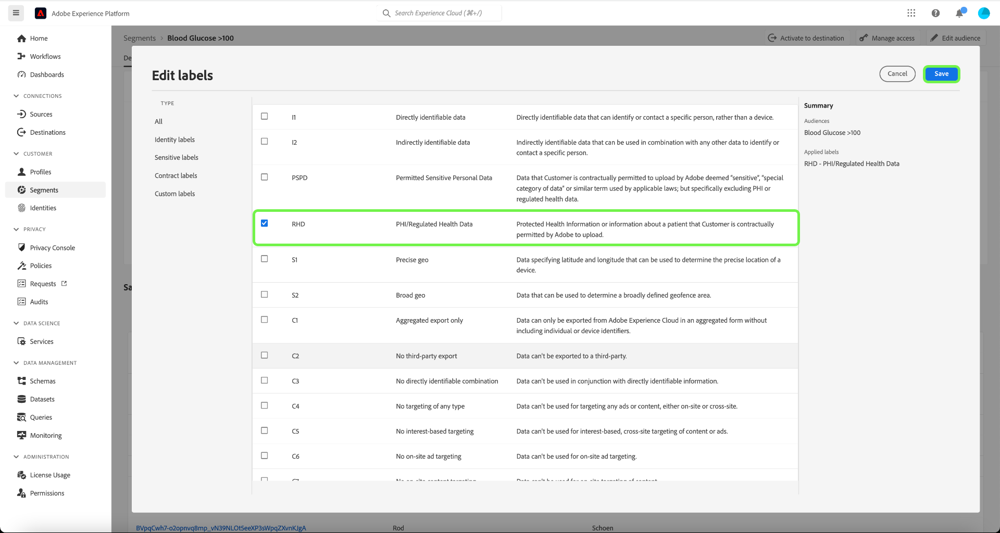

Repeat the above steps with **[!UICONTROL Insulin <50]**.

## Activate the access control policy {#policy}

The default access control policy will leverage labels to define which user roles have access to specific Platform resources. In this example, access to schema fields and segments will be denied in all sandboxes for users who aren't in a role that has the corresponding labels in the schema field.

To activate the access control policy, select [!UICONTROL Permissions] from the left navigation and then select **[!UICONTROL Policies]**. 

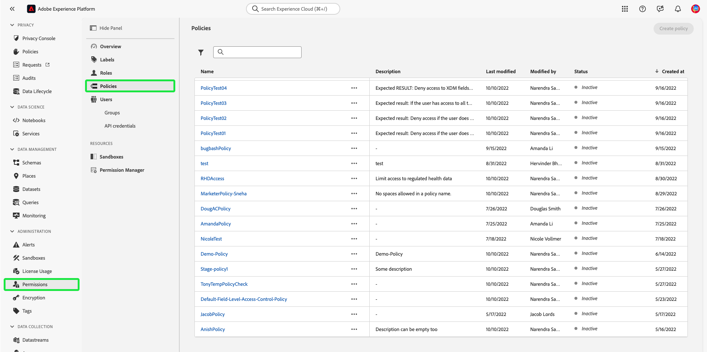

Next, select the ellipsis (`...`) next to the policies name, and a dropdown displays controls to edit, activate, delete, or duplicate the role. Select **[!UICONTROL Activate]** from the dropdown.

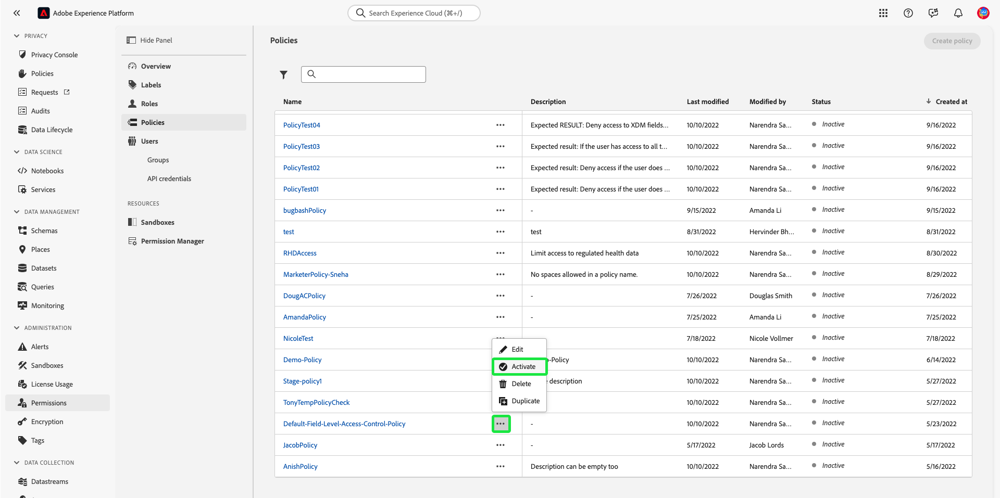

The activate policy dialog appears which prompts you to confirm activation. Select **[!UICONTROL Confirm]**.

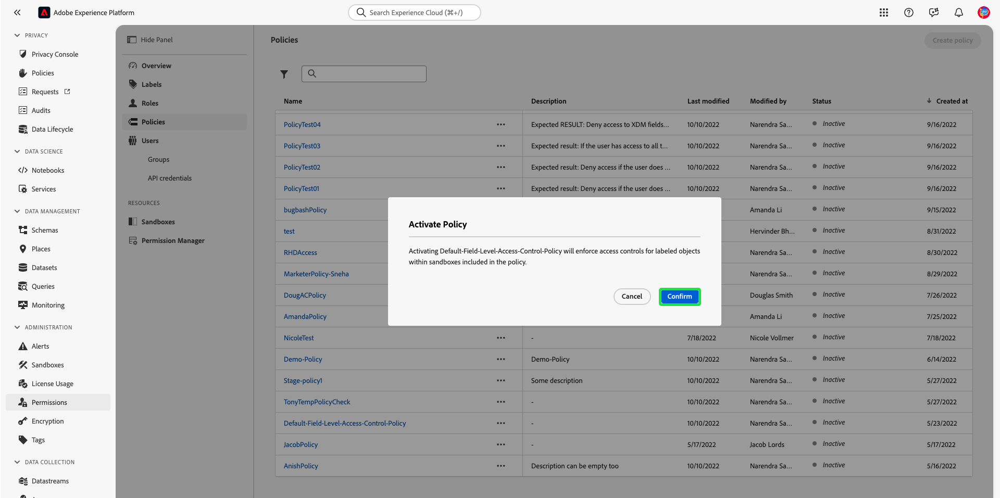

Confirmation of policy activation is received and you are returned to the [!UICONTROL Policies] page.

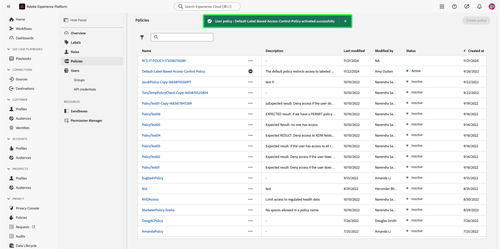

<!-- ## Create an access control policy {#policy}

>[!CONTEXTUALHELP]
>id="platform_permissions_policies_about"
>title="What are policies?"
>abstract="Policies are statements that bring attributes together to establish permissible and impermissible actions. Every organization comes with a default policy that you must activate to define rules for resources like segments and schema fields. Default policies can neither be edited nor deleted. However, default policies can be activated or deactivated."
>additional-url="https://experienceleague.adobe.com/docs/experience-platform/access-control/abac/permissions-ui/policies.html" text="Manage policies"

>[!CONTEXTUALHELP]
>id="platform_permissions_policies_about_create"
>title="Create a policy"
>abstract="Create a policy to define the actions that your users can and cannot take against your segments and schema fields."
>additional-url="https://experienceleague.adobe.com/docs/experience-platform/access-control/abac/permissions-ui/policies.html#create-a-new-policy" text="Create a policy"

>[!CONTEXTUALHELP]
>id="platform_permissions_policies_edit_permitdeny"
>title="Configure permissible and impermissible actions for a policy"
>abstract="A <b>deny access to</b> policy will deny users access when the criteria is met. Combined with <b>The following being false</b> - all users will be denied access unless they meet the matching criteria set. This type of policy allows you to protect a sensitive resource and only allow access to users with matching labels.  A <b>permit access to</b> policy will permit users access when the criteria are met. When combined with <b>The following being true</b> - users will be given access if they meet the matching criteria set. This does not explicitly deny access to users, but adds a permit access. This type of policy allows you to give additional access to resource and in addition to those users who might already have access through role permissions."
>additional-url="https://experienceleague.adobe.com/docs/experience-platform/access-control/abac/permissions-ui/policies.html#edit-a-policy" text="Edit a policy"

>[!CONTEXTUALHELP]
>id="platform_permissions_policies_edit_resource"
>title="Configure permissions for a resource"
>abstract="A resource is the asset or object that a user can or cannot access. Resources can be segments or schemas fields. You can configure write, read, or delete permissions for segments and schema fields."

>[!CONTEXTUALHELP]
>id="platform_permissions_policies_edit_condition"
>title="Edit conditions"
>abstract="Apply conditional statements to your policy to configure user access to certain resources. Select match all to require users to have roles with the same labels as a resource to be permitted access. Select match any to require users to have a role with just one label matching a label on a resource. Labels can either be defined as core or custom labels, with core labels representing labels created and provided by Adobe and custom labels representing labels that you created for your organization."

Access control policies leverage labels to define which user roles have access to specific Platform resources. Policies can either be local or global and can override other policies. In this example, access to schema fields and segments will be denied in all sandboxes for users who don't have the corresponding labels in the schema field.

>[!NOTE]
>
>A "deny policy" is created to grant access to sensitive resources because the role grants permission to the subjects. The written policy in this example **denies** you access if you are missing the required labels.

To create an access control policy, select **[!UICONTROL Permissions]** from the left navigation and then select **[!UICONTROL Policies]**. Next, select **[!UICONTROL Create policy]**.

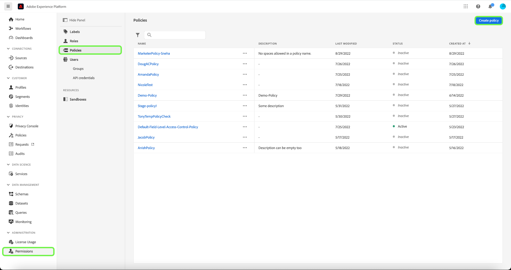

The **[!UICONTROL Create new policy]** dialog appears, prompting you to enter a name and an optional description. Select **[!UICONTROL Confirm]** when finished.

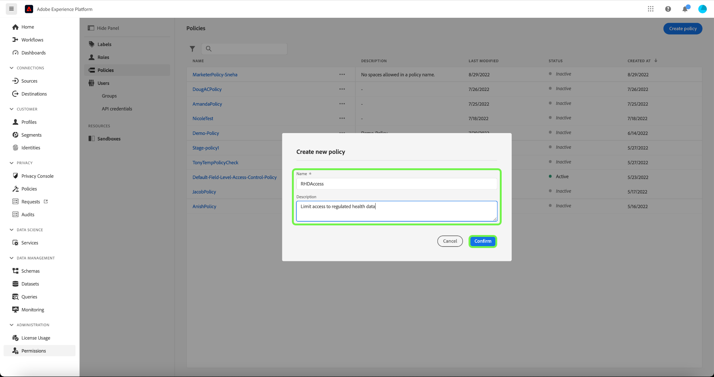

To deny access to the schema fields, use the dropdown arrow and select **[!UICONTROL Deny access to]** and then select **[!UICONTROL No resource selected]**. Next, select **[!UICONTROL Schema Field]** and then select **[!UICONTROL All]**.

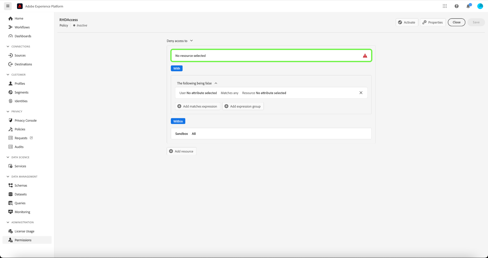

The table below shows the conditions available when creating a policy:

| Conditions | Description |
| --- | --- |
| The following being false| When 'Deny access to' is set, access will be restricted if the user does not meet the criteria selected. |
| The following being true| When 'Permit access to' is set, access will be permitted if the user meets the selected criteria. |
| Matches any| The user has a label that matches any label applied to a resource. |
| Matches all| The user has all labels that matches all labels applied to a resource. |
| Core label| A core label is an Adobe-defined label that is available in all Platform instances.|
| Custom label| A custom label is a label that has been created by your organization.|

Select **[!UICONTROL The following being false]** and then select **[!UICONTROL No attribute selected]**. Next, select the user **[!UICONTROL Core label]**, then select **[!UICONTROL Matches all]**. Select the resource **[!UICONTROL Core label]** and finally select **[!UICONTROL Add resource]**.

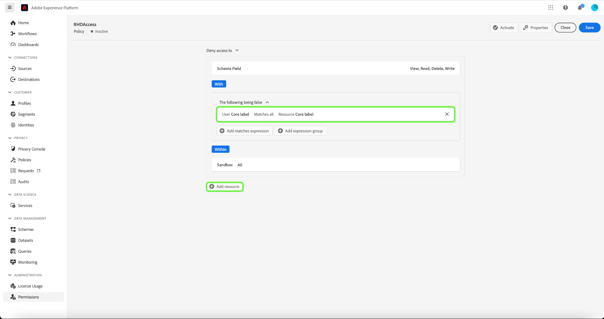

>[!TIP]
>
>A resource is the asset or object that a subject can or cannot access. Resources can be segments or schemas.

To deny access to the segments, use the dropdown arrow and select **[!UICONTROL Deny access to]** and then select **[!UICONTROL No resource selected]**. Next, select **[!UICONTROL Segment]** and then select **[!UICONTROL All]**.

Select **[!UICONTROL The following being false]** and then select **[!UICONTROL No attribute selected]**. Next, select the user **[!UICONTROL Core label]**, then select **[!UICONTROL Matches all]**. Select the resource **[!UICONTROL Core label]** and finally select **[!UICONTROL Save]**.

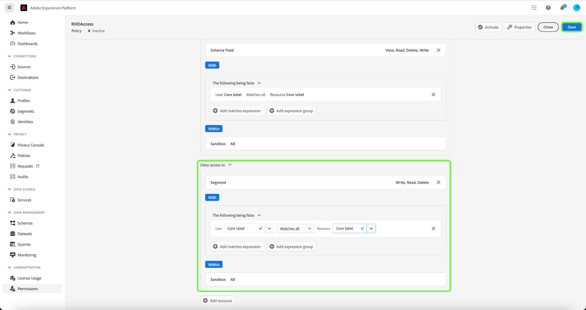

Select **[!UICONTROL Activate]** to activate the policy, and a dialog appears which prompts you to confirm activation. Select **[!UICONTROL Confirm]** and then select **[!UICONTROL Close]**.

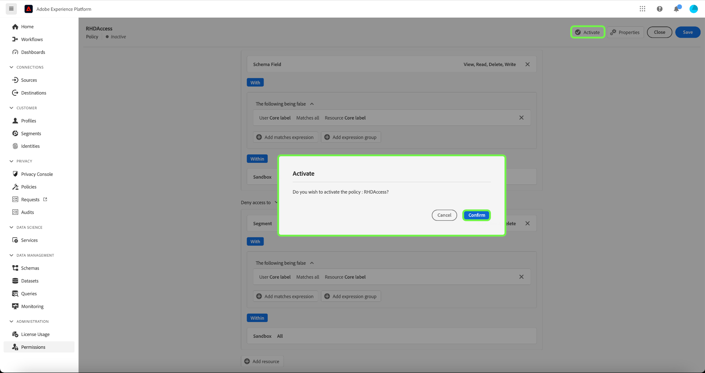 -->

## Next steps

You have completed the application of labels to a role, schema fields, and segments. The external agency assigned to these roles are restricted from viewing these labels and their values in the schema, dataset, and profile view. These fields are also restricted from being used in the segment definition when using the Segment Builder.

For more information on attribute-based access control, see the [attribute-based access control overview](./overview.md).

The following video is intended to support your understanding of attribute-based access control, and outlines how to configure roles, resources, and policies.

>[!VIDEO](https://video.tv.adobe.com/v/345641?learn=on)
