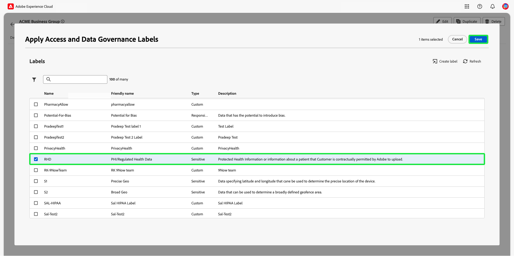
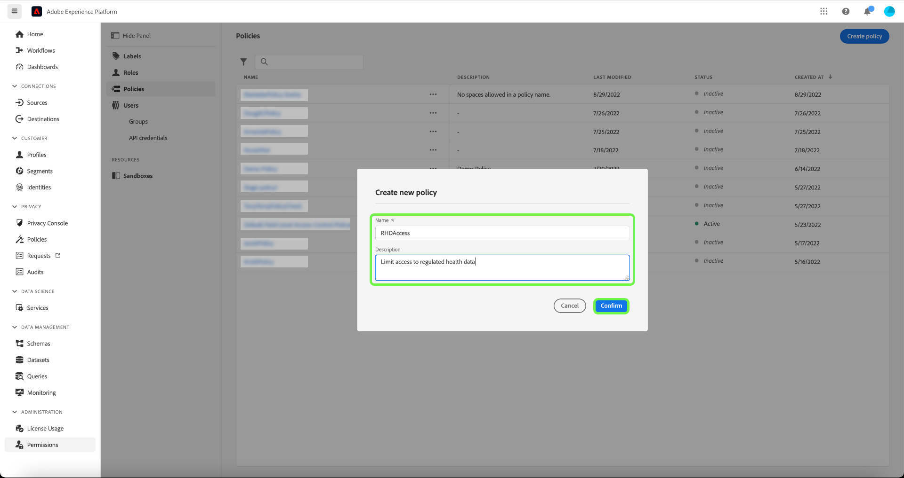

# Attribute-based access control

Attribute-based access control is an Adobe Experience Platform feature that allows privacy conscious brands greater flexibility to manage user access. Individual objects such as schema fields, and segments can be assigned to user roles.

This functionality allows you to label Experience Data Model (XDM) schema fields with labels that define organizational or data usage scopes. In parallel, administrators can use the user and role administration interface to define access policies surrounding XDM schema fields and better manage the access given to users or groups of users (internal, external, or third-party users).

## Getting started

This tutorial requires a working understanding of the following Platform components:

* [[!DNL Experience Data Model (XDM)] System](../../xdm/home.md): The standardized framework by which Experience Platform organizes customer experience data.
  * [Basics of schema composition](../../xdm/schema/composition.md): Learn about the basic building blocks of XDM schemas, including key principles and best practices in schema composition.
  * [Schema Editor tutorial](../../xdm/tutorials/create-schema-ui.md): Learn how to create custom schemas using the Schema Editor UI.
* [Adobe Experience Platform Segmentation Service](../../segmentation/home.md): The segmentation engine within [!DNL Platform] used to create audience segments from your customer profiles based on customer behaviors and attributes.

### Use case - restrict access to sensitive data

In this guide we will use the example of a healthcare company (ACME Business Group) who's marketing group works with external agencies. We will assign the PHI/ Regulated Health Data label to our ACME Business Group role and to the schema resources and segments. Finally, we will create a policy to link the labels in our attribute to the labels in our role denying access to schema fields and segments. This will deny access to the schema field and segment in all sandboxes for users who don't have matching labels.

The basic requirements required are as follows:

* The internal marketing team can see or use personal health information or regulated health data in their marketing campaigns.
* The agency should not be able to see or use this type of data.
* Three components will need to be configured in order to make attribute based access control work:
  * Label roles.
  * Label resources - schema fields and segments.
  * Create a policy which links the labels together.

## Permissions

In order to access attribute-based access control permissions for [!DNL Experience Cloud], you must be an administrator for your organization.

If you do not have admin privileges, contact your system administrator to gain access.

Once you have admin privileges, go to [Adobe Experience Cloud](https://experience.adobe.com/) and sign in using your Adobe credentials. Once logged in, the **[!UICONTROL Overview]** page appears for your organization you have admin privileges for. This page shows the products that your organization is subscribed to, along with other controls to add users and admins to the organization as a whole. Select **[!UICONTROL Permissions]** to open the attribute-based access control workspace for your Platform integration.

The attribute-based access control workspace for Adobe Experience Cloud appears, opening on the **[!UICONTROL Roles]** page.

## Labelling Roles

A role allows you to give access to various platform features to multiple users. 

For this example, we will use the ACME Business Group role. Select this role from the **[!UICONTROL Roles]** page.

Next, select the select the **[!UICONTROL Labels]** tab and select **[!UICONTROL Add Labels]**.

A list of all of the labels in our organization are listed. In this example we are adding the PHI/ Regulated Health Data label.

Scroll down to the PHI/ Regulated Health Data label and select. A blue check mark appears beside the label, then select **[!UICONTROL Save]**.

## Schema labels

The next step is to add the label to the resources you would like to restrict. We will add the label to schema resources.

Select **[!UICONTROL Schemas]** from the left navigation. A list of our schemas are displayed. For this example we will select ACME Healthcare schema.

Select the **[!UICONTROL Labels]** tab where a list of fields is shown. Here a label can be assigned to one or multiple fields at once. For this example we will select the **BloodGlucose** and **InsulinLevel** fields, then select **[!UICONTROL Edit governance labels]**.

The **[!UICONTROL Edit labels]** dialog appears, allowing you to select the label we previously added to our role. Select the PHI/ Regulated Health Data label, then select **[!UICONTROL Save]**.

>[!NOTE] 
>
>The label gets added at the field group level and will impact all other schemas using this field.

## Segment labels

Next we will add the label to a segment. 

Select **[!UICONTROL Segments]** from the left navigation. A list of our segments are displayed. For this example we have two segments displayed based on the fields we have just added to our label:

* Blood Glicose >100
* Insulin <50

For this example we will select the segment Blood Glucose >100. 

The segment **[!UICONTROL Details]** screen appears. Select **[!UICONTROL Manage Access]**.

The **[!UICONTROL Edit labels]** dialog appears, allowing you to select the label we previously added to our role. Select the PHI/ Regulated Health Data label, then select **[!UICONTROL Save]**.

## Create a policy

The new policy will link the labels in our attribute to the labels in our role. For our example we will deny access to schema fields and segments. This will deny access to the schema field in all sandboxes for users who don't have matching labels in the schema field.

Select **[!UICONTROL Permissions]** from the left navigation, then select the **[!UICONTROL Policies]** tab and select **[!UICONTROL Create policy].

The **[!UICONTROL Create new policy]** dialog appears, prompting you to enter a name, an optional description. For this example we will enter the policy name as "RHDAccess", and description as "Limit access to regulated health data", then select **[!UICONTROL Confirm]**.

For our example we will deny access to all schema fields permissions. Using the dropdown arrow select **Deny access to** a resource and select **No resource selected**. Using the dropdown select **Schema Field**. A permissions box appears, using the dropdown select **All**.

Using the dropdown arrow select **The following being false** ) and select **No attribute selected**. Select the user as **Core label** using the drop down, then using the drop down select **Matches any**, and then select the resource **Core label** using the drop down. Next, select **[!UICONTROL Add resource]**.

For our example we will also deny access to all segments. Using the dropdown arrow select **Deny access to** a resource and select **No resource selected**. Using the dropdown select **Segment**. A permissions box appears, using the dropdown select **All**.

Using the dropdown arrow select **The following being false**, then select **No attribute selected**. 

Select the user as **Core label** using the drop down, then using the drop down select **Matches any**, and then select the resource **Core label** using the drop down. 

Select **[!UICONTROL Save]**.

Select **[!UICONTROL Activate]** to activate the policy. A **[!UICONTROL Activate]** dialog appears, prompting you to confirm activation. Select **[!UICONTROL Confirm]** and then select **[!UICONTROL Close]**.

## Next steps

We have completed the label creation which restricts users assigned to the agency role from viewing these labels and their values in the schema, dataset, and the profile view. These fields are also restricted from being used in the segment definition when building a new segment.
