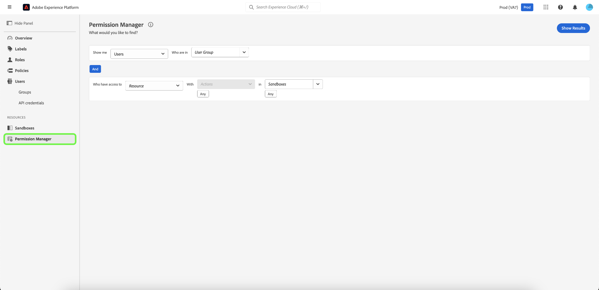

# Permission manager overview {#attribute-based-access-control-overview}

>[!NOTE]
>
>To access [!UICONTROL Permission Manager], you must be a product administrator. If you do not have admin privileges, contact your system administrator to gain access.

The [!UICONTROL Permission Manager] feature provides reporting and enables you to view the complete access control environment. Using simple queries, you can generate clear reports, which will help you understand access management and spend less time verifying access permissions across numerous workflows and granularity levels.

With [!UICONTROL Permission Manager], you can search based on:

* [Users and user group](./permissions.md)
* [Roles and labels](./permissions.md)

You can narrow down your search by selecting specific resources, actions, and sandboxes.

To access [!UICONTROL Permission Manager] for [!DNL Experience Platform], you must be an administrator for an organization that has access to Experience Platform. While Adobe allows for customizable administrator hierarchies inside your organization, you must be a product administrator for the [!DNL Adobe Experience Platform]. For further details, refer to the Adobe Help Center article on [administration roles](https://helpx.adobe.com/enterprise/using/admin-roles.html).

Log in to [Adobe Experience Platform](https://experience.adobe.com/) using your [!DNL Adobe] credentials.  After logging in, you will see the **[!UICONTROL Overview]** page for your organization. This page displays the products to which your organization is subscribed. To launch the attribute-based access control workspace for platform integration, select **[!UICONTROL Permissions]**.

The attribute-based access control workspace for Experience Platform appears, opening on the **[!UICONTROL Overview]** page. This page allows you to view all roles and manage various settings as outlined in this document.

Select **[!UICONTROL Permission Manager]** from the left navigation.

## Next steps

Once you have navigated to the [!UICONTROL Permission Manager] workspace, proceed to the next step to learn more about how you can [search users and roles](./permissions.md).
