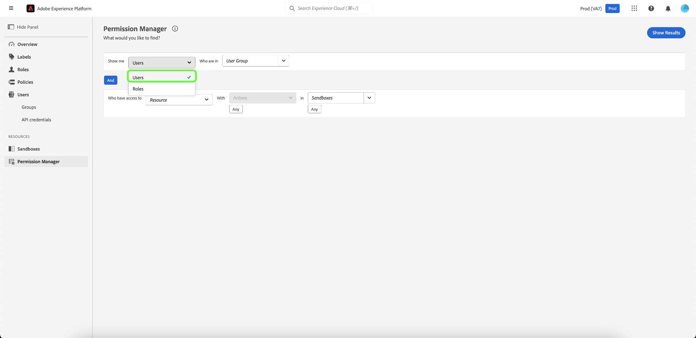
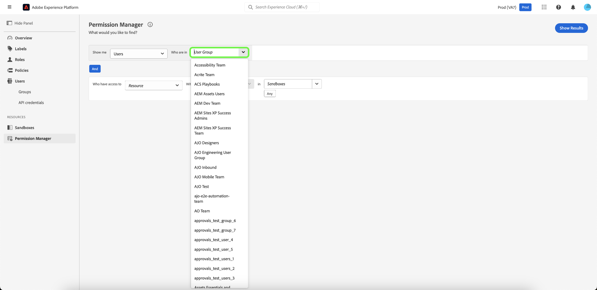
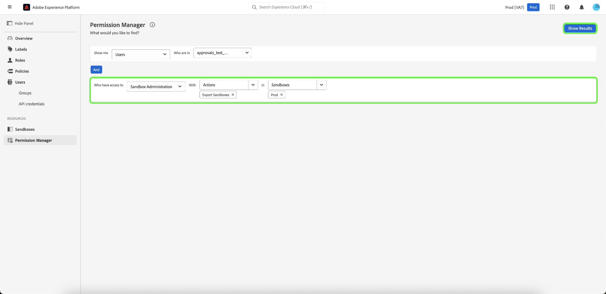
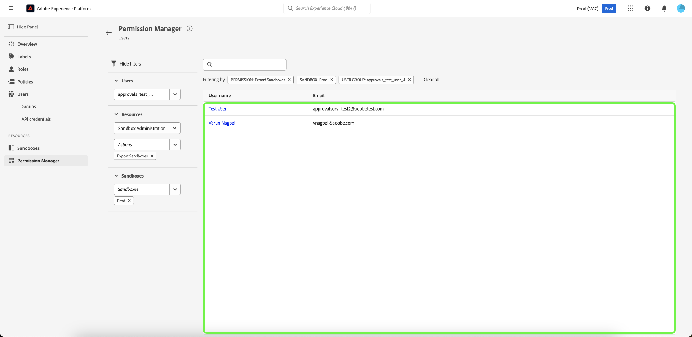
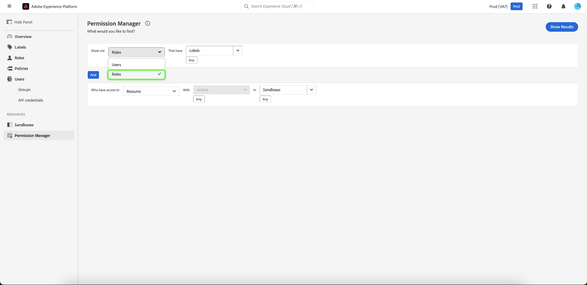
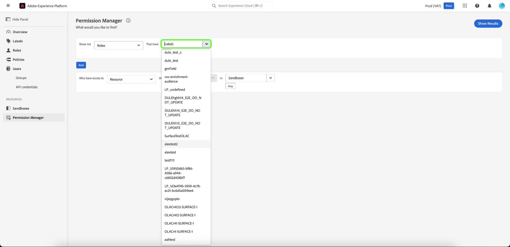
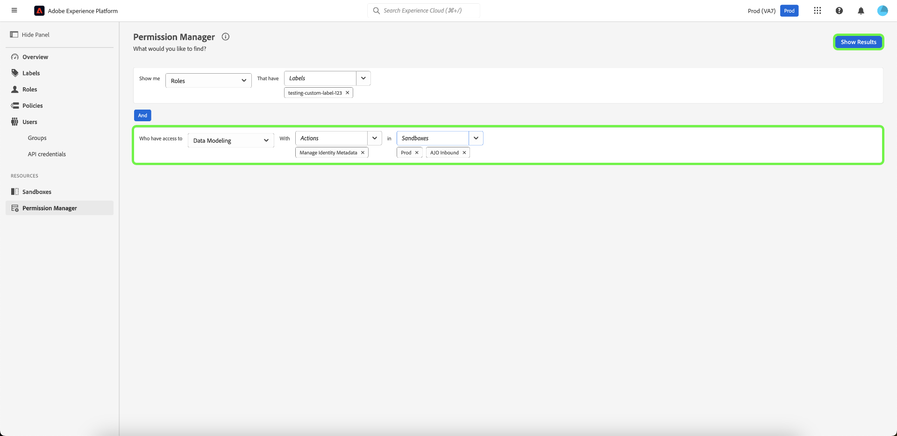
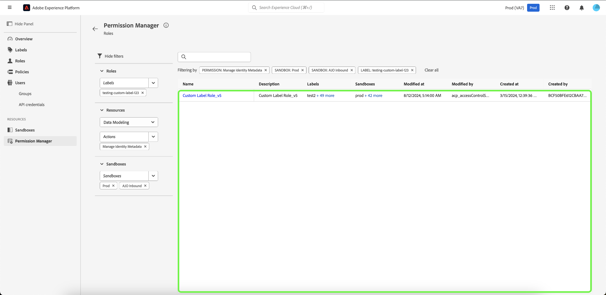

# Permission manager

>[!NOTE]
>
>To access [!UICONTROL Permission Manager], you must be a product administrator. If you do not have admin privileges, contact your system administrator to gain access.

Use simple queries in the [!UICONTROL Permission Manager], to create concise reports that will help you understand access management and save time validating access permissions across many workflows and granularity levels. You can utilize [!UICONTROL Permission Manager] to find users that belong to a user group and have specified access privileges, as well as roles that have specific labels.

## Perform a search for users within a specified user group {#search-users}

>[!CONTEXTUALHELP]
>id="platform_permission_manager"
>title="Permission manager"
>abstract="Use the dropdown selectors on the page to get access level reports of different granularity levels for users and roles."
<!-- >additional-url="https://experienceleague.adobe.com/docs/experience-platform/access-control/abac/permissions-manager/permissions.html" text="Permission manager" -->

Using the drop down, select the attribute **[!UICONTROL Users]**.

Next, select the **[!UICONTROL User Group]** you want to search for using the drop down.

>[!INFO]
>
>[!UICONTROL User Group] is not a mandatory field. You can only select one user group for each report.

For a more granular report, you can specify the resource with actions in a particular sandbox. Select the **[!UICONTROL Resource]**, **[!UICONTROL Actions]**, and **[!UICONTROL Sandboxes]** using the drop down, then select **[!UICONTROL Show Results]**.

>[!INFO]
>
>[!UICONTROL Resource], [!UICONTROL Actions], and [!UICONTROL Sandboxes] are not mandatory fields. An action or sandbox can be removed once added by selecting the **'x'** beside the selection you would like to remove.

A list of users and their email address are reported based on the criteria selected. Use the filter menu on the left to update the attributes and results. For more information on a specific user, select the user name from the list.

## Search for roles with specific labels {#search-roles}

Using the drop down, select the attribute **[!UICONTROL Roles]**.

>[!INFO]
>
>[!UICONTROL Labels] is not a mandatory field. You can select multiple labels, which will be listed beneath this drop down once selected. A label can be removed once added by selecting the **'x'** beside the action.

Next, select the **[!UICONTROL Labels]** you want to search for using the drop down. 

For a more granular report, you can specify the resource with actions in a particular sandbox. Select the **[!UICONTROL Resource]**, **[!UICONTROL Actions]**, and **[!UICONTROL Sandboxes]** using the drop down, then select **[!UICONTROL Show Results]**.

>[!INFO]
>
>[!UICONTROL Resource], [!UICONTROL Actions], and [!UICONTROL Sandboxes] are not mandatory fields. Only one [!UICONTROL Resource] can be selected for each report. An action or sandbox can be removed once added by selecting the **'x'** beside the selection you would like to remove.

A list of roles is reported based on the criteria selected. Use the filter menu on the left to update the attributes and results. For more information on a specific role, select the role from the list.

The following information is displayed for each role matching your criteria:

| Attribute | Description |
| --- | --- |
| Description | A brief descrition of the role. |
| Labels | A list of labels associated with the role. |
| Sandboxes | A list of Sanboxes containing this role. |
| Modified at | The date and timestamp of when the role was last updated. |
| Created at | The date and timestamp of when the role was created. |
| Created by | Details of the creator of the role.  |

## Next steps

You have now learnt how to generate reports for users and roles. To learn more about attribute-based access control, see the [attribute-based access control overview](../overview.md).
