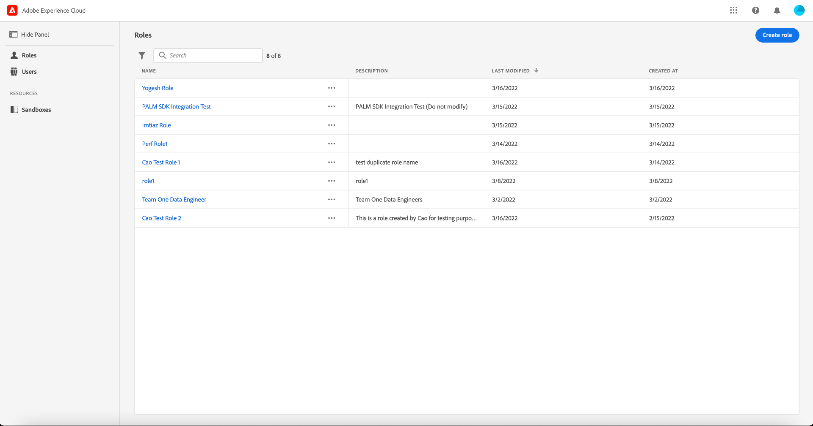

# Permissions guide

[!UICONTROL Permissions] is the area of Adobe Experience Cloud where administrators can define user roles and access policies to manage access permissions for features and objects within a product application. 

With [!UICONTROL Permissions], you can configure:

* [Access policies](./policies.md)
* [Labels](./labels.md)
* [Permissions](./permissions.md)
* [Roles](./roles.md)
* [Sandboxes](./sandboxes.md)
* [Users](./users.md)

In order to access attribute-based access control permissions for [!DNL Experience Cloud], you must be an administrator for your organization that has a subscription to [!DNL Experience Cloud]. While Adobe supports flexible administrator hierarchies for your organizations, you must be a product administrator for Adobe Experience Platform to configure permissions. See the Adobe Help Center article on [administrative roles](https://helpx.adobe.com/enterprise/using/admin-roles.html) for more information.

If you do not have admin privileges, contact your system administrator to gain access.

Once you have admin privileges, go to [Adobe Experience Cloud](https://experience.adobe.com/) and sign in using your Adobe credentials. Once logged in, the **[!UICONTROL Overview]** page appears for your organization you have admin privileges for. This page shows the products that your organization is subscribed to, along with other controls to add users and admins to the organization as a whole. Select **[!UICONTROL Permissions]** to open the attribute-based access control workspace for your Platform integration.

The attribute-based access control workspace for Adobe Experience Cloud appears, opening on the **[!UICONTROL Roles]** page. This page allows you to view all roles and manage various settings as outlined in this document.

>[!IMPORTANT]
>
>Once your organization is enabled for attribute-based access control, you can start using Permissions on Adobe Experience Cloud, instead of Product Profiles in the Adobe Admin Console, to manage permissions for users, functionality, labels, and other resources in your organization.

This user guide focuses on how to use the [!DNL Experience Cloud] to assign access permissions for Platform. For more general information on how to navigate the [!DNL Admin Console], see the [Admin Console user guide](https://helpx.adobe.com/enterprise/using/admin-console.html).

## Next steps

Once you have navigated the permissions workspace, proceed to the next step to [create a new role](roles.md).
