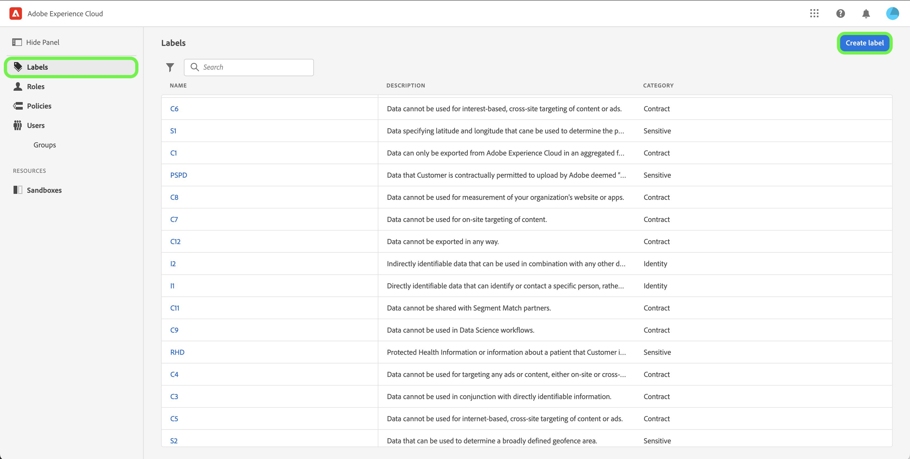
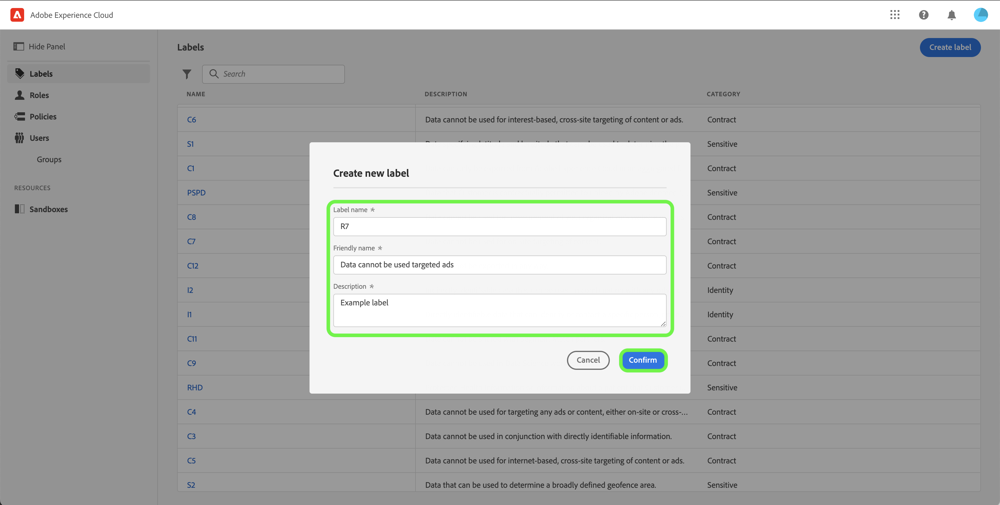

# Manage labels

>[!IMPORTANT]
>
>Attribute-based access control is currently available in a limited release for US-based healthcare customers. This capability will be available to all Real-time Customer Data Platform customers once it is fully released.

Labels allow you to categorize datasets and fields according to usage policies that apply to that data. Labels can be applied at any time, providing flexibility in how you choose to govern data. Best practices encourage labeling data as soon as it is ingested into Platform, or as soon as data becomes available for use in Platform.

## Create a new label

To create a new label, select the **[!UICONTROL Labels]** tab in the sidebar and select **[!UICONTROL Create Label]**.

The **[!UICONTROL Create a new label]** dialog appears, prompting you to enter a name, an optional friendly name and an optional description.

When finished, select **[!UICONTROL Confirm]**.
