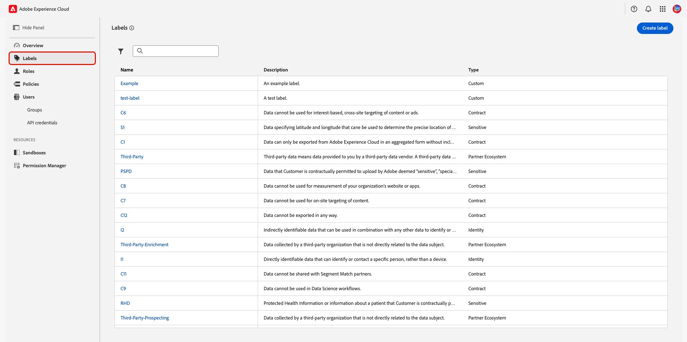
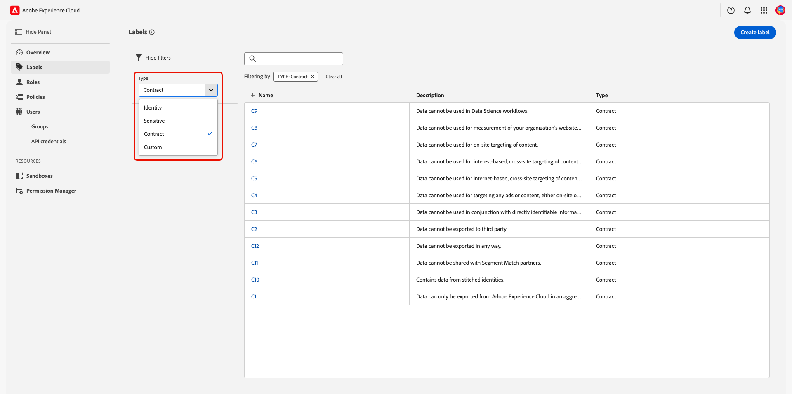
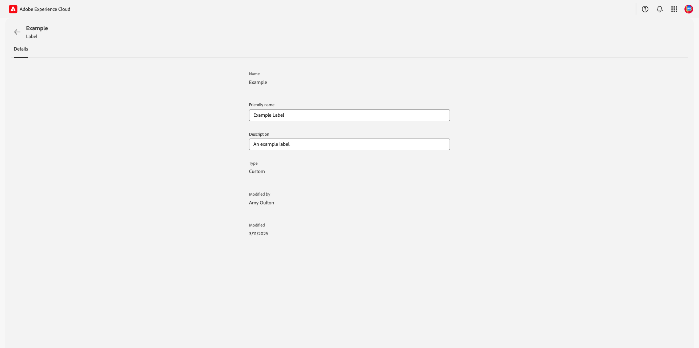
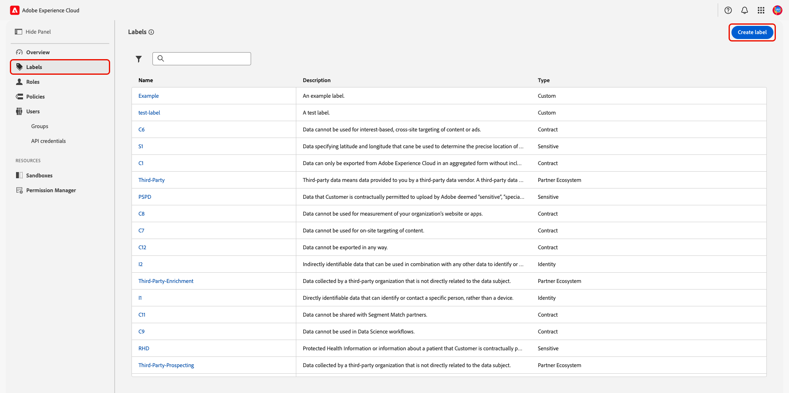
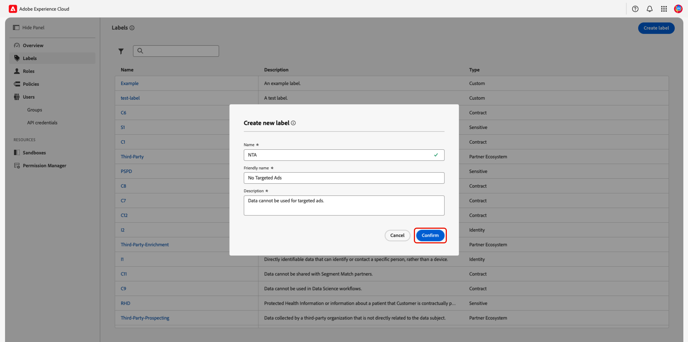
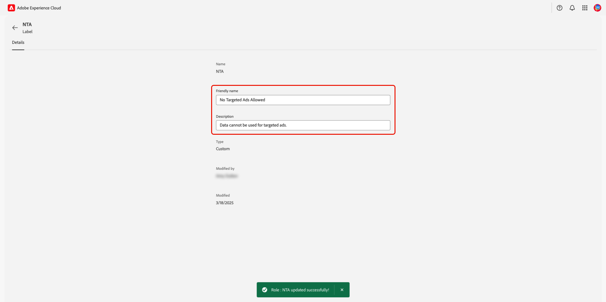

# Manage labels

You can use labels to categorize datasets and fields according to data usage and attribute-based access control policies. Labels can be applied at any time, providing flexibility in how you choose to govern data. Best practices encourage labeling data as soon as it is ingested into Adobe Experience Platform, or as soon as data becomes available for use. Read this document to learn how you can manage labels in the Permissions UI.

For a comprehensive list of labels and their corresponding governance policies, read the guide on [core data usage labels](../../../data-governance/labels/reference.md){target="_blank"}.

>[!NOTE]
>
>To create or view [computed attributes](../../../profile/computed-attributes/overview.md){target="_blank"} with fields containing a given label, you must have access to that label.

## Explore labels {#explore-labels}

To view all available labels, navigate to **[!UICONTROL Permissions]** in [Adobe Experience Cloud](https://experience.adobe.com/){target="_blank"}. Select **[!UICONTROL Labels]** from the left panel. 

{zoomable="yes"}

Labels are categorized by type and belong to one of the following categories:

| Type | Description |
| --- | --- |
| [Contract](../../../data-governance/labels/reference.md#contract){target="_blank"} | This category is used to categorize data that has contractual obligations or is related to your organization's data governance policies. |
| [Identity](../../../data-governance/labels/reference.md#identity){target="_blank"} | This category is used to categorize data that can directly or indirectly identify a person. |
| [Sensitive](../../../data-governance/labels/reference.md#sensitive){target="_blank"} | This category is used to categorize data that your organization considers sensitive. |
| [Partner Ecosystem](../../../data-governance/labels/reference.md#partner){target="_blank"} | This category is used to categorize data obtained from sources external to your organization. |
| Responsible Engagement | This category contains a single label, **[!UICONTROL Potential for Bias]**, which reflects data that has the potential to introduce bias. |
| Custom | This category includes labels that are created by your organization. |

To filter labels, select the filter icon () and then select your desired label type from the **[!UICONTROL Type]** dropdown.

{zoomable="yes"}

To view an individual label, select the label's name from the list. The label's detail page will appear. Adobe's core labels are **not** editable.

{zoomable="yes"}

## Create a custom label {#create-custom-label}

>[!CONTEXTUALHELP]
>id="platform_abac_labelusage"
>title="Label usage"
>abstract="You can use custom labels to apply data governance and access control configurations to your data."

>[!CONTEXTUALHELP]
>id="platform_permissions_labels_about_create"
>title="Create new label"
>abstract="You can create your own custom labels to fit the needs of your organization. Custom labels can be used to apply both data governance and access control configurations to your data."
>additional-url="https://experienceleague.adobe.com/docs/experience-platform/data-governance/labels/overview.html#manage-labels" text="Manage custom labels"

>[!NOTE]
>
>To create a custom label, you will need a role containing the **[!UICONTROL Manage Usage Labels]** permissions and the `Prod` sandbox.

To create a new label, select **[!UICONTROL Labels]** from left panel of the **[!UICONTROL Permissions]** workspace and then select **[!UICONTROL Create label]**. 

{zoomable="yes"}

The **[!UICONTROL Create new label]** dialog appears, prompting you to enter a **[!UICONTROL Name]**, a **[!UICONTROL Friendly name]**, and **[!UICONTROL Description]**. 

>[!IMPORTANT]
>
> The label's [!UICONTROL Name] cannot be changed after the label has been created and label deletion is not currently supported.

Select **[!UICONTROL Confirm]** to finish creating your label.

{zoomable="yes"}

## Edit a custom label {#edit-custom-label}

While you cannot edit a custom label's **[!UICONTROL Name]**, you can edit the **[!UICONTROL Friendly name]** and **[!UICONTROL Description]**. To edit a custom label, select the label from the list within the **[!UICONTROL Labels]** workspace. 

{zoomable="yes"}

Edit either field and then click anywhere outside of the textbox to save your changes. A confirmation message will appear on the screen and the **[!UICONTROL Modified by]** name and **[!UICONTROL Modified]** date will change.

{zoomable="yes"}

## Next steps

Now that you have a deeper understanding of labels, you can begin [applying them to schemas](../../../xdm/tutorials/labels.md).
