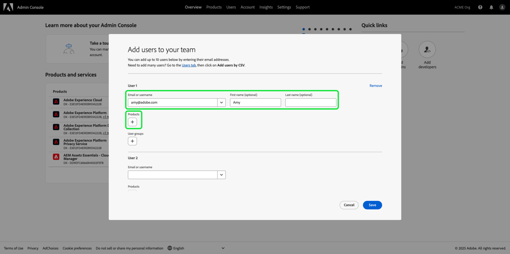
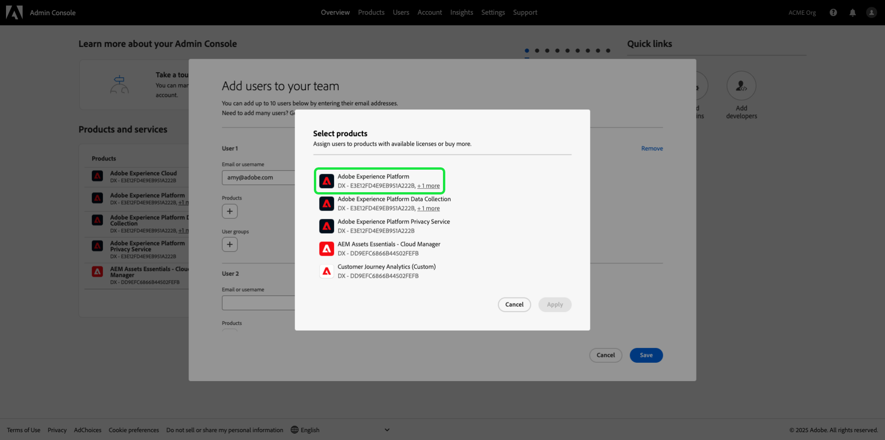
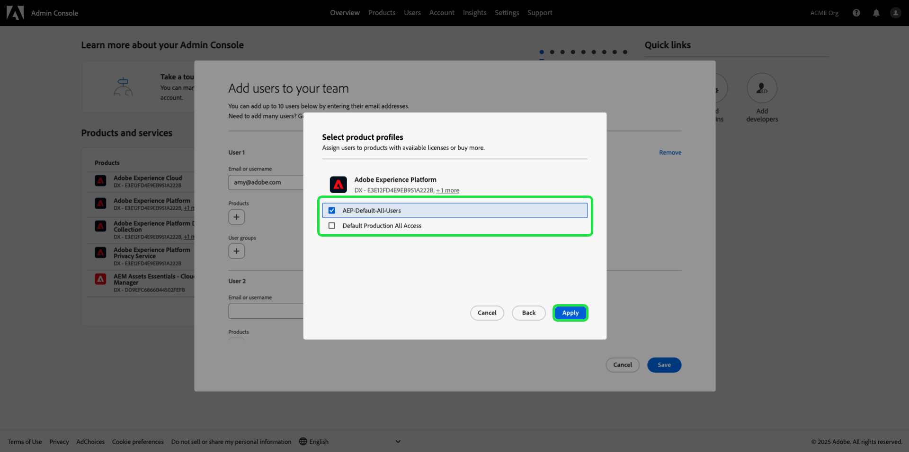
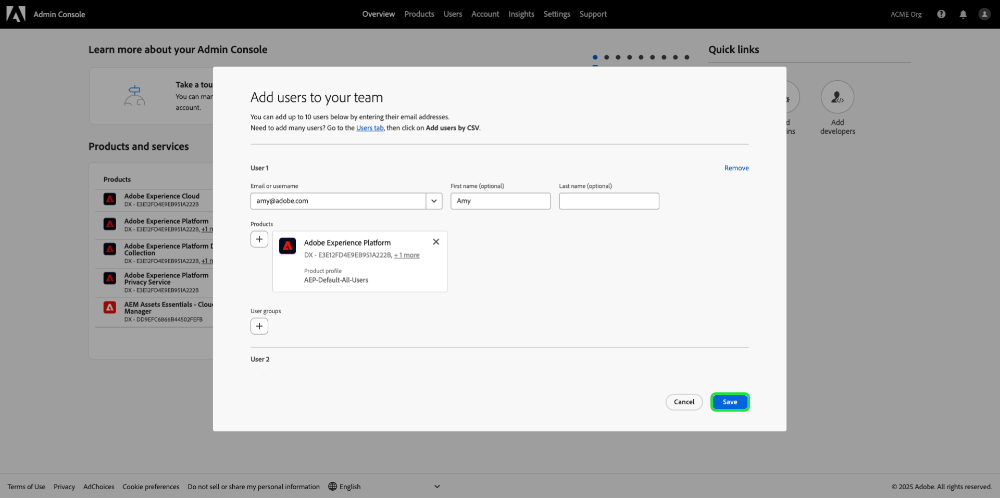

# Manage permissions for a role {#manage-role-permissions}

>[!CONTEXTUALHELP]
>id="platform_permissions_roles_about"
>title="What are roles?"
>abstract="Roles define the access that an administrator, a specialist, or an end-user has to resources in your organization. They categorize the users interacting with your Experience Platform instance and are the building blocks of access control policies. A role has a given set of permissions and members of your organization can be assigned to one or more roles, depending on the scope of view or write access they need."
>additional-url="https://experienceleague.adobe.com/docs/experience-platform/access-control/abac/permissions-ui/roles.html" text="Manage roles"

>[!IMPORTANT]
>
>Access control uses user ID (an internal unique id assigned to a user) for granting permissions. When an organization is migrated from Adobe ID to Business ID, all permissions set for its users will be lost because the user ID changes and access control will use the newly generated user ID. If your organization is migrated to Business ID, please contact your Adobe representative to migrate your user ID from Adobe ID to Business ID.

Permissions is the area of Experience Cloud where administrators can define user roles and access policies to manage access permissions for features and objects within a product application.

Through Permissions, you can create and manage roles, as well as assign the desired resource permissions for these roles. Permissions also allow you to manage the labels, sandboxes, and users associated with a specific role.

Immediately after [creating a new role](#create-a-new-role), you are returned to the **[!UICONTROL Roles]** tab. If you are editing permissions for an existing role, select the role from the **[!UICONTROL Roles]** tab. Alternatively, use the filter option to filter the results to find a role.

## Filter roles

Select the funnel icon () to display a list of filter controls to help narrow results.

The following filters are available for roles in the UI:

| Filter | Description |
| --- | --- |
| [!UICONTROL Created between] | Select a start date and/or an end date to define a date range to filter results by. |
| [!UICONTROL Created by] | Filter by role creator by selecting a user from the dropdown. |
| [!UICONTROL Modified between] | Select a start date and/or an end date to define a date range to filter results by.  |
| [!UICONTROL Modified by] | Filter by role modifier by selecting a user from the dropdown. |

To remove a filter, select the "X" on the pill icon for the filter in question, or select **[!UICONTROL Clear all]** to remove all filters.

## Role details {#role-details}

>[!CONTEXTUALHELP]
>id="platform_permissions_roles_details"
>title="Role overview"
>abstract="The role overview dialog displays the role's details including the resources and sandboxes that a given role is permitted to access. You can manage labels, users, user groups, and API credentials for the role by navigating to the corresponding tab within the role's workspace."
>additional-url="https://experienceleague.adobe.com/en/docs/experience-platform/access-control/abac/permissions-ui/permissions#manage-labels-for-a-role" text="Manage labels for a role"
>additional-url="https://experienceleague.adobe.com/en/docs/experience-platform/access-control/abac/permissions-ui/permissions#manage-users-for-a-role" text="Manage users for a role"

Select the role from the **[!UICONTROL Roles]** tab, which will open the role's [!UICONTROL Details] dashboard.

The [!UICONTROL Details] dashboard provides an overview of the role. The overview displays the role name, description, creator, and last modifier, along with the creation and modification dates. It also shows the permissions attached to the role and the list of assigned sandboxes. The role name and description can be modified, if required.

## Manage labels for a role

Select the **[!UICONTROL Labels]** tab to open the roles labels workspace, then select **[!UICONTROL Add labels]** to assign labels to the role.

The **[!UICONTROL Apply Access and Data Governance Labels]** dialog is displayed, presenting a list of labels. The list displays the label name, friendly name, category, and its description.

Select the labels from the list you would like to add to the role, then select **[!UICONTROL Save]**

Added labels appear under **[!UICONTROL Labels]** tab.

To remove a label from a role, select the label and then select **[!UICONTROL Remove Labels]**.

## Manage sandboxes for a role

Select the **[!UICONTROL Details]** tab and navigate to the **[!UICONTROL Sandboxes]** section. Select **[!UICONTROL View All]** to see the complete list of sandboxes added to the role.

To add more sandboxes to a role, select **[!UICONTROL Edit]** from the top-right of the UI.

The next screen prompts you to choose which sandboxes resources to include in the role using the dropdown. When finished, select **[!UICONTROL Save]** and then **[!UICONTROL Close]**.

## Manage users for a role

Select the **[!UICONTROL Users]** tab to open the roles [!UICONTROL Users] workspace, then select **[!UICONTROL Add Users]** to assign users to the role.

The **[!UICONTROL Add Users]** dialog appears. Select the users from the list you would like to add to the role. Alternatively, use the search bar to search for the user by entering their name or email address, then select **[!UICONTROL Save]**

Added users appear under **[!UICONTROL Users]** tab.

To remove a user from a role, select the **X** icon next to the user's name.

The following video is intended to support your understanding of creating a new role and managing users for that role.

>[!VIDEO](https://video.tv.adobe.com/v/336081/?learn=on)

## Manage API credentials for a role {#manage-api-credentials-for-role}

>[!CONTEXTUALHELP]
>id="platform_permissions_apicredentials_about"
>title="What are API credentials?"
>abstract="API credentials are assigned to roles to grant users and developers access to Experience Platform APIs. Using Experience Platform APIs, you can programmatically perform basic CRUD (Create, Read, Update, Delete) operations on data, such as configuring computed attributes, accessing data/entities, exporting data, deleting unneeded data or batches, and more."
>additional-url="https://experienceleague.adobe.com/en/docs/experience-platform/landing/platform-apis/api-guide" text="Experience Platform API guide"

>[!IMPORTANT]
>
> To use and manage API credentials in [!UICONTROL Permissions], users must have system administrator privileges.

To use Experience Platform APIs as a user or developer, a system administrator needs to add API credentials in addition to a role's given set of permissions. For a complete guide on creating and assigning API credentials, as well as the permissions needed, refer to the step-by-step tutorial in [authenticate and access Experience Platform APIs](../../../landing/api-authentication.md#generate-credentials). 

Select the **[!UICONTROL API credentials]** tab to open the roles API credentials workspace, then select **[!UICONTROL Add API credentials]** to assign API credentials to the role.

The **[!UICONTROL Add API credentials]** dialog appears. Select API credentials from the list to add to the role and then select **[!UICONTROL Save]**

Added API credentials appear under **[!UICONTROL API credentials]** tab.

To remove an API credential from a role, select the **X** icon next to the API credential name. 

The **[!UICONTROL Remove API credentials]** dialog appears, prompting you to confirm deletion. Select **[!UICONTROL Confirm]** to finish removing the selected credential.

You will be returned to the **[!UICONTROL API credentials]** tab.

## Manage user groups for a role {#manage-user-groups}

>[!CONTEXTUALHELP]
>id="platform_permissions_usergroups_about"
>title="What are user groups?"
>abstract="User groups are collections of multiple users who share access to the same functions. Access to resources within an organization is managed through roles assigned to user groups."
>additional-url="https://experienceleague.adobe.com/en/docs/experience-platform/access-control/abac/permissions-ui/roles" text="Manage roles"

User groups are multiple users that have been grouped together and have access to execute the same functions.

Select the **[!UICONTROL User groups]** tab to open the role's user groups workspace and then select **[!UICONTROL Add Groups]** to assign user groups to the role.

The **[!UICONTROL Add Groups]** dialog appears. Select the user groups from the list you would like to add to the role. Alternatively, use the search bar to search for the user group by entering the name of the group, then select **[!UICONTROL Save]**

Added user group appears under **[!UICONTROL User groups]** tab.

To remove a user group from a role, select the **X** icon next to the user group name. 

The **[!UICONTROL Remove user group]** dialog appears, prompting you to confirm deletion. Select **[!UICONTROL Confirm]** to remove the selected user group.

You will be returned to the **[!UICONTROL User groups]** tab.

## Add users to Experience Platform

As a system administrator, you may grant developer access to a user so they can [create integrations](../../../landing/api-authentication.md#generate-credentials) in the Adobe Developer Console.

To add a user Experience Platform, log in to the [Admin Console](https://adminconsole.adobe.com) and select **[!UICONTROL Add users]**.

The **[!UICONTROL Add users to your team]** dialog appears. Enter the user's email address, first name (optional) and last name (optional). Then select **[!UICONTROL Products]**.

The **[!UICONTROL Select products]** dialogu appears. Select **[!UICONTROL Adobe Experience Platform]**.

The **[!UICONTROL Select product profiles]** dialog appears. Select **[!UICONTROL AEP-Default-All-Users]** then select **[!UICONTROL Save]**.

Review the information and then select **[!UICONTROL Save]** to add the user.

## Next steps 

With permissions established, you can proceed to the next step to [manage users](users.md).
