# Manage access control policies

Access control policies are statements that bring attributes together to establish permissible and impermissible actions. Access policies can either be local or global, and can override other policies. Adobe provides a default policy that can be activated immediately or whenever your organization is ready to start controlling access to specific objects based on labels. The default policy leverages labels applied to resources to deny access unless users are in a role with a matching label. 

>[!IMPORTANT]
>
>Access policies are not to be confused with data usage policies, which control how data is used in Adobe Experience Platform instead of which users in your organization have access to it. See the guide on creating [data usage policies](../../../data-governance/policies/create.md) for more information.

<!-- ## Create a new policy

To create a new policy, select the **[!UICONTROL Policies]** tab in the sidebar and select **[!UICONTROL Create Policy]**.

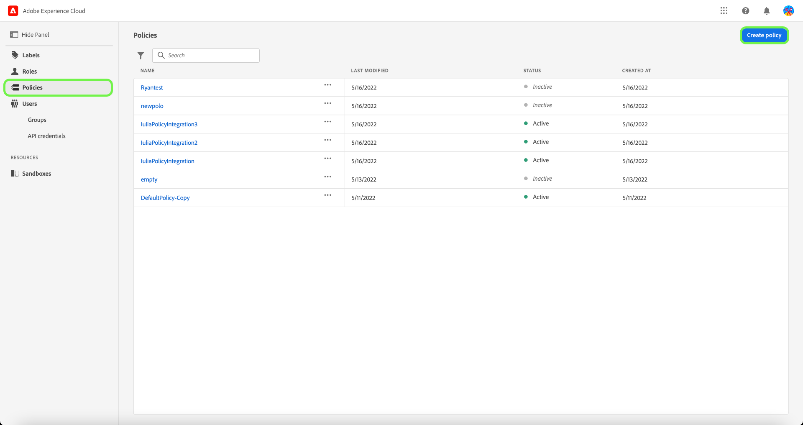

The **[!UICONTROL Create a new policy]** dialog appears, prompting you to enter a name, and an optional description. When finished, select **[!UICONTROL Confirm]**.

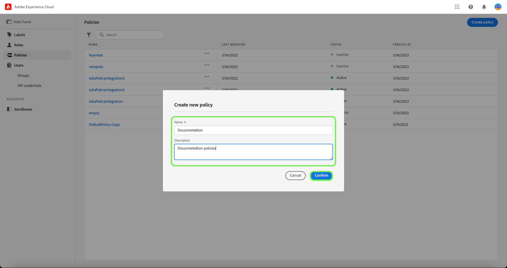

Using the dropdown arrow select if you would like to **Permit access to** () a resource or **Deny access to** () a resource.

Next, select the resource that you would like to include in the policy using the dropdown menu and search access type, read or write.

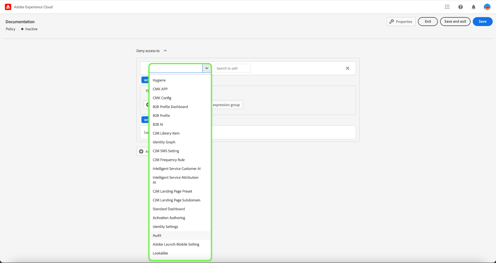

Next, using the dropdown arrow select the condition you would like to apply to this policy, **The following being true** () or **The following being false** ().

Select the plus icon to **Add matches expression** or **Add expression group** for the resource. 

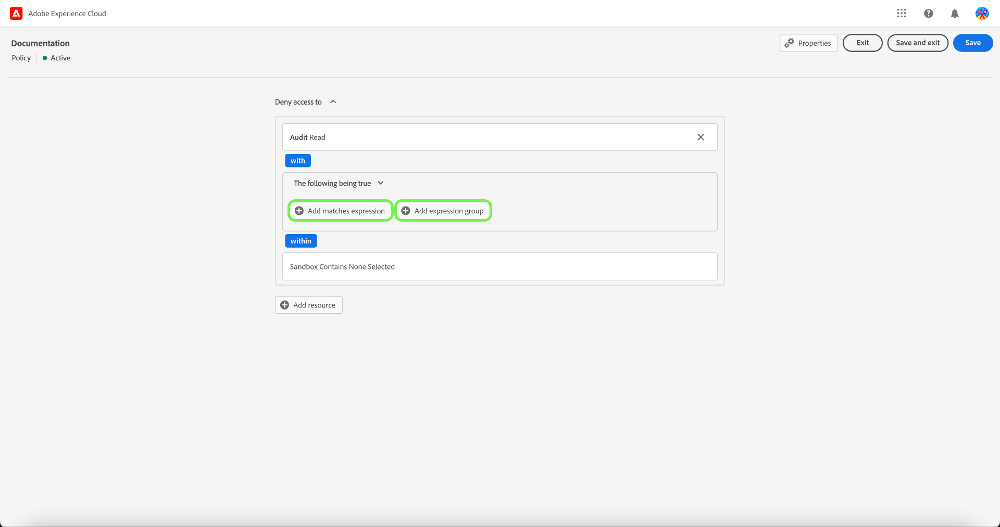

Using the dropdown, select the **Resource**.

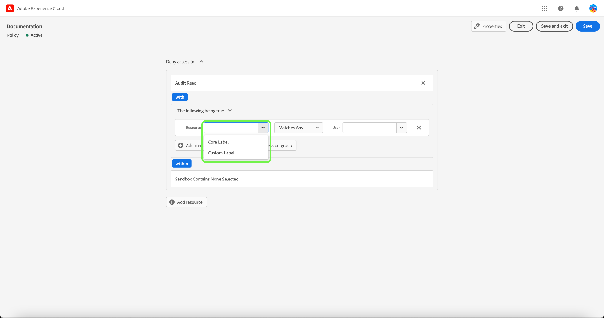

Next, using the dropdown select the **Matches**.

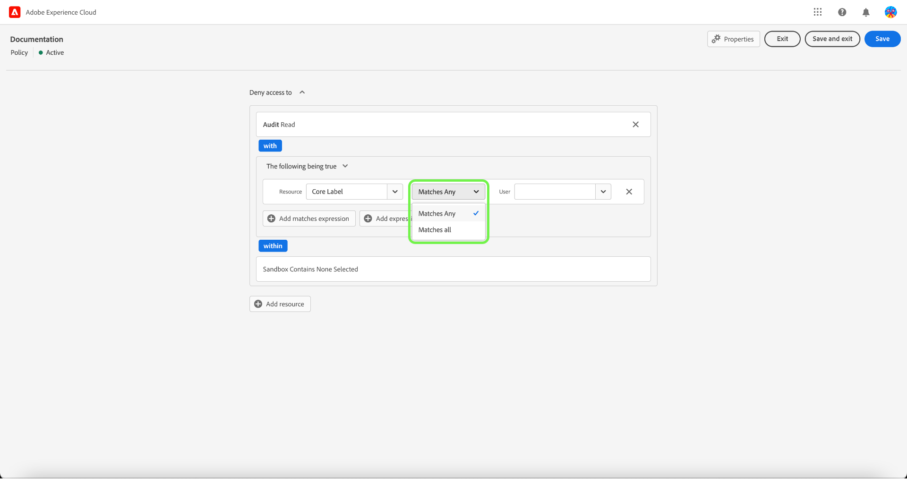

Next, using the dropdown, select the type of label (**[!UICONTROL Core label]** or **[!UICONTROL Custom label]**) to match the label assigned to the User in roles.

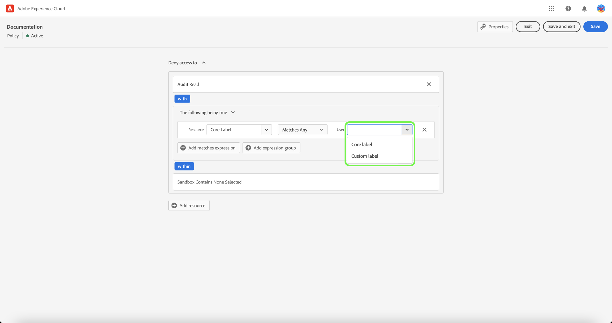

Finally, select the **Sandbox** that you would like the policy conditions to apply to, using the dropdown menu.

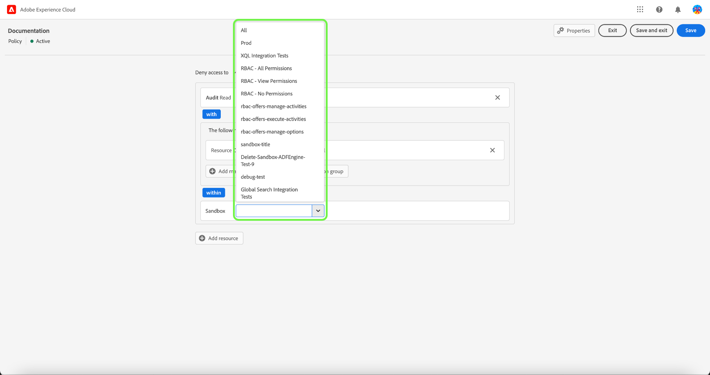

Select **Add resource** to add more resources. Once finished, select **[!UICONTROL Save and exit]**.

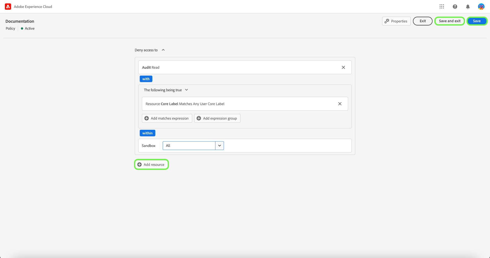

The new policy is successfully created, and you are redirected to the **[!UICONTROL Policies]** tab, where you will see the newly created policy appear in the list. 

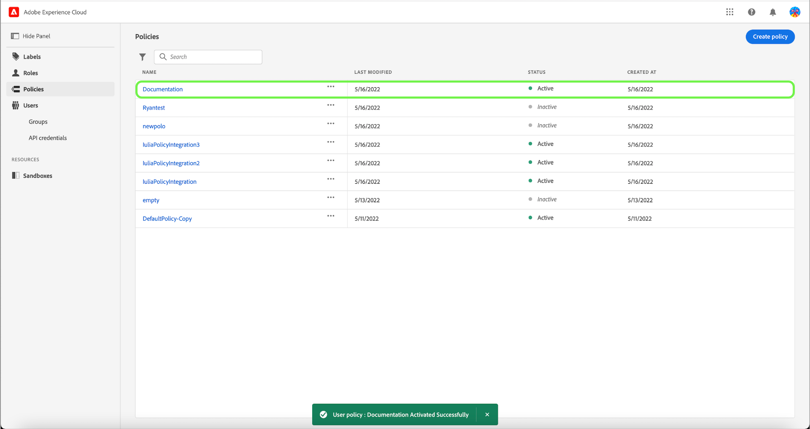

## Edit a policy

To edit an existing policy, select the policy from the **[!UICONTROL Policies]** tab. Alternatively, use the filter option to filter the results to find the policy you want to edit.

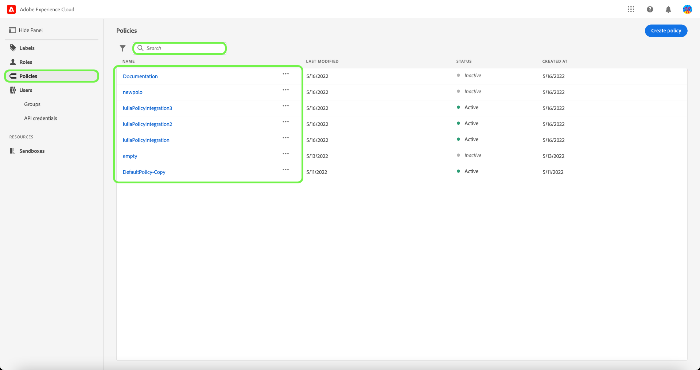

Next, select the ellipsis (`…`) next to the policies name, and a dropdown displays controls to edit, deactivate, delete, or duplicate the role. Select edit from the dropdown.

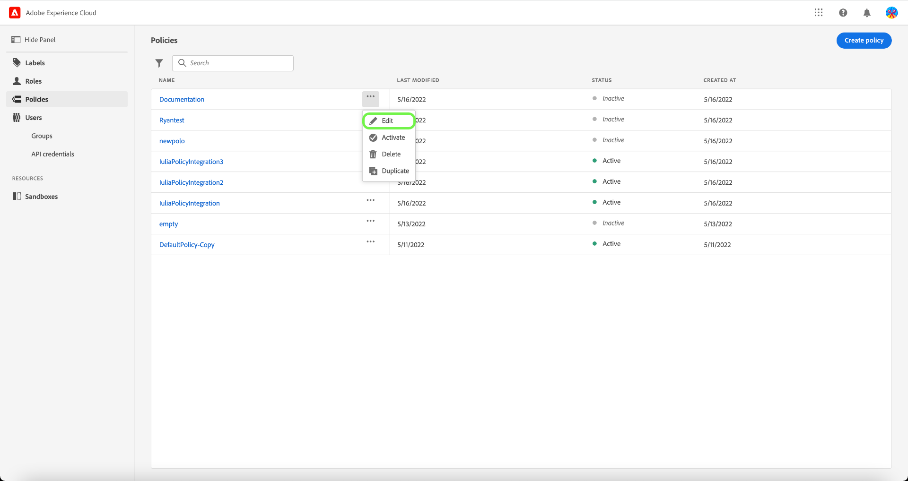

The policy permissions screen appears. Make the updates then select **[!UICONTROL Save and exit]**.

The policy is successfully updated, and you are redirected to the **[!UICONTROL Policies]** tab.

## Duplicate a policy

To duplicate an existing policy, select the policy from the **[!UICONTROL Policies]** tab. Alternatively, use the filter option to filter the results to find the policy you want to edit.

Next, select the ellipsis (`…`) next to a policies name, and a dropdown displays controls to edit, deactivate, delete, or duplicate the role. Select duplicate from the dropdown.

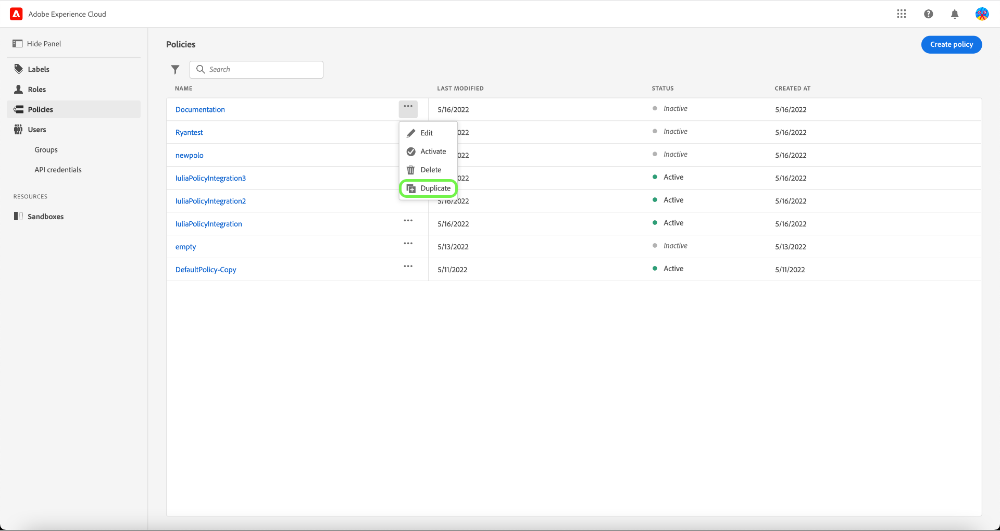

The **[!UICONTROL Duplicate policy]** dialog appears, prompting you to confirm the duplication. 

The new policy appears in the list as a copy of the original on the **[!UICONTROL Policies]** tab.

## Delete a policy

To delete an existing policy, select the policy from the **[!UICONTROL Policies]** tab. Alternatively, use the filter option to filter the results to find the policy you want to delete.

Next, select the ellipsis (`…`) next to a policies name, and a dropdown displays controls to edit, deactivate, delete, or duplicate the role. Select delete from the dropdown.

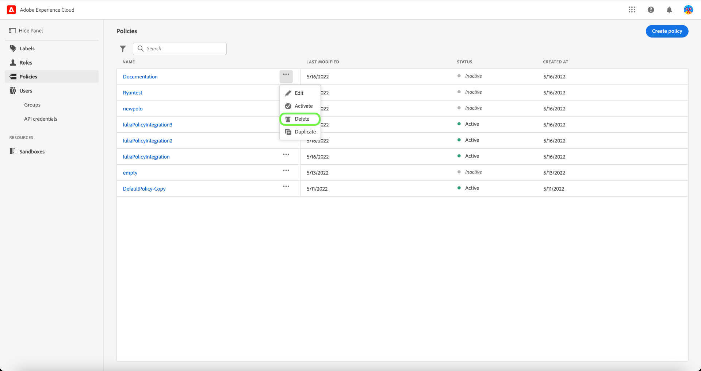

The **[!UICONTROL Delete user policy]** dialog appears, prompting you to confirm the deletion. 

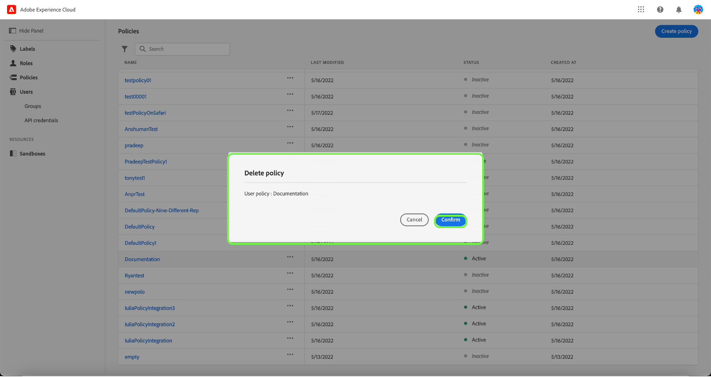

You are returned to the **[!UICONTROL policies]** tab and a confirmation of deletion pop over appears.

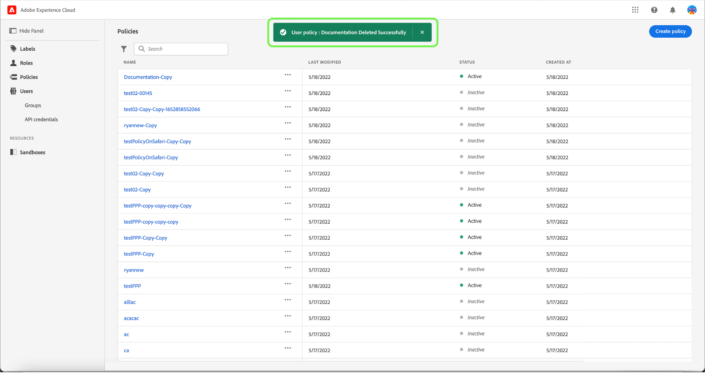 -->

## Configure policy for a sandbox

>[!IMPORTANT]
>
>By default, the [!UICONTROL Auto-include] feature is turned on for all customers, which means all sandboxes are added to the policy.

>[!NOTE]
>
>The **[!UICONTROL Default-Label-Based-Access-Control-Policy]** policy is currently the only one available for configuration.

To view sandboxes associated to a policy, select the policy from the **[!UICONTROL Policies]** tab.

Next, select the policy, then select **[!UICONTROL Sandboxes]** tab. A list of sandboxes associated with the policy are displayed.

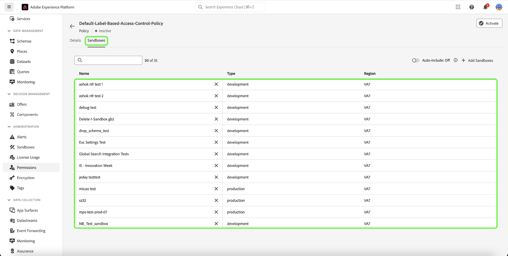

### Add policy to all sandboxes

Use the **[!UICONTROL Auto-include]** toggle on the **[!UICONTROL Sandboxes]** tab to activate the policy for all sandboxes.

![The [!UICONTROL Sandboxes] tab showing the [!UICONTROL Auto-include] toggle.](../../images/flac-ui/abac-policies-auto-include.png)

The **[!UICONTROL Enable Auto-include]** dialog appears prompting you to confirm your selection. Select **[!UICONTROL Enable]** to complete the configuration setting.

![The [!UICONTROL Enable Auto-include] dialog highlighting [!UICONTROL Enable].](../../images/flac-ui/abac-policies-auto-include-enable.png)

>[!SUCCESS]
>
>The policy is activated for all existing sandboxes and will be automatically be added to any new sandboxes when they become available.

### Add policy to select sandboxes

>[!IMPORTANT]
>
>Future sandboxes will not be included in the policy by default if the [!UICONTROL Auto-include] toggle is switched off. You will need to manage and add sandboxes manually to the policy.

Use the **[!UICONTROL Auto-include]** toggle on the **[!UICONTROL Sandboxes]** tab to disable the policy for all sandboxes.

![The [!UICONTROL Sandboxes] tab showing the [!UICONTROL Auto-include] toggle.](../../images/flac-ui/abac-policies-auto-include.png)

From the **[!UICONTROL Sandboxes]** tab, select **[!UICONTROL Add Sandboxes]** to select sandboxes that this policy will apply to.

![The [!UICONTROL Sandboxes] tab showing a list of sandboxes added to the policy.](../../images/flac-ui/abac-policies-sandboxes-tab-add.png)

A list of sandboxes appears. Select the sandbox you would like to add from the list. Alternatively, use the search bar to search for the sandbox. Select **[!UICONTROL Save]**.

![The [!UICONTROL Add Sandboxes] page showing a list of existing sandboxes available to add to the policy.](../../images/flac-ui/abac-policies-sandboxes-list.png)

>[!SUCCESS]
>
>The selected sandboxes have been successfully added to the policy.

### Remove sandboxes from a policy

To remove a sandbox, select the **X** icon next to the sandbox name.

![The [!UICONTROL Sandboxes] tab showing a list of sandboxes, highlighting the [!UICONTROL X] to delete.](../../images/flac-ui/abac-policies-remove-sandbox-x.png)

The **[!UICONTROL Remove]** dialog appears prompting you to confirm your selection. Select **[!UICONTROL Confirm]** to complete the removal.

![The [!UICONTROL Remove] dialog highlighting [!UICONTROL Confirm].](../../images/flac-ui/abac-policies-remove-sandbox.png)

>[!SUCCESS]
>
>The selected sandbox has been successfully removed from the policy.

## Activate a policy

To activate an existing policy, select the policy from the **[!UICONTROL Policies]** tab. 

Next, select the ellipsis (`…`) next to a policies name, and a dropdown displays controls to edit, activate, delete, or duplicate the role. Select activate from the dropdown.

The **[!UICONTROL Activate policy]** dialog appears, prompting you to confirm the activation. 

You are returned to the **[!UICONTROL policies]** tab and a confirmation of activation pop over appears. The policy status shows as active.

## Next steps

With a policy activated, you can proceed to the next step to [manage permissions for a role](permissions.md).
