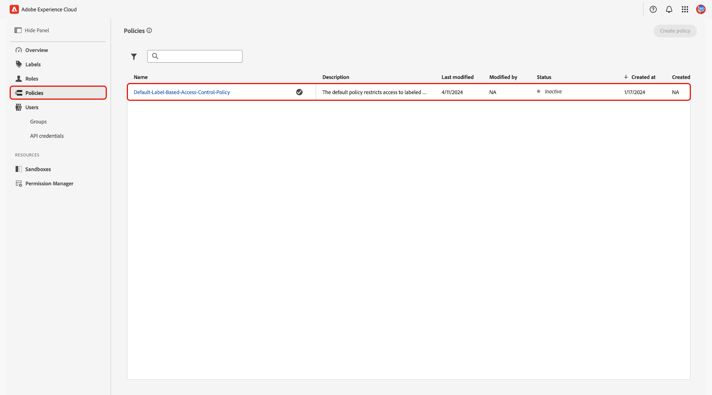
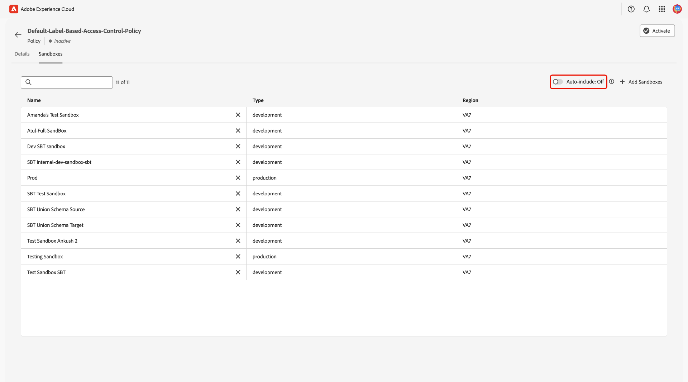
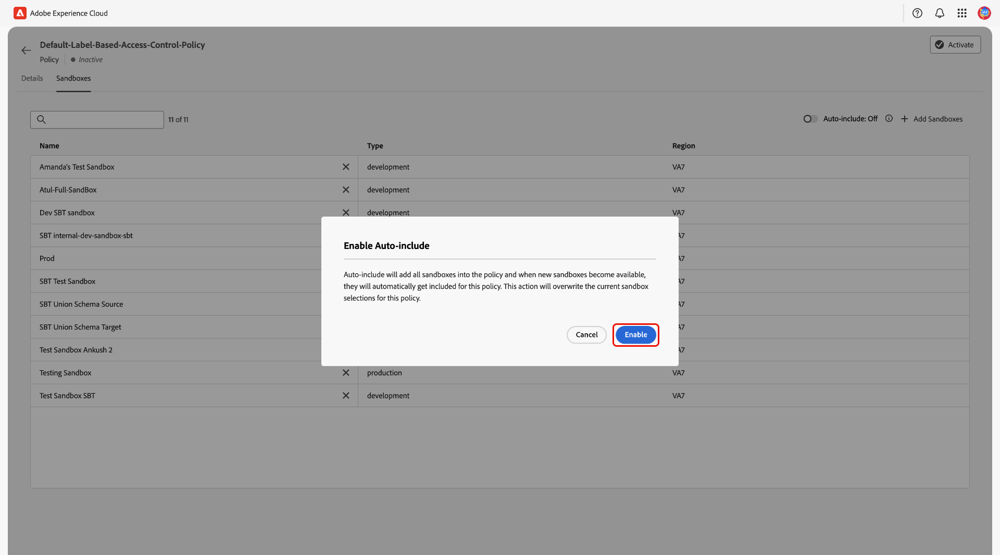
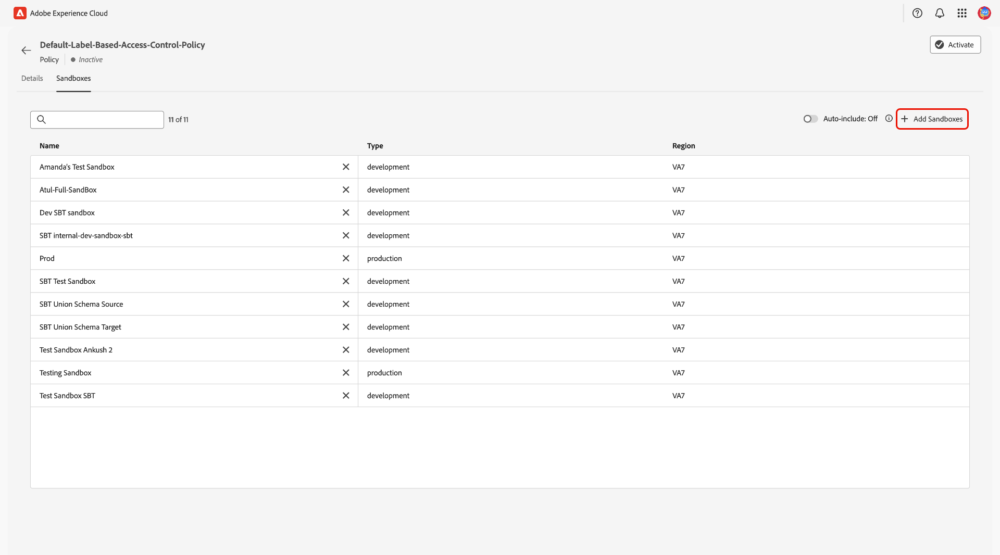
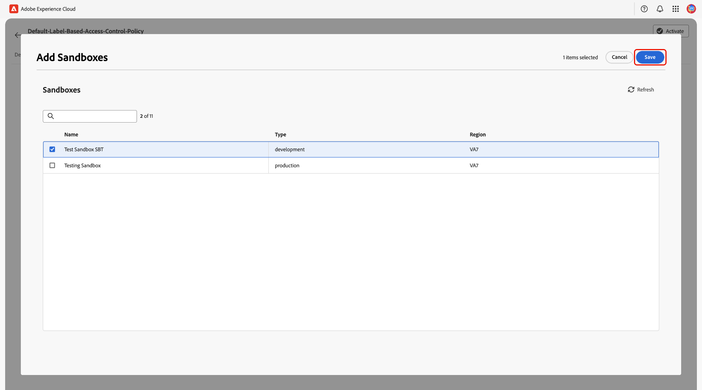
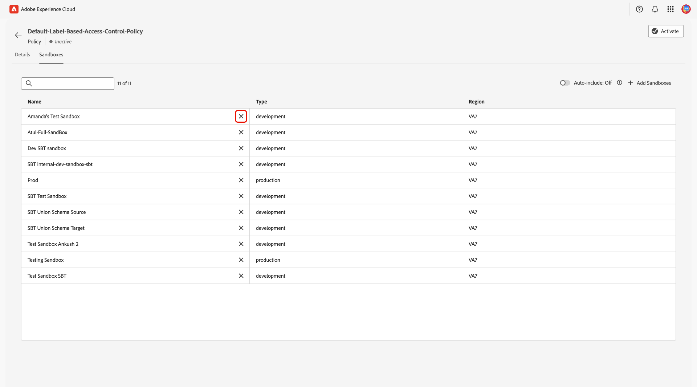
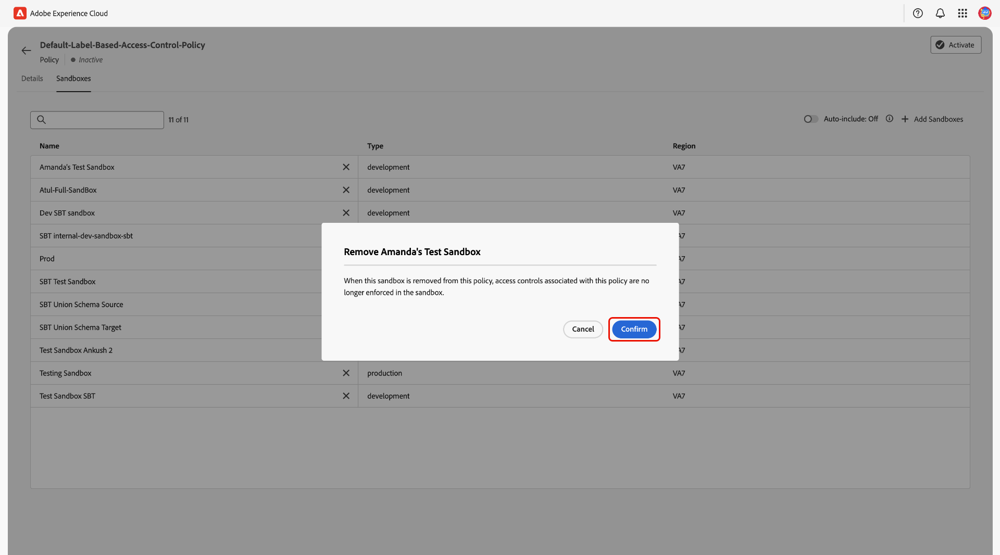
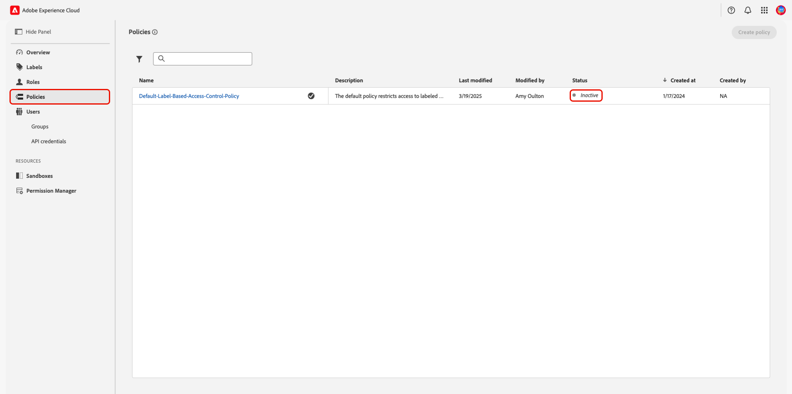
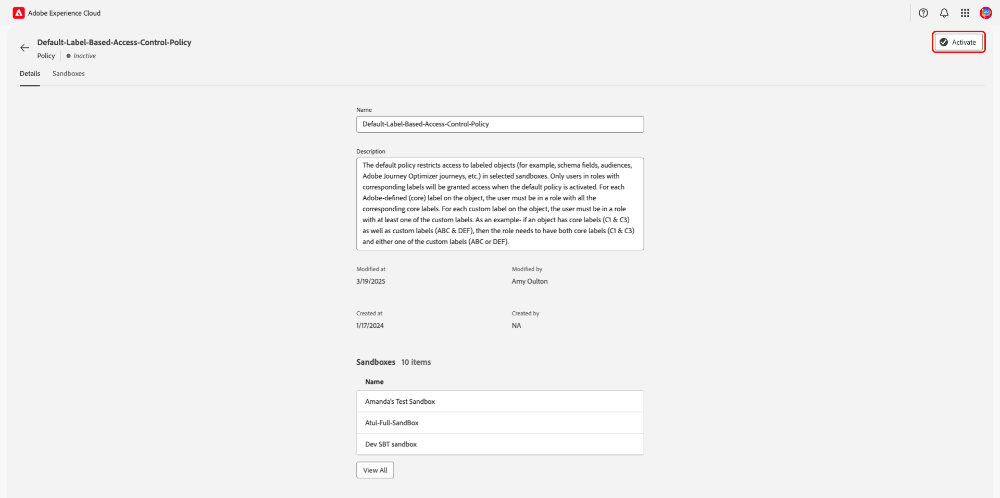
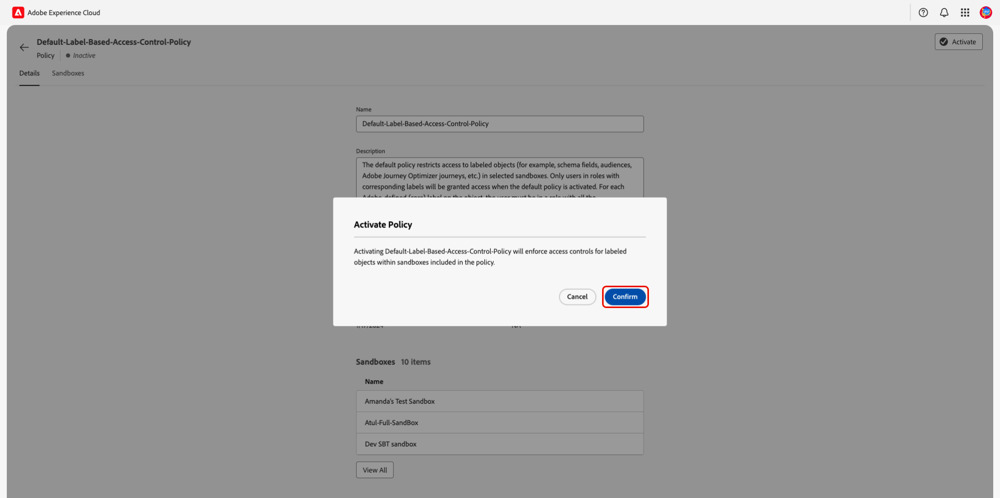

# Manage access control policies

Access control policies are statements that bring attributes together to establish permissible and impermissible actions. Adobe provides a default policy that can be activated immediately or when your organization is ready to start controlling access to specific objects based on [labels](./labels.md){target="_blank"}. The default policy, **[!UICONTROL Default-Label-Based-Access-Control-Policy]**, leverages labels applied to resources to deny access unless users are in a role with a matching label. 

>[!IMPORTANT]
>
>Access control policies should not to be confused with data usage policies, which control how data is used in Adobe Experience Platform. See the guide on creating [data usage policies](../../../data-governance/policies/create.md){target="_blank"} for more information.

## Configure sandboxes for a policy {#configure-policy}

Policies are applied at the sandbox level to control which sandboxes enforce label-based access control. By default, the **[!UICONTROL Auto-include]** feature is turned on, which means all current and future sandboxes are automatically added to the policy. When **[!UICONTROL Auto-include]** is turned off, only the sandboxes you manually add will be subject to the policy's access control rules.

>[!NOTE]
>
>The **[!UICONTROL Default-Label-Based-Access-Control-Policy]** policy is currently the only one available for configuration.

To begin configuring a policy's sandboxes, navigate to **[!UICONTROL Permissions]** in [Adobe Experience Cloud](https://experience.adobe.com/){target="_blank"}. Select **[!UICONTROL Policies]** from the left panel, then select the **[!UICONTROL Default-Label-Based-Access-Control-Policy]** from the list.

{zoomable="yes"}

The policy's details workspace appears. Select the **[!UICONTROL Sandboxes]** tab to view the list of sandboxes associated with the policy and access the sandbox configuration options.

{zoomable="yes"}

### Manage Auto-include {#manage-auto-include}

>[!IMPORTANT]
>
>By default, **[!UICONTROL Auto-include]** is turned on, which means all current and future sandboxes are automatically added to the policy.

To control which sandboxes are included in a policy, you can toggle the **[!UICONTROL Auto-include]** feature on or off. When you toggle off **[!UICONTROL Auto-include]**, future sandboxes will not be automatically added to the policy. However, toggling off the feature **will not** remove any sandboxes that are already included in the policy.

{zoomable="yes"}

To re-enable **[!UICONTROL Auto-include]**, use the toggle to turn it back on. The **[!UICONTROL Enable Auto-include]** dialog appears prompting you to confirm your selection. Select **[!UICONTROL Enable]** to complete the configuration setting.

>[!NOTE]
>
>When you re-enable **[!UICONTROL Auto-include]**, any sandboxes you previously removed from the policy will be re-added.

{zoomable="yes"}

### Manually manage sandboxes {#manually-manage-sandboxes}

When **[!UICONTROL Auto-include]**is turned off, you can manually add or remove specific sandboxes from the policy. This gives you precise control over which sandboxes enforce the policy's access control rules.

>[!NOTE]
>
>To manually add or remove sandboxes, the **[!UICONTROL Auto-include]** toggle **must** be off.

**To add sandboxes:**

Select **[!UICONTROL Add Sandboxes]** from the policy's sandbox workspace.

{zoomable="yes"}

The **[!UICONTROL Add Sandboxes]** dialog appears, displaying your library of available sandboxes. Select the sandbox(es) you wish to add to the policy and then select **[!UICONTROL Save]**.

{zoomable="yes"}

>[!NOTE]
>
>If all available sandboxes are already included in the policy, you will see a "You have nothing in your library" message within the dialog.

**To remove sandboxes:**

Find the sandbox you wish to remove from the list and select the **X** icon next to its name.

{zoomable="yes"}

A confirmation dialog will appear. Select **[!UICONTROL Confirm]** to finish removing the sandbox from the policy.

{zoomable="yes"}

## Activate a policy {#activate-policy}

>[!CONTEXTUALHELP]
>id="platform_permissions_policies_about"
>title="What are policies?"
>abstract="Policies are statements that bring attributes together to establish permissible and impermissible actions. Every organization comes with a default policy that you must activate to start controlling access to specific objects based on labels. Labels applied to resources deny access unless users are assigned to a role with a matching label. Policies cannot be edited or deleted, but they can be activated or deactivated."
>additional-url="https://experienceleague.adobe.com/en/docs/experience-platform/access-control/abac/permissions-ui/labels" text="Manage labels"

To activate an existing policy, select the policy from the **[!UICONTROL Policies]** tab in **[!UICONTROL Permissions]**. The policy's activation status is visible under the **[!UICONTROL Status]** section.

{zoomable="yes"}

The policy's details workspace will display. Select **[!UICONTROL Activate]**.

{zoomable="yes"}

The **[!UICONTROL Activate Policy]** dialog appears. Select **[!UICONTROL Confirm]** to finish activating the policy.

{zoomable="yes"}

## Next steps

With a policy activated, you can proceed to the next step to [manage permissions for a role](permissions.md).
