# Manage roles

Roles define the access that an administrator, a specialist, or an end-user has to resources in your organization. In a role-based access control environment, user access provisioning is group through common responsibilities and needs. A role has a given set of permissions and members of your organization can be assigned to one or more roles, depending on the scope of view or write access they need.

## Create a new role

To create a new role, select the **[!UICONTROL Roles]** tab in the sidebar and select **[!UICONTROL Create Role]**.

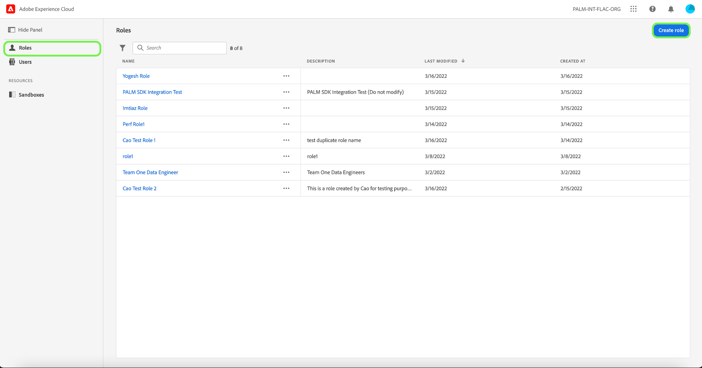

The **[!UICONTROL Create a new role]** dialog appears, prompting you to enter a name, and an optional description. 

When finished, select **[!UICONTROL Confirm]**.

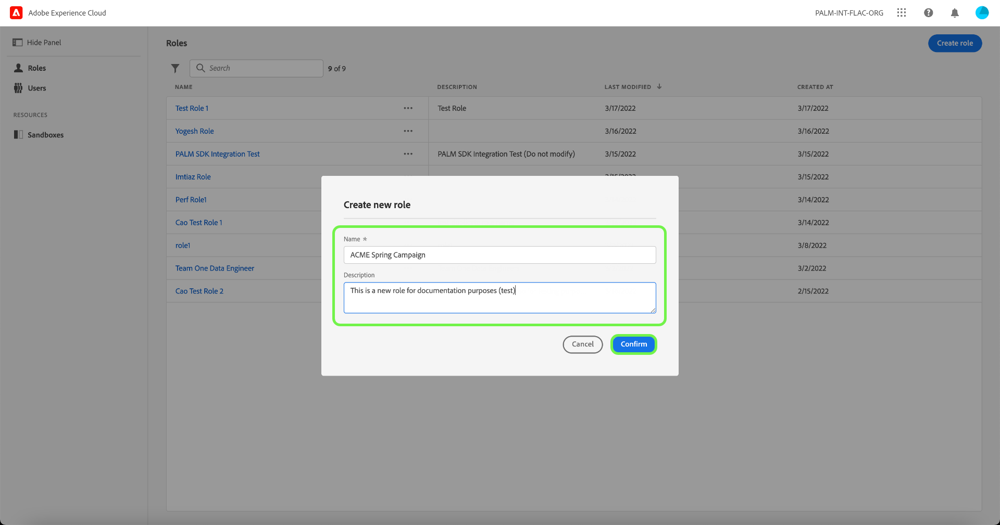

Next, select the resource permissions that you would like to include in the role using the dropdown menu. 

To add additional resources, select **[!UICONTROL Adobe Experience Platform]** from the left navigation panel, which displays a list of resources. Alternatively, enter the resource name into the search bar in the left navigation panel.

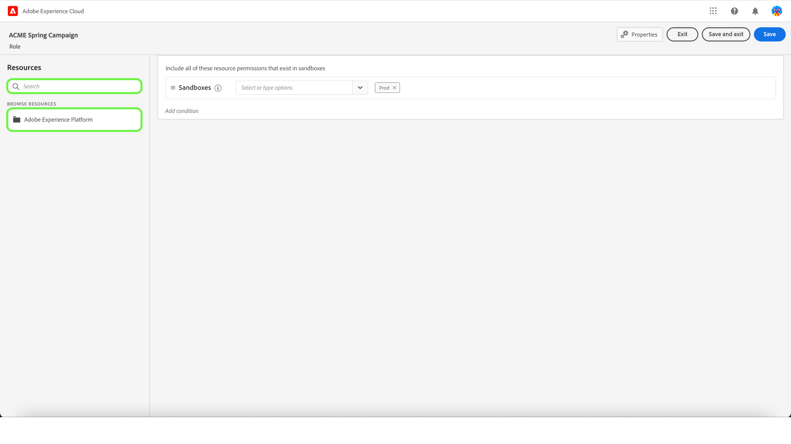

Click and drag the relevant resource and drop into the main panel. 

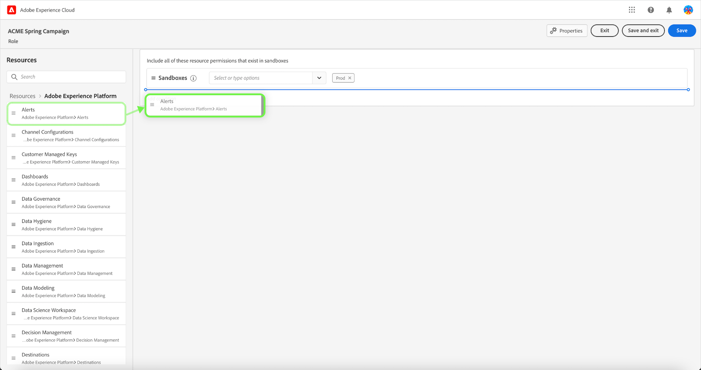

Select the resource permissions that you would like to include in the role using the dropdown menu. Repeat this for all resources you would like to include for the role. When finished, select **[!UICONTROL Save and exit]**.

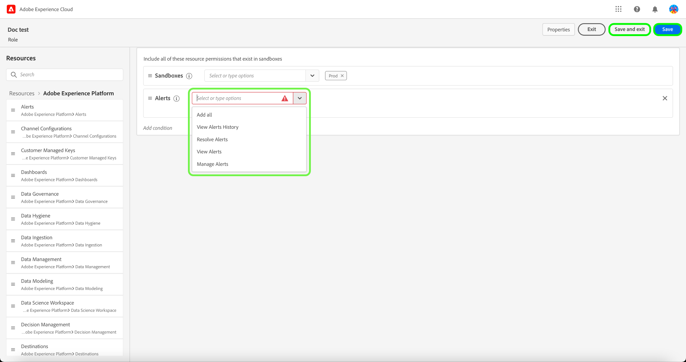

The new role is successfully created, and you are redirected to the **[!UICONTROL Roles]** page, where you will see the newly created role appear in the list. 

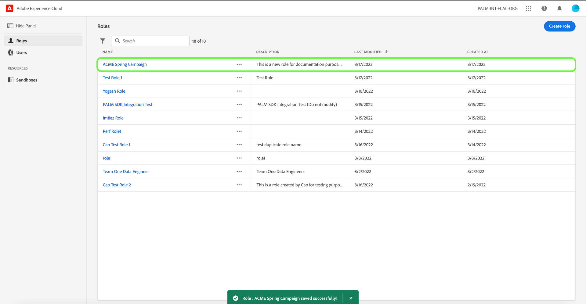

See the sections on [managing permissions for a role](#manage-permissions-for-a-role) for more details on how to manage role permissions once they are created.

The following video is intended to support your understanding of creating a new role and managing users for that role.

>[!VIDEO](https://video.tv.adobe.com/v/336081/?learn=on)

## Duplicate a role

To duplicate an existing role, select the role from the **[!UICONTROL Roles]** tab. Alternatively, use the filter option to filter the results to find the role you want to duplicate.

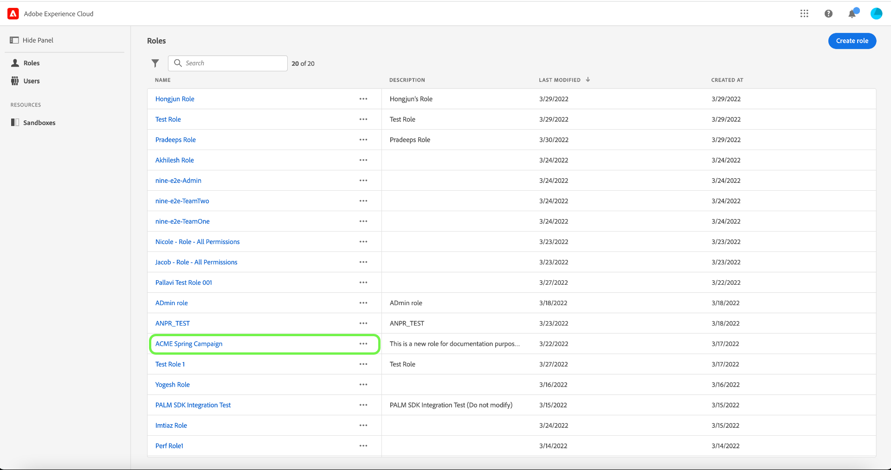

Next, select **[!UICONTROL Duplicate]** from the top right of the screen. 

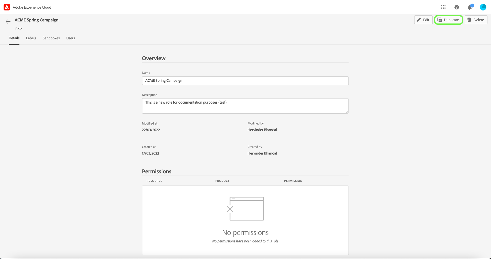

The **[!UICONTROL Duplicate role]** dialog appears, prompting you to confirm the duplication. 

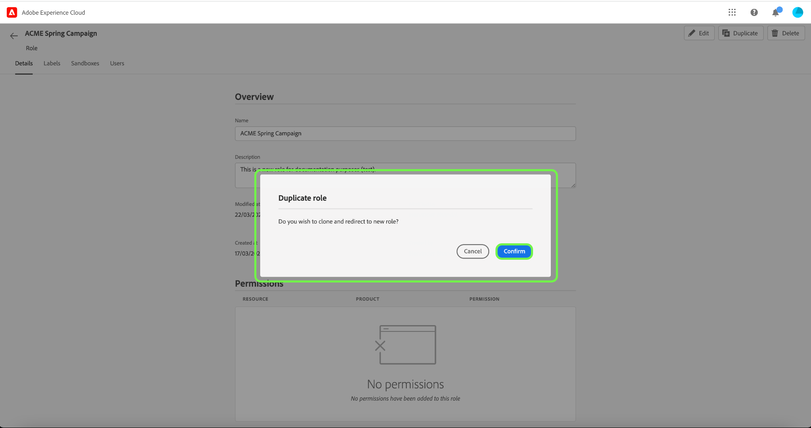

Next, you will be taken to the role's detail page where you can change the name and permissions for the role. The Details, Labels, and Sandboxes are duplicated from the previous role. Users will need to be added via the users tab. You can view the [manage permissions for a role](permissions.md) document to learn more about adding Details, Labels, Sandboxes, and Users to a role.

Click on the left arrow to return to the **[!UICONTROL Roles]** tab.

The new role will appear in the list on the **[!UICONTROL Roles]** page.

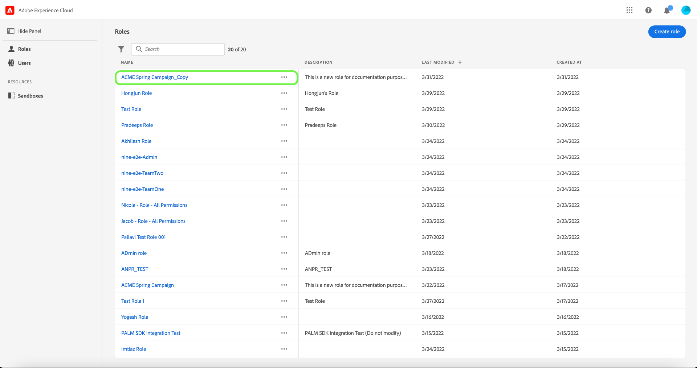

## Delete a role

Select the ellipsis (`…`) next to a role's name, and a dropdown displays controls to edit, delete, or duplicate the role. Select delete from the dropdown.

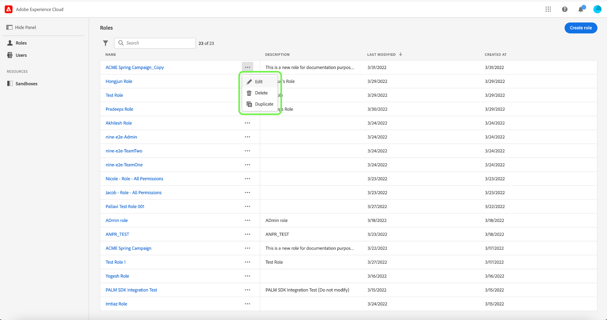

The **[!UICONTROL Delete user role]** dialog appears, prompting you to confirm the deletion. 

You will be returned to the **[!UICONTROL Roles]** tab.

## Next steps

With a new role created, you can proceed to the next step to [manage permissions for a role](permissions.md).
