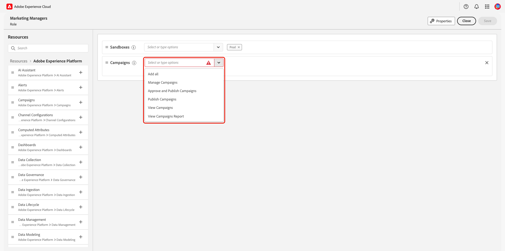
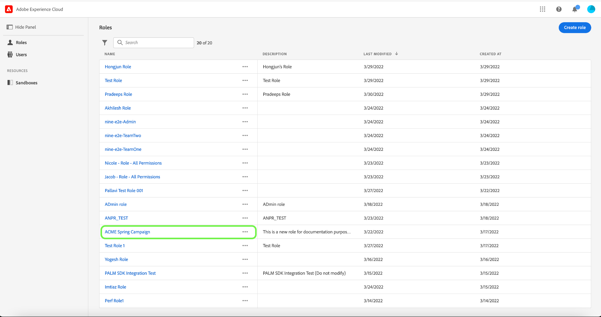
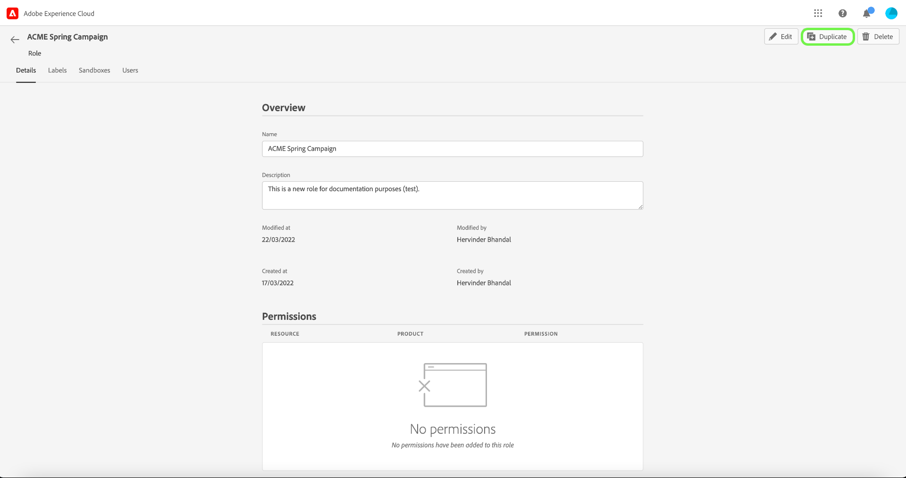
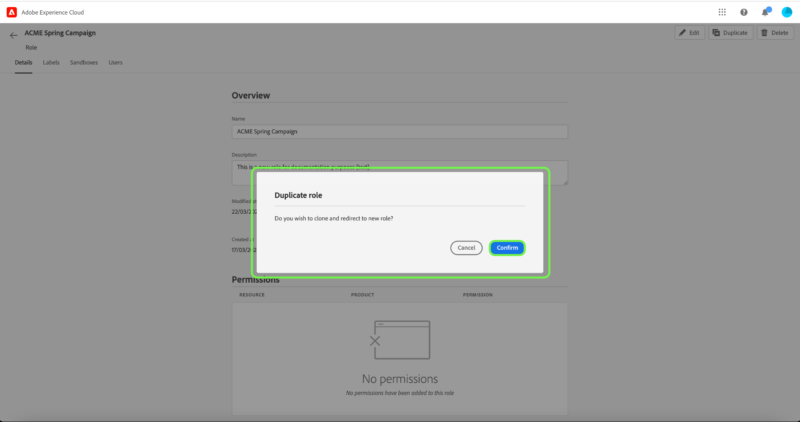
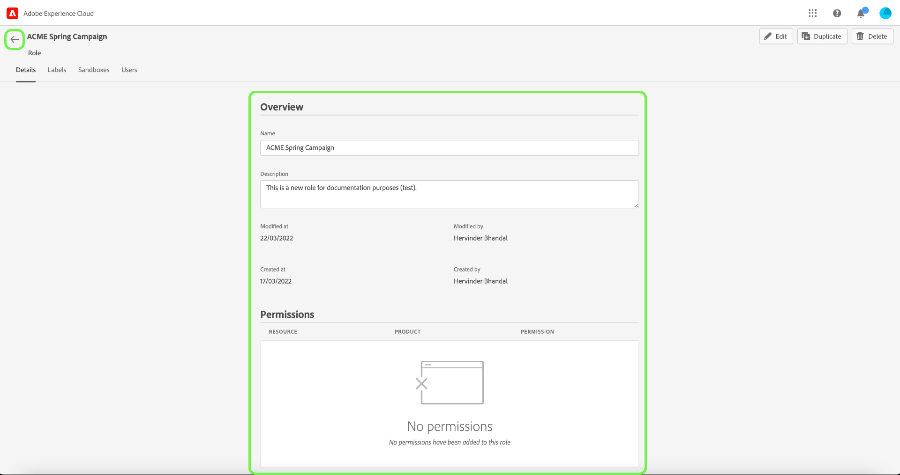
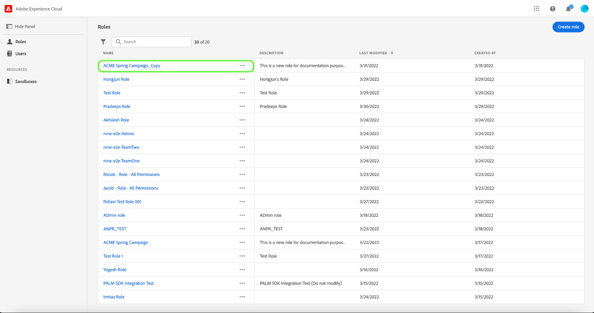
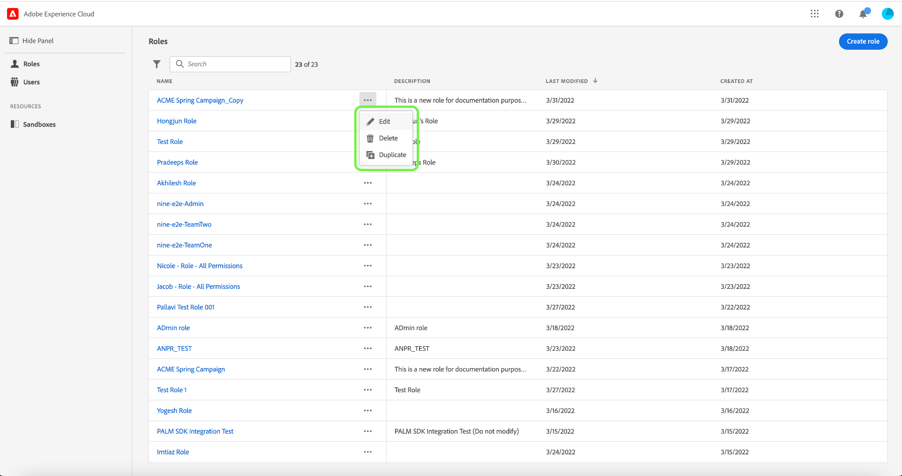
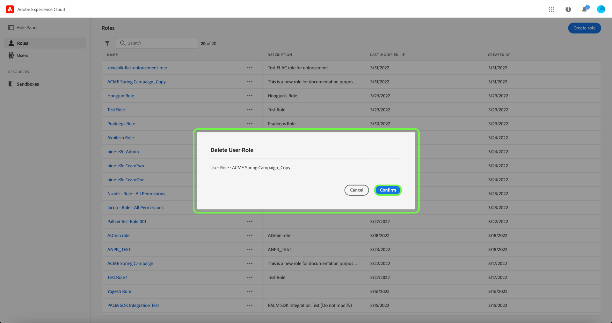

# Manage roles

<!-- UPDATE ROLES WITH A MORE COMPREHENSIVE EXPLANATION -->

To begin managing roles, navigate to **[!UICONTROL Permissions]** in [Adobe Experience Cloud](https://experience.adobe.com/){target="_blank"} and select **[!UICONTROL Roles]** in the left panel.

## Create a new role {#create-new-role}

>[!CONTEXTUALHELP]
>id="platform_permissions_roles_about_create"
>title="Create new role"
>abstract="Create new roles to better categorize users interacting with your Experience Platform instance. For example, you can create a role for an internal marketing team and apply the Regulated Health Data (RHD) label to that role, allowing your internal marketing team to access Protected Health Information (PHI). Alternatively, you can also create a role for an external agency and deny that role access to PHI data by not applying the RHD label to that role."
>additional-url="https://experienceleague.adobe.com/docs/experience-platform/access-control/abac/permissions-ui/roles.html" text="Manage a role"
>additional-url="https://experienceleague.adobe.com/en/docs/experience-platform/access-control/abac/end-to-end-guide#label-roles" text="Apply labels to a role"

To create a new role, select **[!UICONTROL Create role]**.

The **[!UICONTROL Create new role]** dialog appears. Enter a **[!UICONTROL Name]** for the role, and optionally, a **[!UICONTROL Description]**, and then select **[!UICONTROL Confirm]**.

The **[!UICONTROL Resources]** workspace appears. Locate the resource you need by scrolling, or by entering the resource's name into the search bar in the left panel. Add resources by selecting the  beside the resource's name. 

<!-- ADD IN NOTE ABOUT THE DEFAULT SANDBOX - THIS SHOULD BE MENTIONED IN THE HIGHER LEVEL DOCS, WE MAY BE ABLE TO LINK TO IT -->

The resource gets added to the main workspace. Select the dropdown beside the resource's name, and select the permissions you wish to add to the role. You can choose them individually, select **[!UICONTROL Add all]**, or locate specific permissions by entering the permission name in the search bar.

Continue selecting all the resources and the permissions you wish to add to the role. When you're finished, select **[!UICONTROL Save]**.

You will receive an alert showing that the role has been saved successfully. Select **[!UICONTROL Close]** to return to the **[!UICONTROL Roles]** workspace.

The new role is successfully created, and you are redirected to the **[!UICONTROL Roles]** page, where you will see the newly created role appear in the list. 

<!--
The following video is intended to support your understanding of creating a new role and managing users for that role.

>[!VIDEO](https://video.tv.adobe.com/v/336081/?learn=on) -->

## Duplicate a role

To duplicate an existing role, select the role from the **[!UICONTROL Roles]** tab. Alternatively, use the filter option to filter the results to find the role you want to duplicate.

Next, select **[!UICONTROL Duplicate]** from the top right of the screen. 

The **[!UICONTROL Duplicate role]** dialog appears, prompting you to confirm the duplication. 

Next, you will be taken to the role's detail page where you can change the name and permissions for the role. The Details, Labels, and Sandboxes are duplicated from the previous role. Users will need to be added via the users tab. You can view the [manage permissions for a role](permissions.md) document to learn more about adding Details, Labels, Sandboxes, and Users to a role.

Click on the left arrow to return to the **[!UICONTROL Roles]** tab.

The new role will appear in the list on the **[!UICONTROL Roles]** page.

## Delete a role

Select the ellipsis (`…`) next to a role's name, and a dropdown displays controls to edit, delete, or duplicate the role. Select delete from the dropdown.

The **[!UICONTROL Delete user role]** dialog appears, prompting you to confirm the deletion. 

You will be returned to the **[!UICONTROL Roles]** tab.

## Next steps

With a new role created, you can proceed to the next step to [manage permissions for a role](permissions.md).
