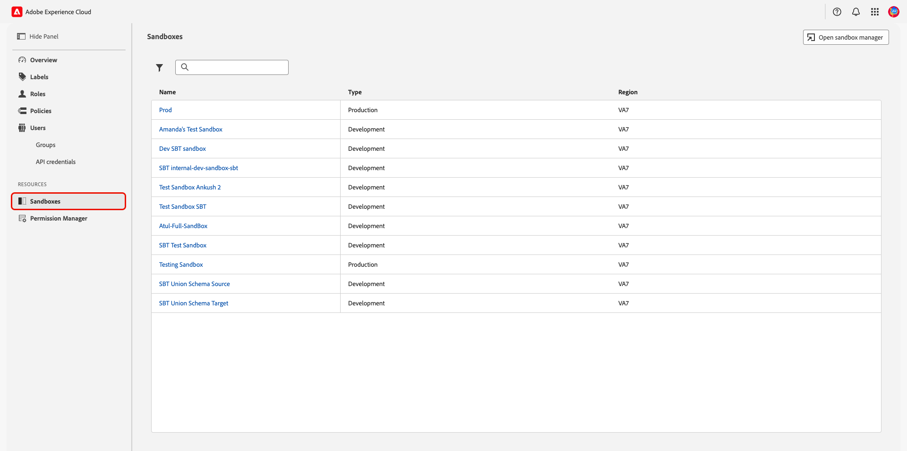
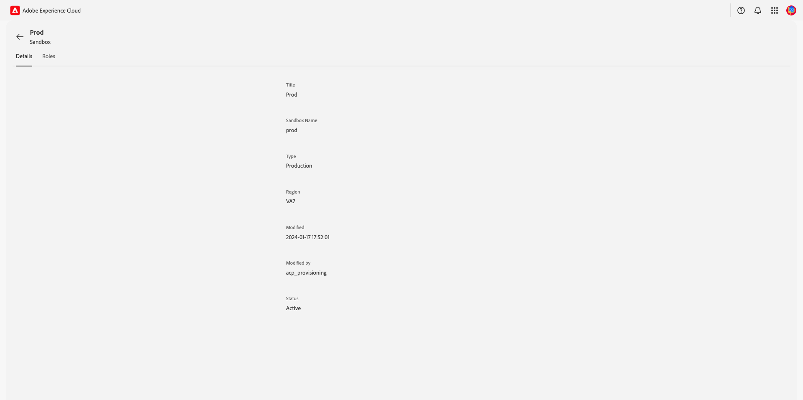
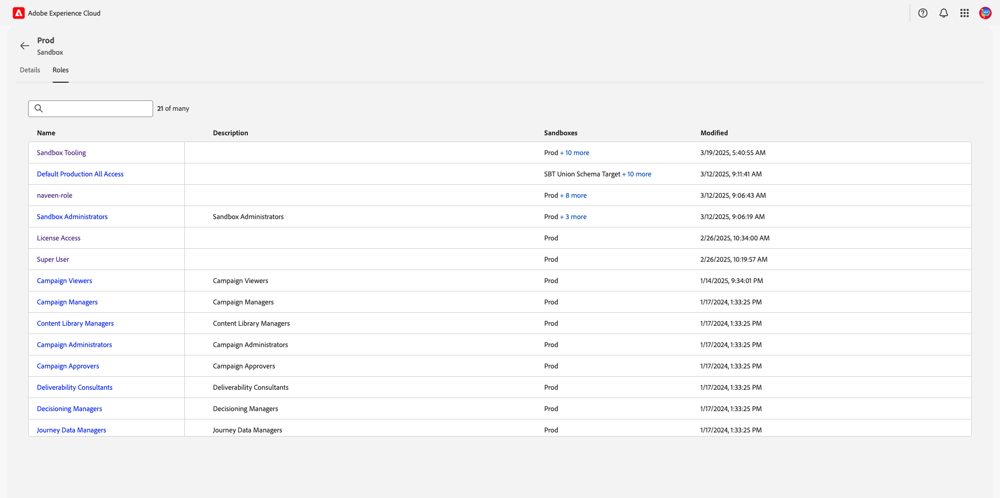

# Manage Sandboxes {#mange-sandboxes}

>[!CONTEXTUALHELP]
>id="platform_permissions_sandboxes_about"
>title="What are sandboxes?"
>abstract="Sandboxes are virtual partitions within a single instance of Experience Platform. All content and actions taken within a sandbox are confined to that sandbox and do not affect other sandboxes. Access to sandboxes is managed through roles."
>additional-url="https://experienceleague.adobe.com/en/docs/experience-platform/sandbox/home" text="Sandboxes overview"

Sandboxes are virtual partitions within a single instance of Adobe Experience Platform that seamlessly integrate the development process of your digital experience applications. All content and actions taken within a sandbox are confined to only that sandbox and do not affect any other sandboxes. For more information on sandboxes, see the [Sandboxes overview](../../../sandboxes/home.md).

## Explore sandboxes {#explore-sandboxes}

To view a sandbox's details and associated roles, navigate to **[!UICONTROL Permissions]** in [Adobe Experience Cloud](https://experience.adobe.com/){target="_blank"}. Select **[!UICONTROL Sandboxes]** from the **[!UICONTROL Resources]** section in the left panel.

A list of your organization's sandboxes appears. Select the sandbox you would like to view from the list. Alternatively, search for a sandbox by entering the sandbox's name into the search bar, or filter sandboxes by type by selecting the filter icon () and using the **[!UICONTROL Sandbox Type]** dropdown menu.

{zoomable="yes"}

>[!NOTE]
>
>The Sandbox workspace in Permissions does not allow for any sandbox management actions. To manage sandboxes, select the **[!UICONTROL Open sandbox manager]** option from the top-right of the workspace.

The **[!UICONTROL Details]** tab provides an overview of the sandbox. The overview displays the **[!UICONTROL Title]**, **[!UICONTROL Sandbox Name]**, **[!UICONTROL Type]**, **[!UICONTROL Region]**, **[!UICONTROL Modified]** date, **[!UICONTROL Modified by]**, and the **[!UICONTROL Status]** of the sandbox.

{zoomable="yes"}

Select the **[!UICONTROL Roles]** tab to view the roles the sandbox is assigned to. Selecting a role will take you to the role's workspace. 

<!-- To manage the role's sandboxes, follow the  guide. --> 

{zoomable="yes"}

## Next steps

You now know how to view the details and roles for a sandbox. To learn more about attribute-based access control, see the [attribute-based access control overview](../overview.md).
