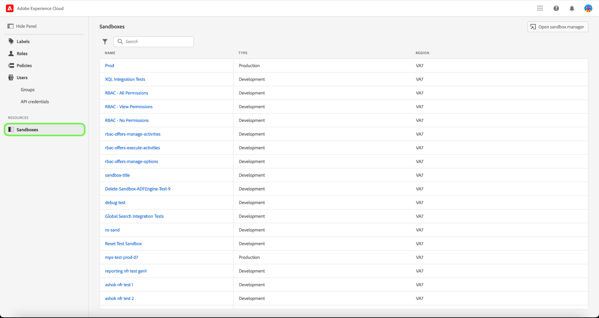
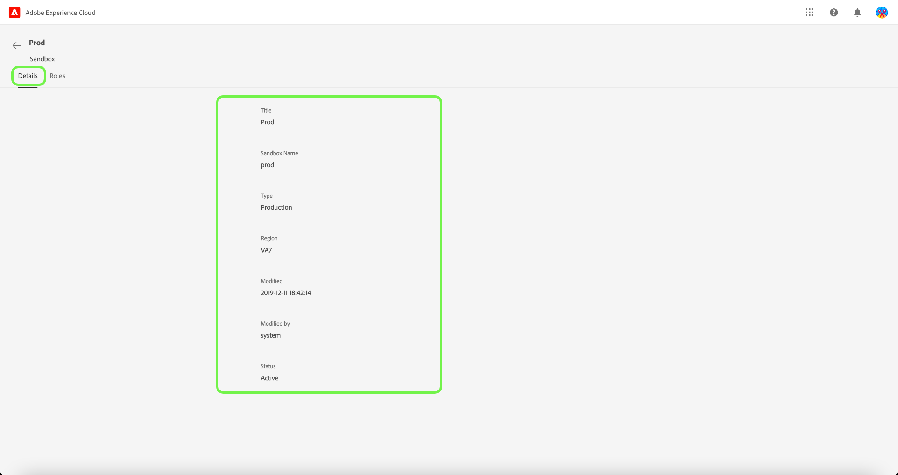
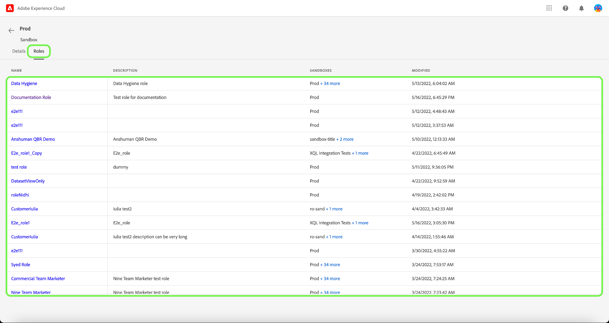

# Manage Sandboxes

Sandboxes are virtual partitions within a single instance of Experience Platform, which allow for seamless integration with the development process of your digital experience applications. All content and actions taken within a sandbox are confined to only that sandbox and do not affect any other sandboxes. For more information on sandboxes, see the [Sandboxes overview](../../../sandboxes/home.md).

## Configure sandboxes

To view details and roles that a sandbox is assigned to/with, select the **[!UICONTROL Sandboxes]** tab. 

A list of sandboxes appears. Select the sandbox you would like to view from the list. Alternatively, use the search bar to search for the sandbox by entering the sandbox name.

The details tab provides an overview of the sandbox. The overview displays the sandbox name, type, region, date of modification, who modified the sanbox, and the status of the sandbox.

Select the **[!UICONTROL Roles]** tab to view the roles the sandbox is assigned to.

## Next steps

You have now learnt how to view sandbox details and the roles it is currently assigned to. For a high-level overview of sandboxes in Experience Platform, please refer to the [sandbox overview documentation](../../sanboxes/../ui/overview.md).
