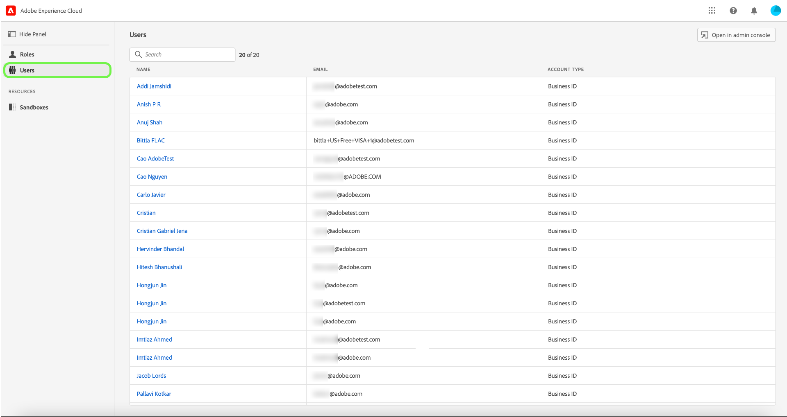
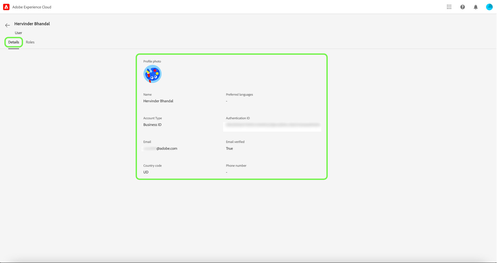
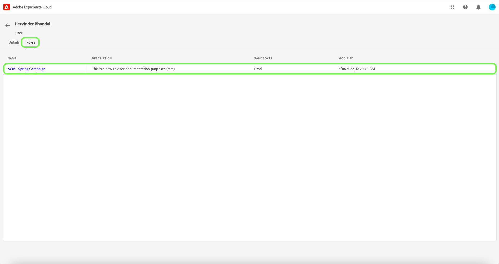

# Manage users

If you would like to view user details and roles they are assigned to, select the **[!UICONTROL Users]** tab. 

A list of users appears. Select the user you would like to view from the list. Alternatively, use the search bar to search for the user by entering their name or email address.

The details tab provides an overview of the user. The overview displays the users name, account type, email, authentication ID, contact information, and location details.

Select the **[!UICONTROL Roles]** tab to view the roles the user is assigned to.

## Developer and API access control with Experience Platform permissions

>[!NOTE]
>
>Only system administrators have the ability to view and manage API credentials in Permissions.

The transition to Adobe Experience Platform permissions has additional steps that need to be completed for the developer API workflow that previously relied on product profiles. See the guide on [API authentication](../../../landing/api-authentication.md) for more information.

## Next steps

You have now learnt how to view user details and the roles they are currently added to. To learn more about attribute-based access control, see the [attribute-based access control overview](../overview.md).
