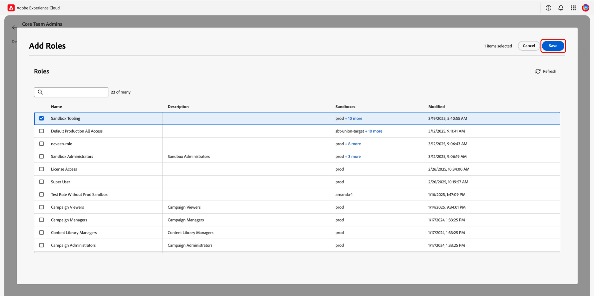
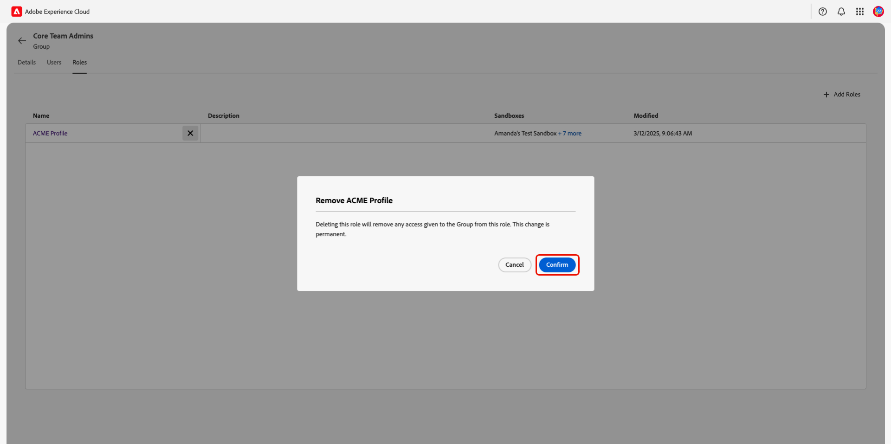

# Manage users and add user groups {#manage-users}

>[!CONTEXTUALHELP]
>id="platform_permissions_users_about"
>title="What are users?"
>abstract="Users are the individuals that have access to Experience Platform. An individual user's access to an organization's resources is managed through roles."
>additional-url="https://experienceleague.adobe.com/en/docs/experience-platform/access-control/abac/permissions-ui/roles" text="Manage roles"

Users are the individuals that have access to Adobe Experience Platform. An individual user's access to an organization's resources is managed through [roles](./roles.md){target="_blank"}. An organization can also create [user groups](#user-groups) to give seamless access to multiple user's at the same time. 

## Manage users

<!-- ADD LINKS INTO IMPORTANT NOTE BELOW
>[!IMPORTANT]
>
>[!UICONTROL Permissions] manages access control for existing Experience Platform users. To add users to Experience Platform, navigate to Adobe Admin Console through the **[!UICONTROL Edit in admin console]** option. To learn how to add users through the Admin Console, follow the [adding users to Experience Platform](...){#target="_blank"} guide.
-->

To view your organization's users, navigate to **[!UICONTROL Permissions]** in [Adobe Experience Cloud](https://experience.adobe.com/){target="_blank"}. Select **[!UICONTROL Users]** in the left panel.

{zoomable="yes"}

A list of users appears. Select the user you would like to view from the list. Alternatively, use the search bar to search for the user by entering their name or email address.

The **[!UICONTROL Details]** tab provides an overview of the user. The overview displays the user's **[!UICONTROL Name]**, **[!UICONTROL Preferred languages]**, **[!UICONTROL Account Type]**, **[!UICONTROL Authentication ID]**, **[!UICONTROL Email]**, **[!UICONTROL Email verified]** status, **[!UICONTROL Country code]**, and **[!UICONTROL Phone number]**.

{zoomable="yes"}

Select the **[!UICONTROL Roles]** tab to view the roles the user is assigned to. 

{zoomable="yes"}

### Add a role to a user {#add-user-role}

To add a role to the user, select **[!UICONTROL Add Roles]**.

{zoomable="yes"}

The **[!UICONTROL Add Roles]** dialog appears. Select the role(s) you wish to add to the user and then select **[!UICONTROL Save]**.

{zoomable="yes"}

### Remove a role from a user {#remove-user-role}

To remove a role from the user, select the **X** next to the role's name. 

<!-- ADD LINKS INTO IMPORTANT NOTE BELOW

>[!NOTE]
>
>Role's that have been added to a user through a user group cannot be removed through the user's role workspace. Role's that have been added through a user group will have an [!Info icon](/help/images/icons/info.png) beside the **X** containing information about the associated user group. To remove the role, the role would need to be [removed from the user group](#remove-user-group-role).
-->

{zoomable="yes"}

A confirm dialog appears. Select **[!UICONTROL Confirm]** to finish removing the role.

{zoomable="yes"}

## Manage user groups {#user-groups}

User groups are multiple users that have been grouped together and have the access to execute the same functions. 

<!-- ADD LINKS INTO IMPORTANT NOTE BELOW
>[!IMPORTANT]
>
>[!UICONTROL Permissions] manages access control for existing Experience Platform user groups. To add user groups to Experience Platform, navigate to Admin Console through the **[!UICONTROL Edit in admin console]** option. To learn how to add user groups in the Admin Console, follow the [adding user groups to Experience Platform](...){#target="_blank"} guide.
 -->

To view your organization's users, navigate to **[!UICONTROL Permissions]** in [Adobe Experience Cloud](https://experience.adobe.com/){target="_blank"}.Select **[!UICONTROL Groups]** from the **[!UICONTROL Users]** section in the left panel.

{zoomable="yes"}

A list of user groups appears. Select the group you would like to view from the list. 

The **[!UICONTROL Details]** tab provides an overview of the user group. The overview displays the groups's **[!UICONTROL Name]**, **[!UICONTROL Description]**, **[!UICONTROL User Count]**, and **[!UICONTROL Admin count]**.

{zoomable="yes"}

Select the **[!UICONTROL Users]** tab to view a list of users assigned to the group. 

{zoomable="yes"}

Select the **[!UICONTROL Roles]** tab to view the list of roles currently assigned to the group.

{zoomable="yes"}

### Add roles to a user group {#add-user-group-role}

To add a new role to the group, select **[!UICONTROL Add Roles]**.

{zoomable="yes"}

The **[!UICONTROL Add Roles]** dialog appears. Select the role(s) you wish to add and then select **[!UICONTROL Save]**. The roles will be added for all users belonging to the user group.

{zoomable="yes"}

### Remove roles from a user group {#remove-user-group-role}

To remove a role from the user group, select the **X** next to the role's name. 

{zoomable="yes"}

A confirm dialog appears. Select **[!UICONTROL Confirm]** to finish removing the role.

{zoomable="yes"}

## API Credentials

>[!IMPORTANT]
>
>Only system administrators have the ability to view and manage API credentials in Permissions.

To use Experience Platform APIs as a user or developer, a system administrator needs to add API credentials in addition to a role's given set of permissions. Permissions allows you to assign previously created API credentials assigned to the Experience Platform product to roles. For a complete guide on creating and assigning API credentials, as well as the permissions needed, refer to the step-by-step tutorial in [authenticate and access Experience Platform APIs](/help/landing/api-authentication.md){target="_blank"}.

To view your organizations API credentials associated with Experience Platform, navigate to **[!UICONTROL Permissions]** in [Adobe Experience Cloud](https://experience.adobe.com/){target="_blank"}. Select **[!UICONTROL API Credentials]** from the **[!UICONTROL Users]** section in the left panel.

{zoomable="yes"}

>[!NOTE]
>
> To view your organization's API Credentials across all products in your organization, or for further information on the credential, select **[!UICONTROL Edit in admin console]**. 

A list of API credentials appears. Select the API credential you would like to view from the list. 

The **[!UICONTROL Details]** tab provides an overview of the API credential. The overview displays the credentials's **[!UICONTROL Name]**, **[!UICONTROL Modified]** date, **[!UICONTROL Modified By]** attribute, **[!UICONTROL Created]** date, **[!UICONTROL Created by]** attribute, **[!UICONTROL API key]**, **[!UICONTROL Technical ID]**, and **[!UICONTROL Email]**.

{zoomable="yes"}

Select the **[!UICONTROL Roles]** tab. A list of role's associated with the API credential appears. 

{zoomable="yes"}

### Add a role to an API Credential {#add-api-credential-role}

To add a role to the API credential, select **[!UICONTROL Add Roles]**.

{zoomable="yes"}

The **[!UICONTROL Add Roles]** dialog appears. Select the role(s) you wish to add to the user and then select **[!UICONTROL Save]**.

{zoomable="yes"}

### Remove a role from an API credential {#remove-api-credential-role}

To remove a role from the API credential, select the **X** next to the API credential's name. 

{zoomable="yes"}

A confirm dialog appears. Select **[!UICONTROL Confirm]** to finish removing the role.

{zoomable="yes"}

## Next steps

You now know how to view the details and roles for a user, user group, and API credential. To learn more about attribute-based access control, see the [attribute-based access control overview](../overview.md).

<!--
The following video is intended to support your understanding of developer and API credentials.

>[!VIDEO](https://video.tv.adobe.com/v/3426407/?learn=on)
-->