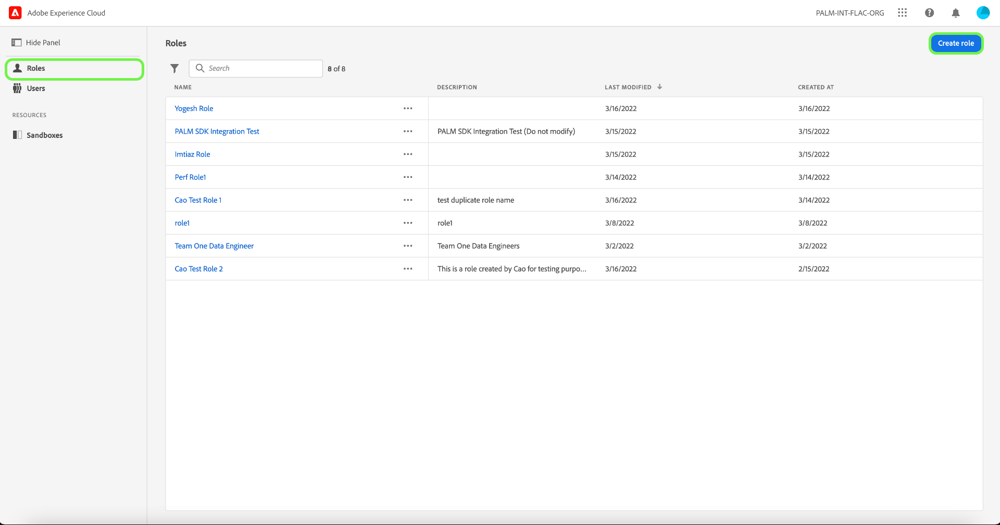
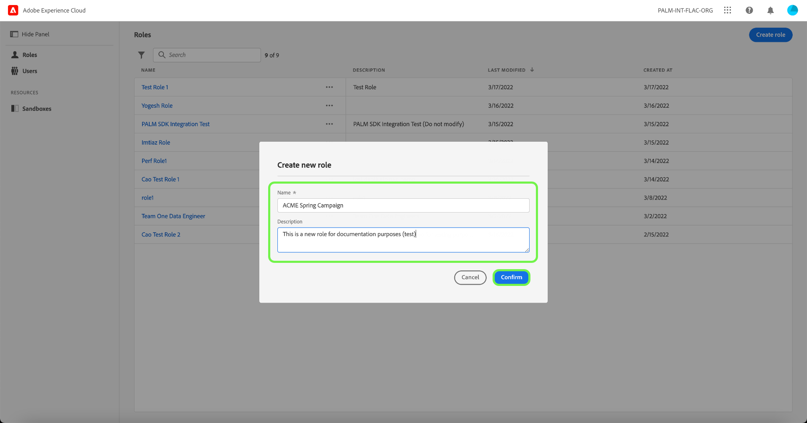
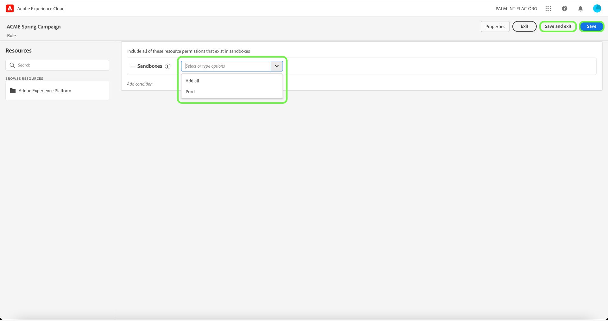
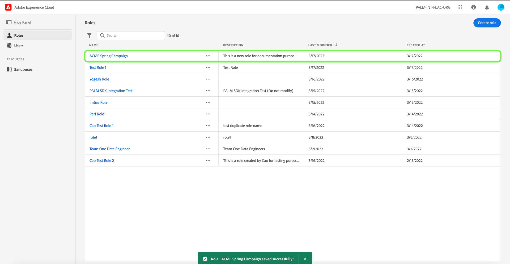

# Create a new role 

To start creating a new profile, select the **[!UICONTROL Roles]** tab in the sidebar and select **[!UICONTROL Create Role]**.

The **[!UICONTROL Create a new role]** dialog appears, prompting you to enter a name, and an optional description. 

When finished, select **[!UICONTROL Confirm]**.

The next screen prompts you to choose which resource permissions that exist in sandboxes to include in the role using the dropdown. When finished, select **[!UICONTROL Save and exit]**.

The new role is successfully created, and you are redirected to the **[!UICONTROL Roles]** page, where you will see the newly created role appear in the list. 

See the sections on [managing permissions for a role](#manage-permissions-for-a-role) for more details on how to manage role permissions once they are created.

## Next steps

With a new role created, you can proceed to the next step to [manage permissions for a role](permissions.md).
