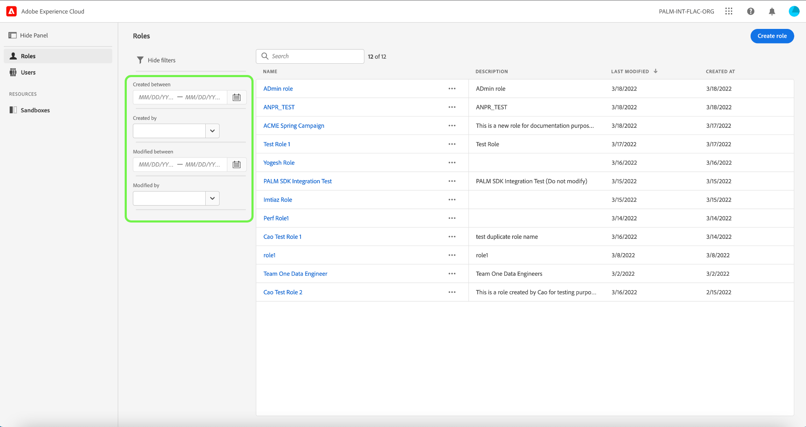
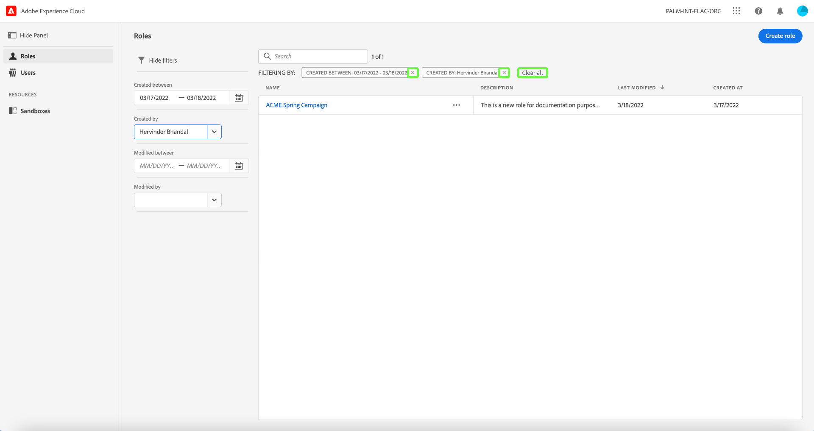
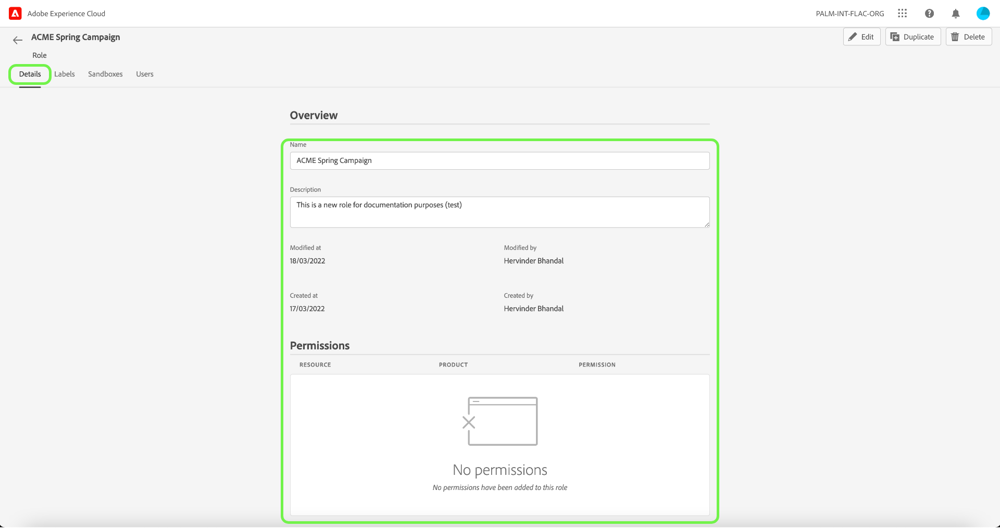
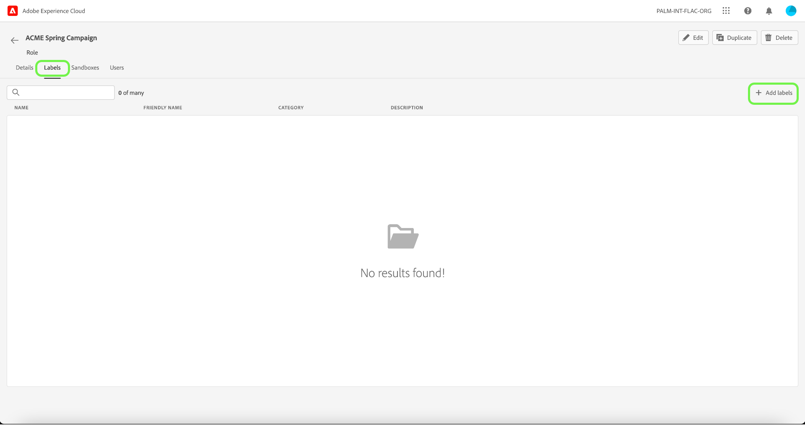
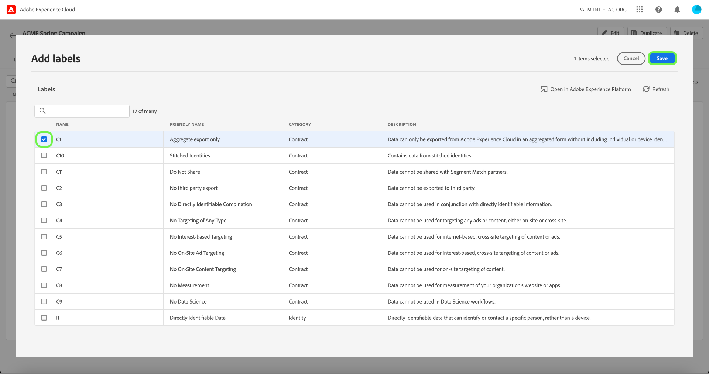
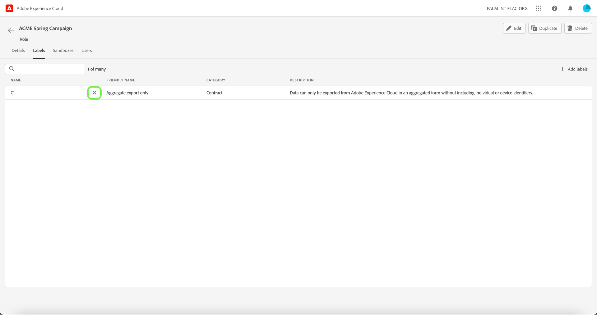
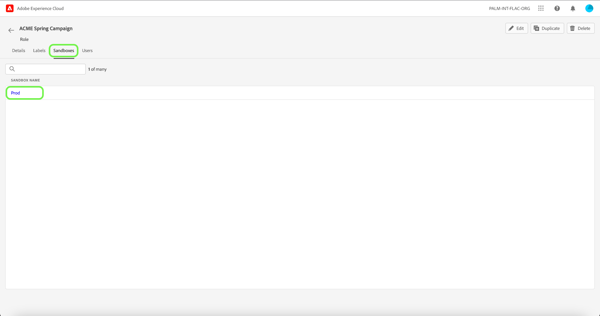
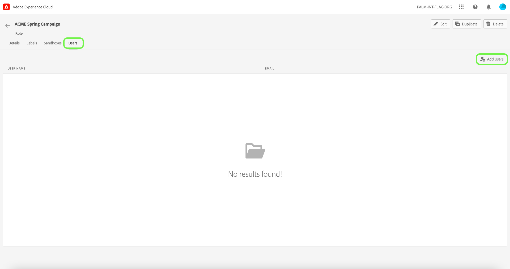
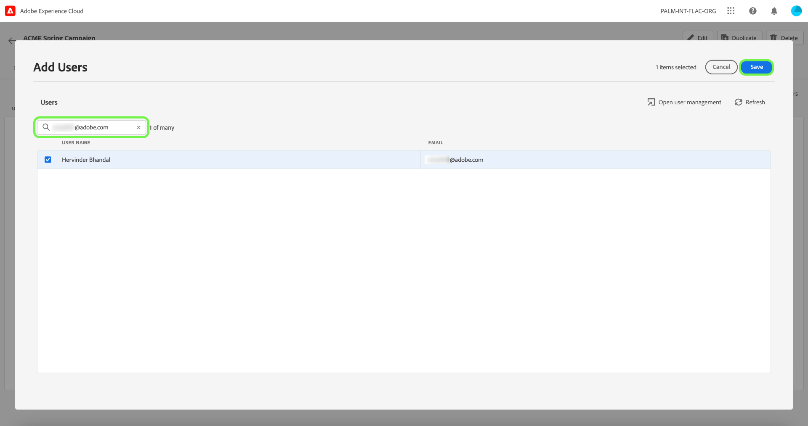

# Manage permissions for a role

## Filter roles
Select the funnel icon () to display a list of filter controls to help narrow results.

The following filters are available for roles in the UI:

| Filter | Description |
| --- | --- |
| [!UICONTROL Created between] | Select a start date and/or an end date to define a date range to filter results by. |
| [!UICONTROL Created by] | Filter by role creator by selecting a user from the dropdown. |
| [!UICONTROL Modified between] | Select a start date and/or an end date to define a date range to filter results by.  |
| [!UICONTROL Modified by] | Filter by role modifier by selecting a user from the dropdown. |

To remove a filter, select the "X" on the pill icon for the filter in question, or select **[!UICONTROL Clear all]** to remove all filters.

## Role details

## Managing labels permissions

## Managing sandboxes permissions

## Managing users permissions

## Next steps
