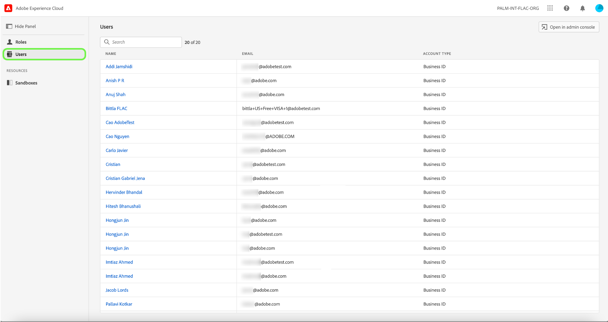

# Manage users

If you would like to view user details and roles they are assigned to, select the **[!UICONTROL Users]** tab. 

A list users appears. Select the user you would like to view from the list. Alternatively, use the search bar to search for the user by entering their name or email address.

The details tab provides an overview of the user. The overview displays the users name, account type, email, authentication ID, contact information, and location details.

Select the **[!UICONTROL Roles]** tab to view the roles the user is assigned to.

## Next steps
You have now learnt how to view user details and the roles they are currently added to.
