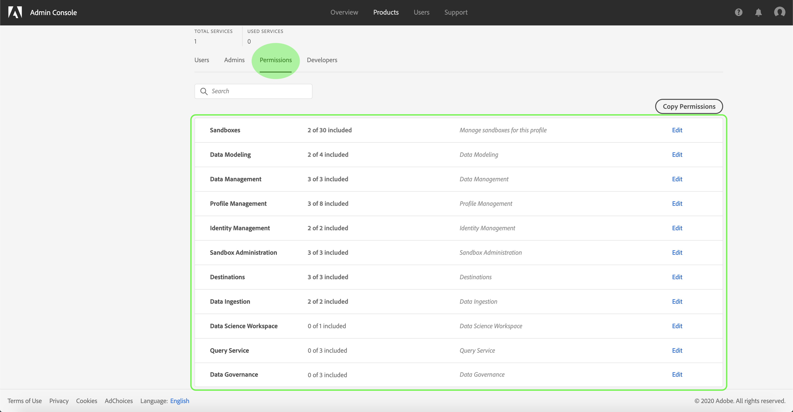

# Access control overview

Access control for [!DNL Experience Platform] is provided through the [Adobe Admin Console](https://adminconsole.adobe.com). This functionality leverages product profiles in [!DNL Admin Console], which link users with permissions and sandboxes.

## Access control hierarchy and workflow

In order to configure access control for [!DNL Experience Platform], you must have administrator privileges for an organization that has an [!DNL Experience Platform] product integration. The minimum role that grant or withdraw permissions is a **[!UICONTROL product profile administrator]**. Other administrator roles that can manage permissions are **[!UICONTROL product administrators]** (can manage all profiles within a product) and **[!UICONTROL system administrators]** (no restrictions). See the Adobe Help Center article on [administrative roles](https://helpx.adobe.com/enterprise/using/admin-roles.html) for more information.

>[!NOTE]
>
>From this point on, any mentions of "administrator" in this document refer to a product profile administrator or higher (as outlined above).

A high-level workflow for gaining and assigning access permissions can be summarized as follows:

- After licensing Adobe Experience Platform, or an Application/App Service that uses Experience Platform, an email is sent to the administrator specified during licensing.
- The administrator logs in to [Adobe Admin Console](#adobe-admin-console) and selects **Adobe Experience Platform** from the list of products on the overview page.
- The administrator can view the default [product profiles](#product-profiles) or create new customer product profiles as needed.
- The administrator can edit the permissions and users for any existing product profiles.
- When creating or editing a product profile, the administrator adds users to the profile using the **[!UICONTROL users]** tab, and grants permissions to these users (such as "[!UICONTROL Read Datasets]" or "[!UICONTROL Manage Schemas]") by accessing the **[!UICONTROL permissions]** tab. Similarly, the administrator can assign access to sandboxes using the same permissions tab.
- When users log in to the [!DNL Experience Platform] user interface, their access to [!DNL Platform] capabilities is driven by the permissions that have been granted to them from Step 2. For example, if a user does not have the "[!UICONTROL View Datasets]" permission, the **[!UICONTROL Datasets]** tab in the side menu will not be visible to that user.

For more detailed steps on how to manage access control in [!DNL Experience Platform], see the [access control user guide](./ui/overview.md).

All calls to [!DNL Experience Platform] APIs are validated for permissions, and will return errors if the appropriate permission(s) are not found in the current user context. Within the UI, elements will be hidden or altered depending on permissions granted to the current user.

## Adobe Admin Console

Adobe Admin Console provides a central location for managing Adobe product entitlements and access for your organization. Through the console, you can grant groups of users access permissions for various [!DNL Platform] capabilities, such as "[!UICONTROL Manage Datasets]", "[!UICONTROL View Datasets]", or "[!UICONTROL Manage Profiles]".

### Product profiles

In the [!DNL Admin Console], permissions are assigned to users through the use of **[!UICONTROL product profiles]**. Product profiles allow you to grant permissions to one or multiple users, and also contain their access to the scope of the sandboxes that are assigned to them through product profiles. Users can be assigned to one or multiple product profiles belonging to your organization.

### Default product profiles

[!DNL Experience Platform] comes with two pre-configured default product profiles. The following table outlines what is provided in each default profile, including the sandbox they grant access to as well as the permissions they grant within the scope of that sandbox.

| Product profile | Sandbox access | Permissions |
| --- | --- | --- |
| Default Production - All Access | Production | All permissions applicable to [!DNL Experience Platform], except for Sandbox Administration permissions. |
| Default Sandbox Administration | N/A | Provides access only to Sandbox Administration permissions. |

## Sandboxes and permissions

[!DNL Experience Platform] provides access to one Production sandbox, and allows you to create Non-Production **sandboxes**. Non-Production sandboxes are a form of data virtualization that allow you to isolate data from other sandboxes and are typically used for development experiments, testing, or trials. A product profile's **[!UICONTROL permissions]** give the profile's users access to [!DNL Platform] features within the sandbox environments to which they've been granted access to.

For more information about sandboxes in [!DNL Experience Platform], please refer to the [sandboxes overview](../sandboxes/home.md).

### Access to sandboxes

Access to sandboxes is managed through product profiles. For detailed steps on how to enable access to a sandbox for a product profile, see the [access control user guide](./ui/overview.md).

Users can be granted access to one or more sandboxes within a product profile. If one user is included in two or more product profiles, that user will have access to all sandboxes included in those profiles.

The "Sandbox Management" permission allows users to manage, view, or reset sandboxes.

### Permissions

The **permissions** tab within a product profile displays the sandboxes and permissions that are active for that profile:

Permissions that are granted through the [!DNL Admin Console] are sorted by category, with some permissions granting access to several low-level functionalities.

The following table outlines the available permissions for [!DNL Experience Platform] in the [!DNL Admin Console], with descriptions of the specific [!DNL Platform] capabilities they grant access to. For detailed steps on how to add permissions to a product profile, see the [access control user guide](./ui/overview.md).

| Category | Permission | Description |
| --- | --- | --- |
| [!DNL Data Modeling] | [!UICONTROL Manage Schemas] | Access to read, create, edit, and delete schemas and related resources. |
| [!DNL Data Modeling] | [!UICONTROL View Schemas] | Read-only access to schemas and related resources. |
| [!DNL Data Management] | [!UICONTROL Manage Datasets] | Access to read, create, edit, and delete datasets. Read-only access for schemas. |
| [!DNL Data Management] | [!UICONTROL View Datasets] | Read-only access for datasets and schemas. |
| [!DNL Data Management] | [!UICONTROL Data Monitoring] | Read-only access to monitoring datasets and streams. |
| [!DNL Profile Management] | [!UICONTROL Manage Profiles] | Access to read, create, edit, and delete datasets that are used for customer profiles. Read-only access to available profiles. |
| [!DNL Profile Management] | [!UICONTROL View Profiles] | Read-only access to available profiles. |
| [!DNL Profile Management] | [!UICONTROL Export Audience for Segment] | Ability to export an evaluated audience segment to a dataset. |
| [!DNL Identities] | [!UICONTROL Manage Identity Namespaces] | Access to read, create, edit, and delete identity namespaces. |
| [!DNL Identities] | [!UICONTROL View Identity Namespaces] | Read-only access for identity namespaces. |
| [!DNL Sandbox Administration] | [!UICONTROL Manage Sandboxes] | Access to read, create, edit, and delete sandboxes. |
| [!DNL Sandbox Administration] | [!UICONTROL View Sandboxes] | Read-only access for sandboxes belonging to your organization. |
| [!DNL Sandbox Administration] | [!UICONTROL Reset a Sandbox] | Ability to reset a sandbox. |
| [!DNL Destinations] | [!UICONTROL Manage Destinations] | Access to read, create, edit, and disable destinations.* |
| [!DNL Destinations] | [!UICONTROL View Destinations] | Read-only access to available destinations in the **[!UICONTROL Catalog]* tab and authenticated destinations in the *[!UICONTROL Browse]** tab.* |
| [!DNL Destinations] | [!UICONTROL Activate Destinations] | Ability to activate data to active destinations that have been created. This permission requires either “View Destinations” or “Manage [!UICONTROL Destinations”] to be granted to the user who will activate destinations.* |
| [!DNL Data Ingestion] | [!UICONTROL Manage Sources] | Access to read, create, edit, and disable sources. |
| [!DNL Data Ingestion] | [!UICONTROL View Sources] | Read-only access to available sources in the **[!UICONTROL Catalog]* tab and authenticated sources in the *[!UICONTROL Browse]** tab. |
| [!DNL Data Science Workspace] | [!UICONTROL Manage Data Science Workspace] | Access to read, create, edit, and delete in [!DNL Data Science Workspace]. |

_(*) This permission requires provisions to [!DNL Real-time Customer Data Platform]. For more information regarding Real-time CDP, please begin by reading the [Real-time CDP overview](https://docs.adobe.com/content/help/en/experience-platform/rtcdp/overview.html)._

## Next steps

By reading this guide, you have been introduced to the main principles of access control in [!DNL Experience Platform]. You can now continue to the [access control user guide](./ui/overview.md) for detailed steps on how use the [!DNL Admin Console] to create product profiles and assign permissions for [!DNL Platform].