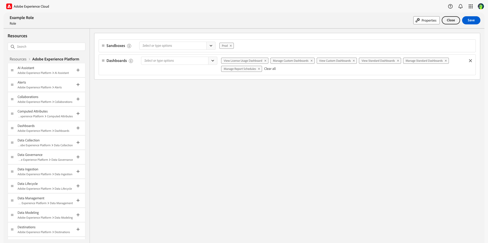

# Access control overview

Access control for Adobe Experience Platform is provided through the **[!UICONTROL Permissions]** in [Adobe Experience Cloud](https://experience.adobe.com/). This functionality leverages roles and policies, which link users with permissions and sandboxes.

## Access control hierarchy and workflow

In order to configure access control for Experience Platform, you must have system or product administrator privileges for an organization that has an Experience Platform product. The minimum role that can grant or withdraw permissions is a product administrator. Other administrator roles that can manage permissions are system administrators (no restrictions). See the Adobe Help Center article on [administrative roles](https://helpx.adobe.com/enterprise/using/admin-roles.html) for more information.

>[!NOTE]
>
>From this point on, any mentions of "administrator" in this document refer to a product administrator or higher (as outlined above).

A high-level workflow for gaining and assigning access permissions can be summarized as follows:

- After licensing Adobe Experience Platform, or an Application/App Service that uses Experience Platform, an email is sent to the administrator specified during licensing.
- The administrator logs in to [Adobe Admin Console](#adobe-admin-console) and selects **Adobe Experience Platform** from the list of products on the overview page.
- The administrator can edit the permissions and users for any existing roles.
- When creating or editing a role, the administrator adds users to the role using the **[!UICONTROL users]** tab, and grants permissions to these users (such as "[!UICONTROL Read Datasets]" or "[!UICONTROL Manage Schemas]") by editing the role's permissions. Similarly, the administrator can assign access to sandboxes using the same editing option.
- When users log in to the Experience Platform user interface, their access to Experience Platform capabilities is driven by the permissions that have been granted to them from Step 2. For example, if a user does not have the [!UICONTROL View Datasets] permission, the **[!UICONTROL Datasets]** tab in the side menu will not be visible to that user.

For more detailed steps on how to manage access control in Experience Platform, see the [access control user guide](./ui/overview.md).

All calls to Experience Platform APIs are validated for permissions, and will return errors if the appropriate permission(s) are not found in the current user context. Within the UI, elements will be hidden or altered depending on permissions granted to the current user.

## Permissions

[!UICONTROL Permissions] provides a central location for managing Experience Platform access for your organization. Through [!UICONTROL Permissions], you can grant groups of users access permissions for various Experience Platform capabilities, such as [!UICONTROL Manage Datasets], [!UICONTROL View Datasets], or [!UICONTROL Manage Profiles].

### Roles

In the [!UICONTROL Roles] section, permissions are assigned to users through the use of roles. Roles allow you to grant permissions to one or multiple users, and also contain their access to the scope of the sandboxes that are assigned to them through roles. Users can be assigned to one or multiple roles belonging to your organization.

### Default product profiles

Experience Platform comes with two pre-configured default product profiles. The following table outlines what is provided in each default profile, including the sandbox they grant access to as well as the permissions they grant within the scope of that sandbox.

| Product profile | Sandbox access | Permissions |
| --- | --- | --- |
| Default production all access | Production | All permissions applicable to Experience Platform, except for Sandbox Administration permissions. |
| Sandbox Administrators | N/A | Provides access only to Sandbox Administration permissions. |

## Sandboxes and permissions

Non-Production sandboxes are a form of data virtualization that allow you to isolate data from other sandboxes and are typically used for development experiments, testing, or trials. A product profile's permissions give the profile's users access to Experience Platform features within the sandbox environments to which they've been granted access to. A default Experience Platform license grants you five sandboxes (one production and four non-production). You can add packs of ten non-production sandboxes up to a maximum of 75 sandboxes in total. Please contact your organization's administrator or your Adobe sales representative for more details.

For more information about sandboxes in Experience Platform, please refer to the [sandboxes overview](../sandboxes/home.md).

### Access to sandboxes

Access to sandboxes is managed through roles. For detailed steps on how to enable access to a sandbox for a role, see the [attribute based access control roles guide](./abac/ui/roles.md).

Users can be granted access to one or more sandboxes within a role. If one user is included in two or more roles, that user will have access to all sandboxes included in those roles.

The "Sandbox Management" permission allows users to manage, view, or reset sandboxes.

### Resource permissions {#permissions}

The resource [!UICONTROL Permissions] tab within a role displays the sandboxes and permissions that are active for that role:

Permissions that are granted through the resource permissions are sorted by category, with some permissions granting access to several low-level functionalities.

The following table outlines the available permissions for Experience Platform in the role, with descriptions of the specific Experience Platform capabilities they grant access to. For detailed steps on how to add permissions to a role, see the [attribute based access control roles guide](./abac/ui/roles.md).

| Category | Permission | Description |
| --- | --- | --- |
| [!DNL Alerts] | [!UICONTROL View Alerts History] | Read-only access for alerts history. |
| [!DNL Alerts] | [!UICONTROL Resolve Alerts] | Access to read, edit, and delete alerts. |
| [!DNL Alerts] | [!UICONTROL View Alerts] | Read-only access for alerts. |
| [!DNL Alerts] | [!UICONTROL Manage Alerts] | Access to read, create, edit, and delete alerts history. |
| [!DNL Data Hygiene] | [!UICONTROL View Data Hygiene] | Read-only access for data hygiene.|
| [!DNL Data Hygiene] | [!UICONTROL Manage Data Hygiene] | Access to read, create, edit, and delete data hygiene. |
| [!DNL Data Modeling] | [!UICONTROL Manage Schemas] | Access to read, create, edit, and delete schemas and related resources. |
| [!DNL Data Modeling] | [!UICONTROL View Schemas] | Read-only access to schemas and related resources. |
| [!DNL Data Modeling] | [!UICONTROL Manage Relationships] | Access to read, create, edit, and delete schema relationships. |
| [!DNL Data Modeling] | [!UICONTROL Manage Identity Metadata] | Access to read, create, edit, and delete identity metadata for schemas. |
| [!DNL Data Management] | [!UICONTROL Manage Datasets] | Access to read, create, edit, and delete datasets. Read-only access for schemas. |
| [!DNL Data Management] | [!UICONTROL View Datasets] | Read-only access for datasets and schemas. |
| [!DNL Data Management] | [!UICONTROL Data Monitoring] | Read-only access to monitoring datasets and streams. |
| [!DNL Profile Management] | [!UICONTROL Manage Profiles] | Access to read, create, edit, and delete datasets that are used for customer profiles. Read-only access to available profiles. |
| [!DNL Profile Management] | [!UICONTROL View Profiles] | Read-only access to available profiles. |
| [!DNL Profile Management] | [!UICONTROL Manage Segments] | Access to read, create, edit, and delete segments. |
| [!DNL Profile Management] | [!UICONTROL View Segments] | Read-only access to available segments. |
| [!DNL Profile Management] | [!UICONTROL Manage Merge Policies] | Access to read, create, edit, and delete merge policies. |
| [!DNL Profile Management] | [!UICONTROL View Merge Policies] | Read-only access to available merge policies. |
| [!DNL Profile Management] | [!UICONTROL Export Audience for Segment] | Ability to export an evaluated audience segment to a dataset. |
| [!DNL Profile Management] | [!UICONTROL Evaluate a Segment to an Audience] | Ability to generate profiles for an audience by evaluating a segment definition.. |
| [!DNL Identity Management] | [!UICONTROL Manage Identity Namespaces] | Access to read, create, edit, and delete identity namespaces. |
| [!DNL Identity Management] | [!UICONTROL View Identity Namespaces] | Read-only access for identity namespaces. |
| [!DNL Identity Management] | [!UICONTROL View Identity Graph] | Read-only access for identity graphs. |
| [!DNL Sandbox Administration] | [!UICONTROL Manage Sandboxes] | Access to read, create, edit, and delete sandboxes. |
| [!DNL Sandbox Administration] | [!UICONTROL View Sandboxes] | Read-only access for sandboxes belonging to your organization. |
| [!DNL Sandbox Administration] | [!UICONTROL Reset a Sandbox] | Ability to reset a sandbox. |
| [!DNL Destinations] | [!UICONTROL Manage Destinations] | Access to read, create, and delete destination activation flows and destination accounts. |
| [!DNL Destinations] | [!UICONTROL View Destinations] | Read-only access to available destinations in the **[!UICONTROL Catalog]** tab and authenticated destinations in the **[!UICONTROL Browse]** tab. |
| [!DNL Destinations] | [!UICONTROL Activate Destinations] | Gives users the ability to activate segments to existing destinations. Enables the mapping step in the activation workflow. This permission requires either [!UICONTROL View Destinations] or [!UICONTROL Manage Destinations] to be granted to the user who will activate data to destinations. |
| [!DNL Destinations] | [!UICONTROL Activate Segment without Mapping] | Gives users the ability to activate segments to existing destinations, without displaying the [mapping step](../destinations/ui/activate-batch-profile-destinations.md#mapping). Users can add and remove segments in activation workflows, but cannot add or remove mapped attributes or identities. This permission requires the [!UICONTROL Activate Destinations] permission to be granted to the user who will activate data to destinations. |
| [!DNL Destinations] | [!UICONTROL Manage and Activate Dataset Destinations] | Ability to read, create, edit, and disable dataset export flows. Ability to also activate data to active datasets that have been created. |
| [!DNL Destinations] | [!UICONTROL Destination Authoring] | Ability to author destinations using [Adobe Experience Platform Destination SDK](../destinations/destination-sdk/overview.md). |
| [!DNL Data Ingestion] | [!UICONTROL Manage Sources] | Access to read, create, edit, and disable sources. |
| [!DNL Data Ingestion] | [!UICONTROL View Sources] | Read-only access to available sources in the **[!UICONTROL Catalog]** tab and authenticated sources in the **[!UICONTROL Browse]** tab. |
| [!DNL Data Ingestion] | [!DNL Manage Audience Share Connections] | Access to create, accept, and decline partner handshakes to connect two organizations and enable [!DNL Segment Match] flows. |
| [!DNL Data Ingestion] | [!DNL Manage Audience Share] | Access to read, create, edit, and publish [!DNL Segment Match] feeds with active partners. |
| [!DNL Data Science Workspace] | [!UICONTROL Manage Data Science Workspace] | Access to read, create, edit, and delete in [!DNL Data Science Workspace]. |
| Data Governance | [!UICONTROL Apply Data Usage Labels] | Access to read, create, and delete usage labels. |
| Data Governance | [!UICONTROL Manage Data Usage Policies] | Access to read, create, edit, and delete data usage policies. |
| Data Governance | [!UICONTROL View Data Usage Policies] | Read-only access for data usage policies belonging to your organization. |
| Data Governance | [!UICONTROL View User Activity Log] | Read-only access to view recorded [audit logs](../landing/governance-privacy-security/audit-logs/overview.md) of Platform activities. |
| [!DNL Dashboards] | [!UICONTROL View License Usage Dashboard] | Read-only access to view the license usage dashboard. |
| [!DNL Dashboards] | [!UICONTROL Manage Standard Dashboards] | Add custom attributes that are not yet in the data warehouse. |
| [!DNL Query Service] | [!UICONTROL Manage Queries] | Access to read, create, edit, and delete structured SQL queries for Platform data. |
| [!DNL Query Service] | [!UICONTROL Manage Query Service Integration] | Access to create, update, and delete non-expiring credentials for Query Service access. |

## Next steps

By reading this guide, you have been introduced to the main principles of access control in Experience Platform. You can now continue to the [attribute based access control user guide](./abac/overview.md) for detailed steps on how use Experience Cloud to create product profiles and assign permissions for Experience Platform.
