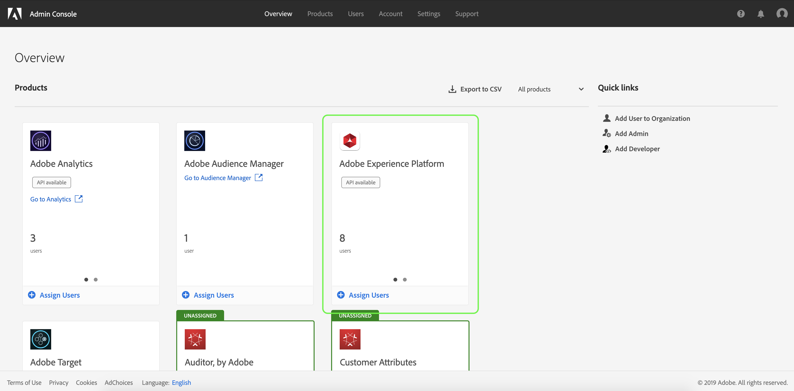
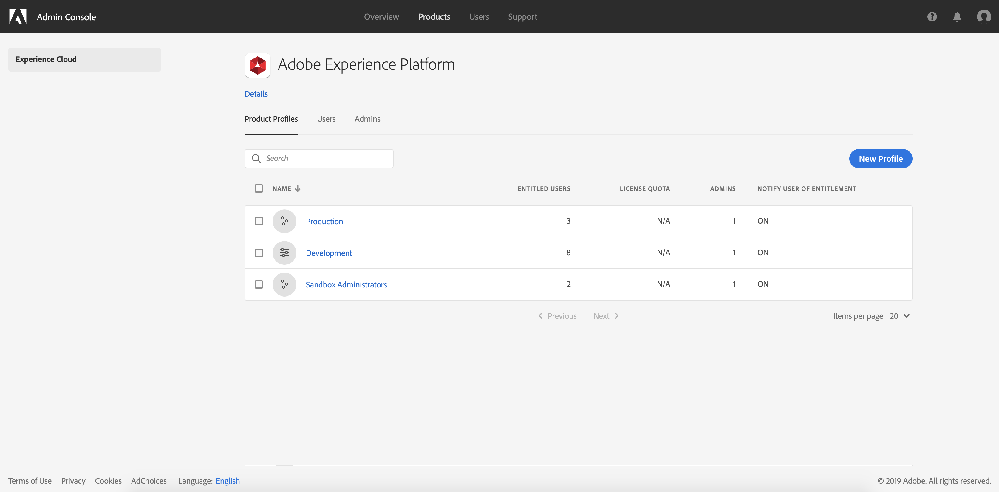

# Select a product profile to manage access control permissions for

In order to configure access control for [!DNL Experience Platform] through the Adobe Admin Console, you must be an administrator for an IMS Organization that has a subscription to [!DNL Experience Platform]. While Adobe supports flexible administrator hierarchies for IMS Orgs, you must have system administrator, product administrator, or product profile administrator privileges to configure access control. See the Adobe Help Center article on [administrative roles](https://helpx.adobe.com/enterprise/using/admin-roles.html) for more information.

If you do not have admin privileges, contact your system administrator to gain access.

Once you have admin privileges, go to [Adobe Admin Console](https://adminconsole.adobe.com) and sign in using your Adobe credentials. Once logged in, the **[!UICONTROL Overview]** page appears for the IMS Org you have admin privileges for. This page shows the products that your IMS Org is subscribed to, along with other controls to add users and admins to the IMS Org as a whole. Click **[!UICONTROL Adobe Experience Platform]** to open the access control workspace for your [!DNL Platform] integration.

The access control workspace for Adobe Experience Platform appears, opening on the **[!UICONTROL Product Profiles]** tab. This tab allows you to view all product profiles and manage various settings as outlined in this document.

This user guide focuses on how to use the [!DNL Admin Console] to assign access permissions for [!DNL Platform]. For more general information on how to navigate the [!DNL Admin Console], see the [Admin Console user guide](https://helpx.adobe.com/enterprise/using/admin-console.html).

## Next steps

Once you have navigated the access control workspace, proceed to the next step to [create a new product profile](create-profile.md)