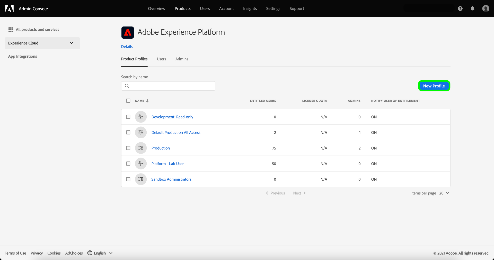
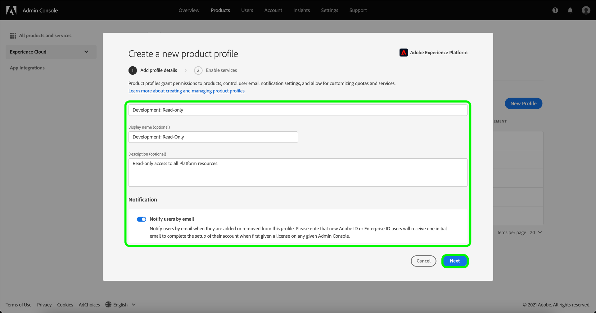
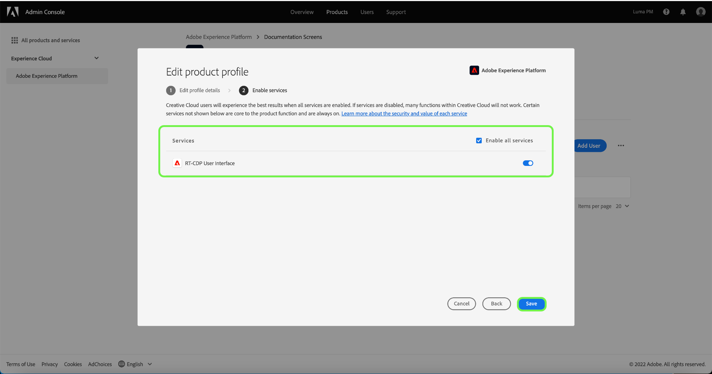
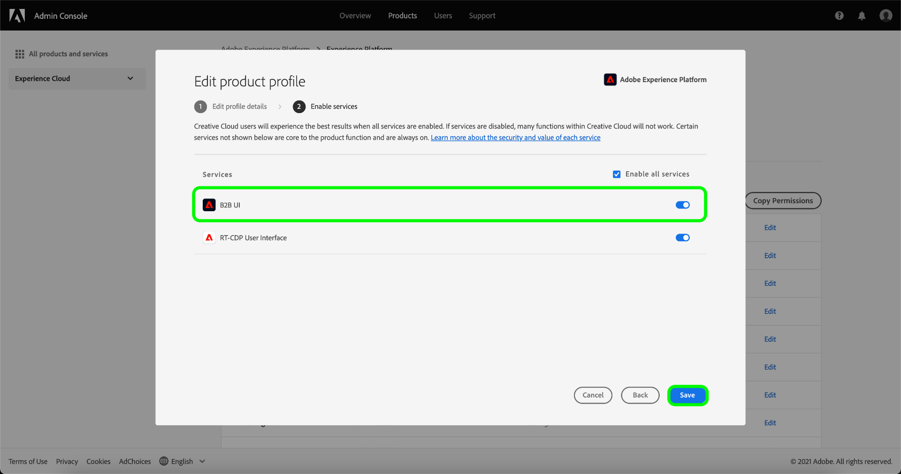

# Create a new product profile in Adobe Admin Console

To start creating a new profile, navigate to the **[!UICONTROL Product Profiles]** tab and select **[!UICONTROL New Profile]**.

The **[!UICONTROL Create a new product profile]** dialog appears, prompting you to enter a profile, an optional display name, and an optional description. Under **[!UICONTROL User Notifications]**, you can toggle whether users will be notified by email when they are added or removed from the profile.

When finished, select **[!UICONTROL Next]**.

The next screen prompts you to choose which Platform services to include in the profile. Select the toggle button next to a service to disable it. If a service is disabled, all functions associated with that service will not be available to users assigned to this product profile. When finished, select **[!UICONTROL Save]**.

Customers entitled to the B2B or B2P Edition have access to B2B UI. B2B UI can be provisioned for users through the [!UICONTROL Enable services menu]. Select the toggle beside [!UICONTROL B2B UI] to enable the service for a particular product profile, and then select **[!UICONTROL Save]**.

The B2B UI toggle enables users to view B2B workflows around managing Accounts and Opportunities, as well as create B2B related segments. For more information, see the documentation on [[!DNL Adobe Real-Time Customer Data Platform B2B Edition]](../../rtcdp/b2b-overview.md).

The new product profile is successfully created, and you are redirected to the profile's [edit permissions page](#edit-permissions). See the sections on [managing permissions](#manage-permissions-for-a-product-profile) and [managing users](#manage-users-for-a-product-profile) for more details on how to manage product profiles once they are created.

## Next steps

With a new product profile created, you can proceed to the next step to [manage permissions for a product profile](permissions.md)
