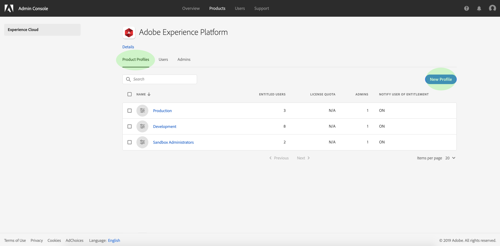
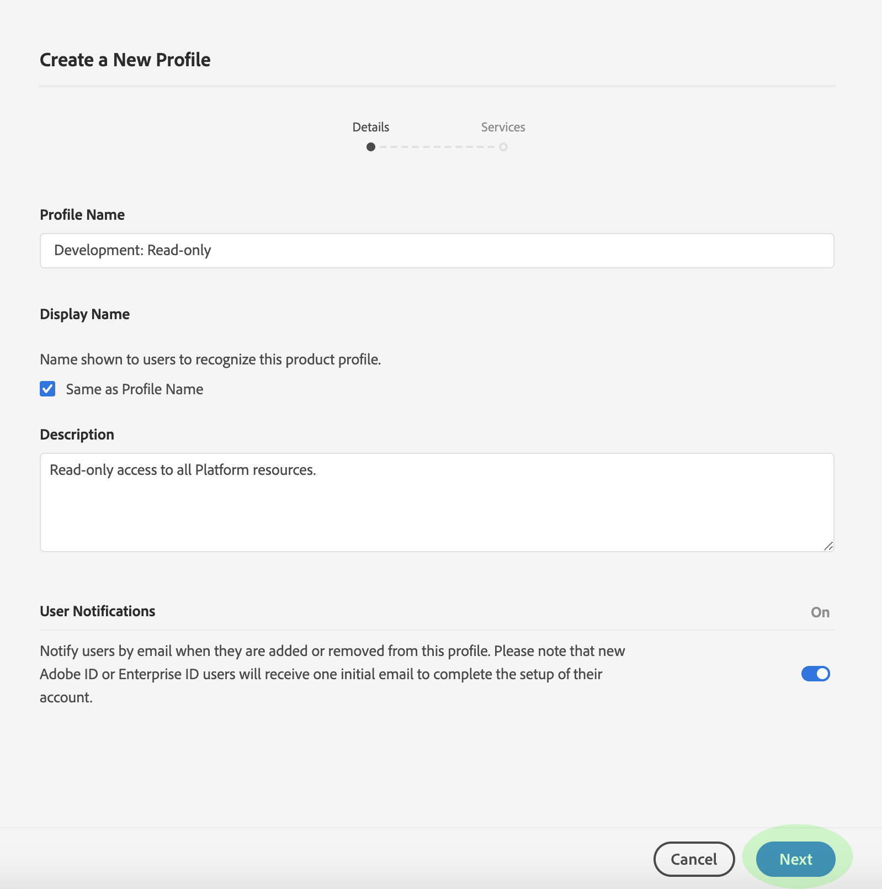
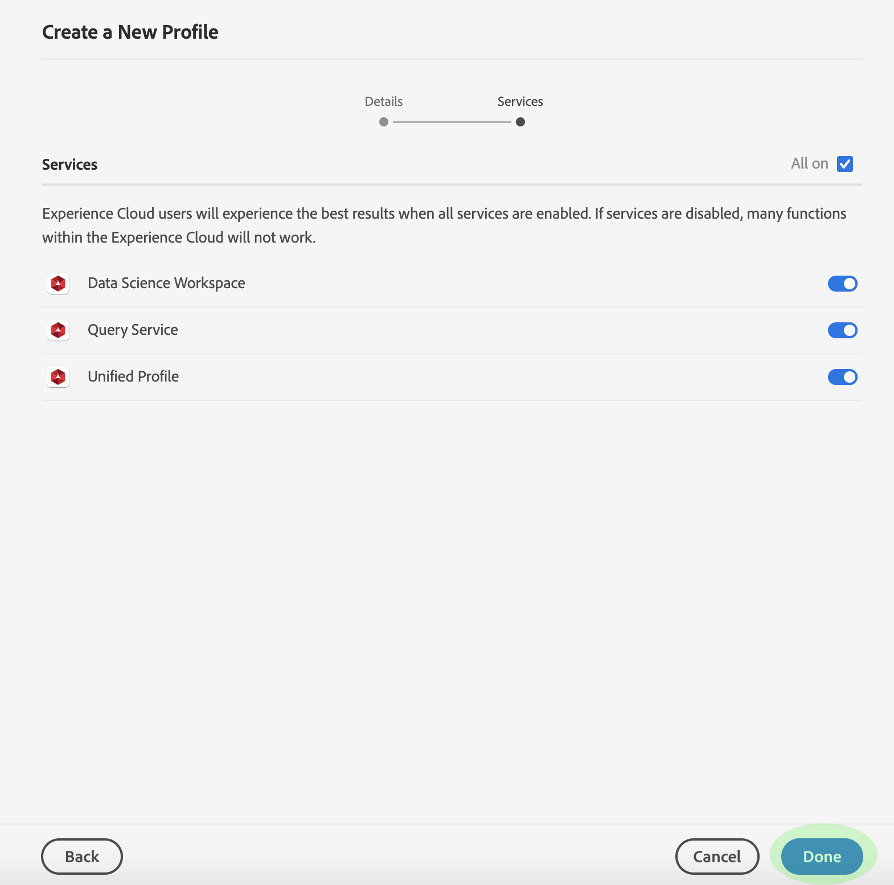

# Create a new product profile in Adobe Admin Console

To start creating a new profile, navigate to the **[!UICONTROL Product Profiles]** tab and click **[!UICONTROL New Profile]**.

The **[!UICONTROL Create New Profile]** dialog appears, prompting you to enter a profile name and description for the new profile. If you want the profile's display name to be different, uncheck **[!UICONTROL Same as Profile Name]** and enter the display name in the text box that appears. Under **[!UICONTROL User Notifications]**, you can toggle whether users will be notified by email when they are added or removed from the profile.

When finished, click **[!UICONTROL Next]**.

The next screen prompts you to choose which [!DNL Platform] services to include in the profile. Click the toggle button next to a service to disable it. If a service is disabled, all functions associated with that service will not be available to users assigned to this product profile. When finished, click **[!UICONTROL Done]**.

The new product profile is successfully created, and you are redirected to the profile's [edit permissions page](#edit-permissions). See the sections on [managing permissions](#manage-permissions-for-a-product-profile) and [managing users](#manage-users-for-a-product-profile) for more details on how to manage product profiles once they are created.

## Next steps

With a new product profile created, you can proceed to the next step to [manage permissions for a product profile](permissions.md)
