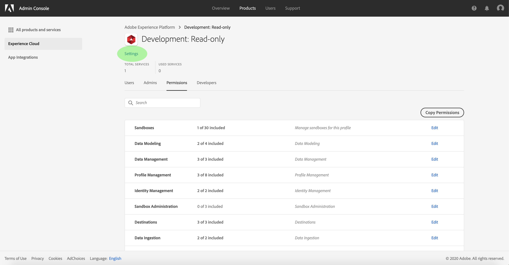
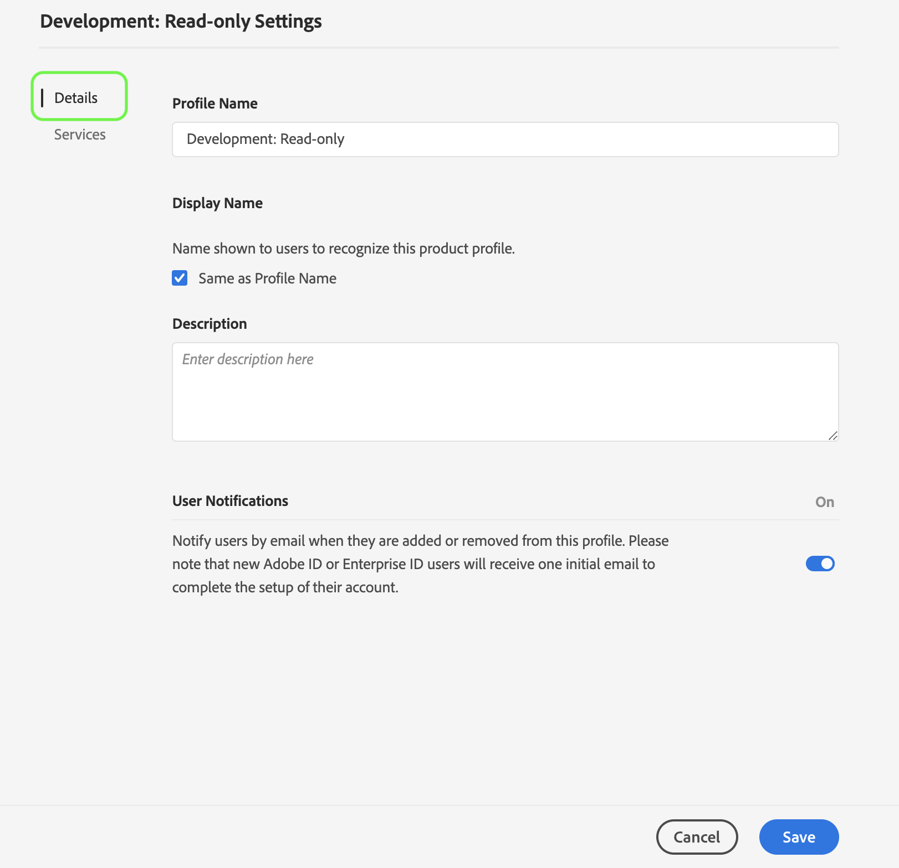
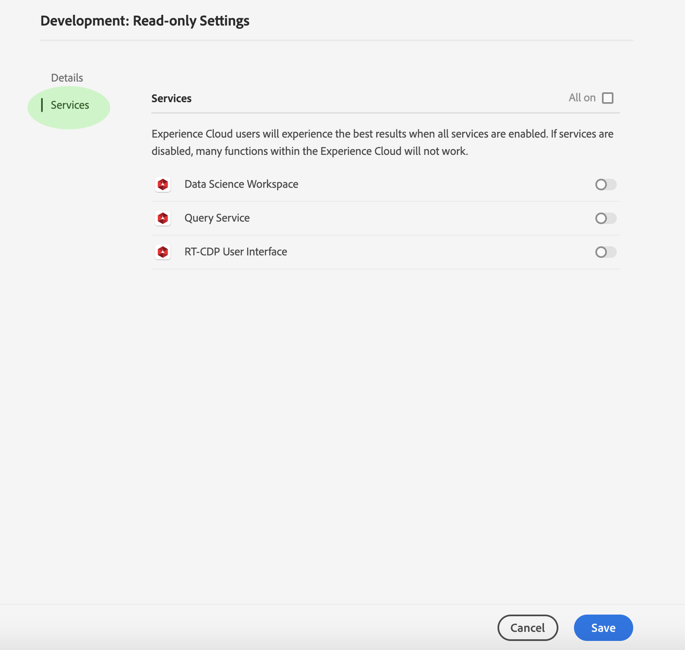
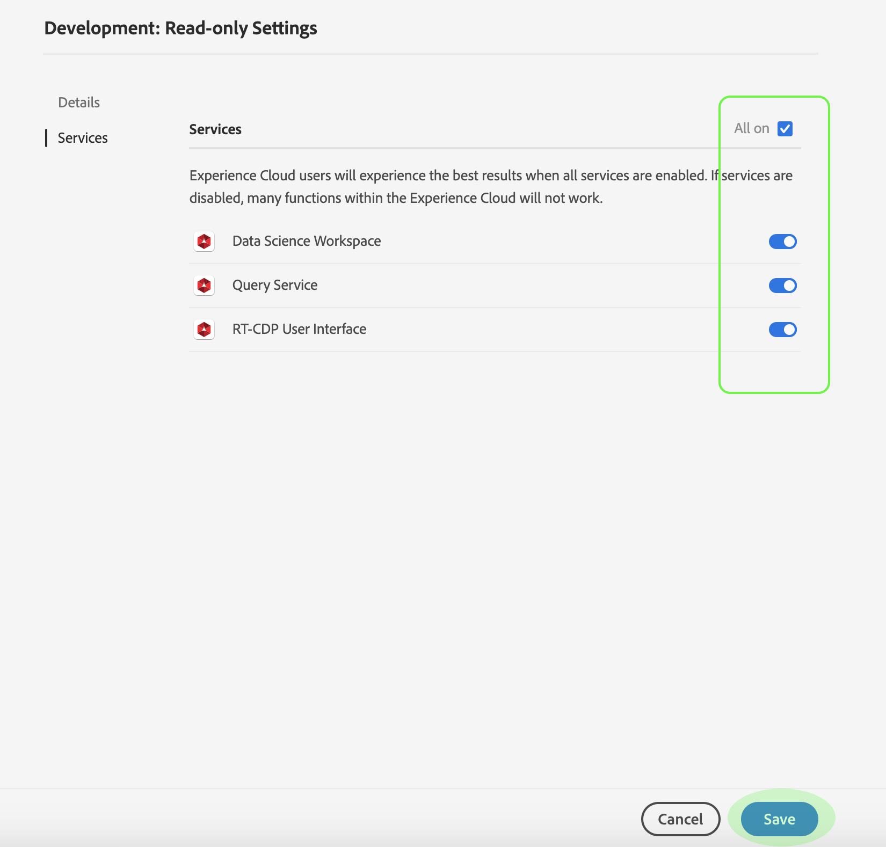

# Manage details and additional services for a product profile

You can configure a profile's details and access to additional services from within the *[!UICONTROL Profile Settings]* menu. To access the menu, click **[!UICONTROL Settings]** from the *[!UICONTROL Product Profile]* page.

The *[!UICONTROL Profile Settings]* menu appears, starting on the *[!UICONTROL Details]* tab. This tab allows you to input and edit your **[!UICONTROL Profile Name]** and **[!UICONTROL Description]**. You can also modify your **[!UICONTROL Display Name]** as well as the email notification settings for your account.

Click **[!UICONTROL Services]** to access the *[!UICONTROL Services]* page.

The *[!UICONTROL Services]* menu allows you to modify a profile's access to additional [!DNL Platform] services that were initially configured when the profile was created. Depending on your [!DNL Platform] subscription, these services can include:

- [!DNL Data Science Workspace]
- [!DNL Query Service]
- [!DNL Real-Time Customer Data Platform] UI (For Real-time CDP only)

Click the toggle on the right side of a particular service to enable or disable it. You can also click the **[!UICONTROL All on]** checkbox to enable or disable all listed services.

When finished, click **[!UICONTROL Save]**.

