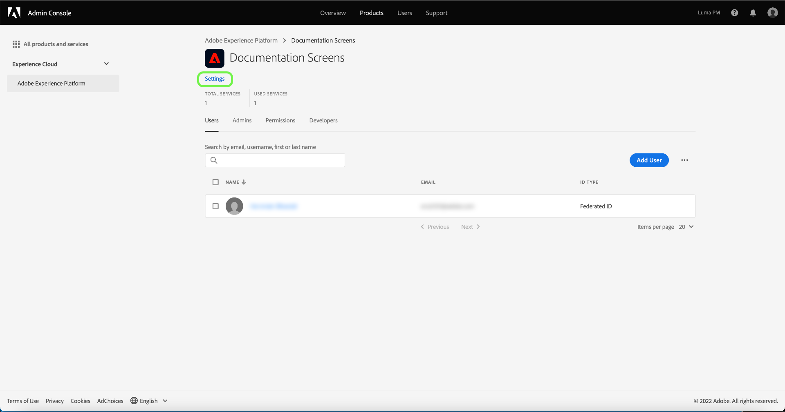
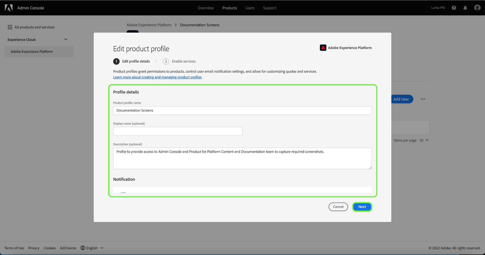

# Manage details and additional services for a product profile

You can configure a profile's details and access to additional services from within the **[!UICONTROL Profile Settings]** menu. To access the menu, select **[!UICONTROL Settings]** from the **[!UICONTROL Product Profile]** page.

The **[!UICONTROL Edit product profile]** menu appears, starting on the **[!UICONTROL Edit profile details]** tab. This tab allows you to input and edit your profile name and description. You can also modify your display name as well as the email notification settings for your account.

Select **[!UICONTROL Next]** to access the **[!UICONTROL Enable services]** page.

The **[!UICONTROL Enable services]** menu allows you to modify a profile's access to additional [!DNL Platform] services that were initially configured when the profile was created. Depending on your [!DNL Platform] subscription, these services can include:

- [!DNL Data Science Workspace]
- [!DNL Query Service]
- [!DNL Adobe Real-Time Customer Data Platform] UI (For Real-Time CDP only)
- B2B UI

Click the toggle on the right side of a particular service to enable or disable it. You can also select the **[!UICONTROL All on]** checkbox to enable or disable all listed services.

When finished, select **[!UICONTROL Save]**.

Customers entitled to the B2B or B2P Edition have access to B2B UI. B2B UI can be provisioned for users through the [!UICONTROL Enable services menu]. Select the toggle beside [!UICONTROL B2B UI] to enable the service for a particular product profile, and then select **[!UICONTROL Save]**.

The B2B UI toggle enables users to view B2B workflows around managing Accounts and Opportunities, as well as create B2B related segments. For more information, see the documentation on [[!DNL Adobe Real-Time Customer Data Platform B2B Edition]](../../rtcdp/b2b-overview.md).

