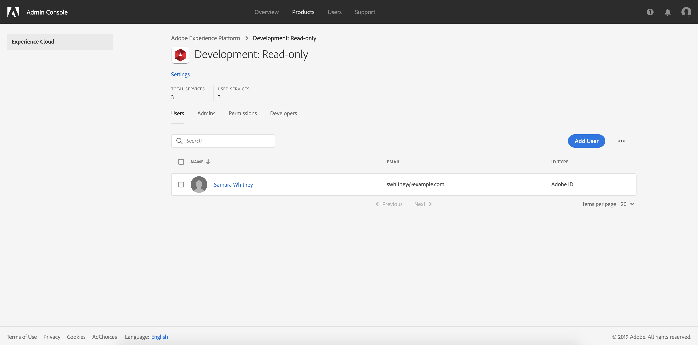

# Access control user guide

Access control in Adobe Experience Platform allows you to manage roles and permissions for various Platform capabilities by using the [Adobe Admin Console](https://adminconsole.adobe.com). This document serves as a guide for how to navigate the Admin Console to manage access control for Platform. For a high-level overview of access control in Experience Platform, see the [access control overview](./../home.md). 

The following tasks are covered:

- [Access control user guide](#access-control-user-guide)
  - [Access the Admin Console](#access-the-admin-console)
  - [Create a new product profile](#create-a-new-product-profile)
  - [Manage permissions for a product profile](#manage-permissions-for-a-product-profile)
    - [Edit permissions](#edit-permissions)
  - [Manage details and additional services for a product profile](#manage-details-and-additional-services-for-a-product-profile)
  - [Manage users for a product profile](#manage-users-for-a-product-profile)
  - [Next steps](#next-steps)

## Access the Admin Console

In order to configure access control for Experience Platform through the Adobe Admin Console, you must be an administrator for an IMS Organization that has a subscription to Experience Platform. While Adobe supports flexible administrator hierarchies for IMS Orgs, you must have **system administrator**, **product administrator**, or **product profile administrator** privileges to configure access control. See the Adobe Help Center article on [administrative roles](https://helpx.adobe.com/enterprise/using/admin-roles.html) for more information.

If you do not have admin privileges, contact your system administrator to gain access.

Once you have admin privileges, go to [Adobe Admin Console](https://adminconsole.adobe.com) and sign in using your Adobe credentials. Once logged in, the *Overview* page appears for the IMS Org you have admin privileges for. This page shows the products that your IMS Org is subscribed to, along with other controls to add users and admins to the IMS Org as a whole. Click **Adobe Experience Platform** to open the access control workspace for your Platform integration.

The access control workspace for Adobe Experience Platform appears, opening on the *Product Profiles* tab. This tab allows you to view all product profiles and manage various settings as outlined in this document.

This user guide focuses on how to use the Admin Console to assign access permissions for Platform. For more general information on how to navigate the Admin Console, see the [Admin Console user guide](https://helpx.adobe.com/enterprise/using/admin-console.html).

## Create a new product profile

To start creating a new profile, navigate to the *Product Profiles* tab and click **New Profile**.

The _Create New Profile_ dialog appears, prompting you to enter a **Profile Name** and **Description** for the new profile. If you want the profile's display name to be different, uncheck **Same as Profile Name** and enter the display name in the text box that appears. Under *User Notifications*, you can toggle whether users will be notified by email when they are added or removed from the profile.

When finished, click **Next**.

The next screen prompts you to choose which Platform services to include in the profile. Click the toggle button next to a service to disable it. If a service is disabled, all functions associated with that service will not be available to users assigned to this product profile. When finished, click **Done**.

The new product profile is successfully created, and you are redirected to the profile's [edit permissions page](#edit-permissions). See the sections on [managing permissions](#manage-permissions-for-a-product-profile) and [managing users](#manage-users-for-a-product-profile) for more details on how to manage product profiles once they are created.

## Manage permissions for a product profile

Immediately after [creating a new product profile](#create-a-new-product-profile), you are prompted to configure the profile's permissions. If you are editing permissions for an existing profile, select the profile from the *Product Profiles* tab to open the profile's details page, then click **Permissions**.

Permissions are divided into categories and listed on this page. The list displays the category name, the number of permissions it contains (and how many are active), and its description.

Click any category on the list to open the *Edit Permissions* page.

### Edit permissions

The *Edit Permissions* page provides a workspace to add and remove permissions from the selected product profile. The left side of the screen displays a list of permission categories. Clicking a category changes the permissions that are displayed under *Available Permissions Items*.

To add a permission, click the **plus (+)** icon next to the permission's name. Alternatively, you can click **Add all** to add all permissions under the current category to the profile. Added permissions appear under *Included Permission Items*.

> **Note**: The *Included Permissions Items* list only displays added permissions from the currently selected category.

To remove a permission, click the **X** icon next to the permission's name, or select **Remove all** to remove all permissions under the current category. Removed permissions reappear under *Available Permission Items*.

Continue going through the available categories and adding any desired permissions. When finished, click **Save**.

The *Permissions* tab for the product profile reappears, and shows that the selected permissions are now active.

## Manage details and additional services for a product profile

You can configure a profile's details and access to additional services from within the *Profile Settings* menu. To access the menu, click **Settings** from the *Product Profile* page.

The *Profile Settings* menu appears, starting on the *Details* tab. This tab allows you to input and edit your **Profile Name** and **Description**. You can also modify your **Display Name** as well as the email notification settings for your account.

Click **Services** to access the *Services* page.

The *Services* menu allows you to modify a profile's access to additional Platform services that were initially configured when the profile was created. Depending on your Platform subscription, these services can include:

- Data Science Workspace
- Query Service
- Real-Time Customer Data Platform UI (For Real-time CDP only)

Click the toggle on the right side of a particular service to enable or disable it. You can also click the **All on** checkbox to enable or disable all listed services.

When finished, click **Save**.

## Manage users for a product profile

To assign or remove users from a product profile, open the profile's details page and navigate to the *Users* tab. From here, click **Add User**.

The *Add User* dialog appears. Using the search field, you can lookup users to add either by name or by email. As you type, matching users will appear in an autocomplete window below the textbox.

> **Note:** If a user does not appear in the autocomplete window, enter their complete email address in the search bar. An invite will be sent to the email with instructions on setting up an Adobe ID account.

Once you have selected a user, click **Save** to add them to the product profile.

The *Users* tab for the product profile reappears, where the added user is now listed.

## Next steps

Repeat the above steps to continue adding users as necessary. Now that you have learned how to control access to Platform features through the Admin Console, see the appendix section in the [access control overview](../home.md) to learn more about each individual permission and the Platform functionalities they grant access to.  