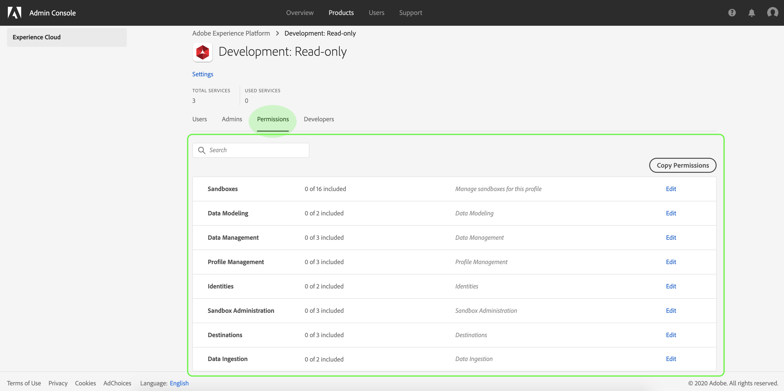
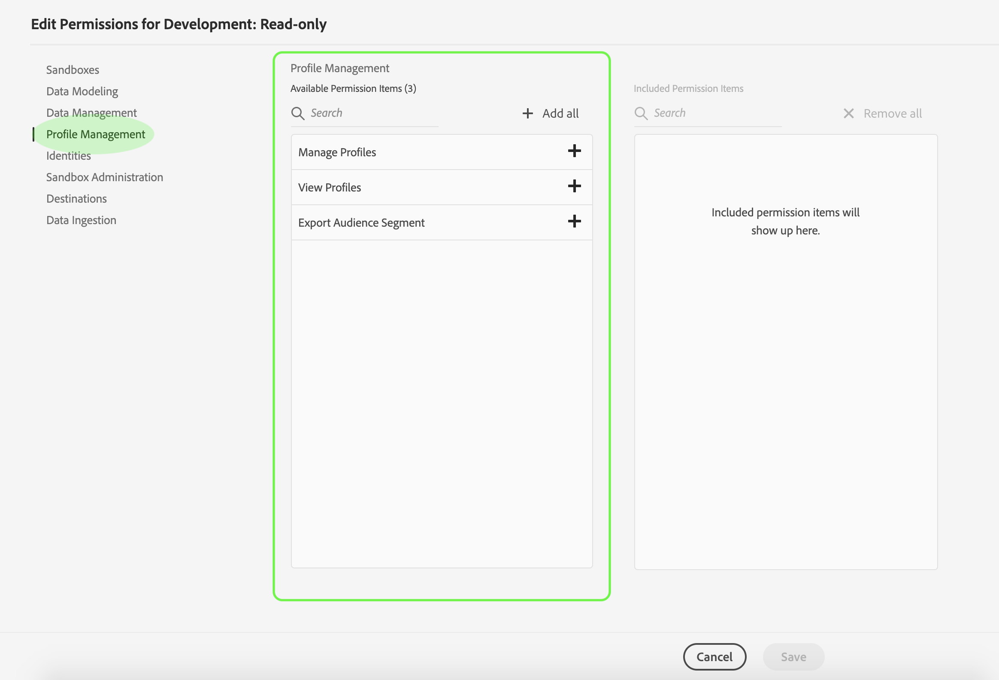
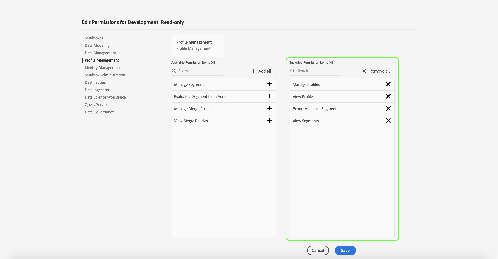
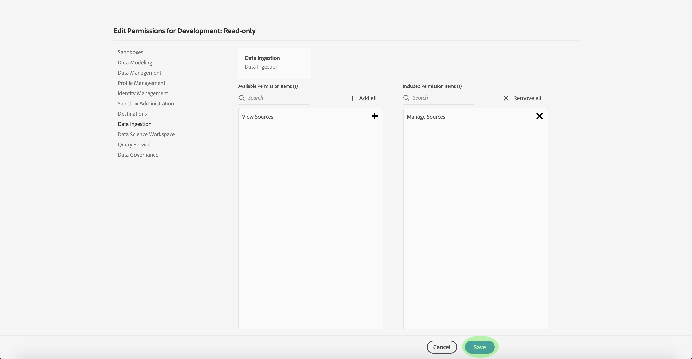
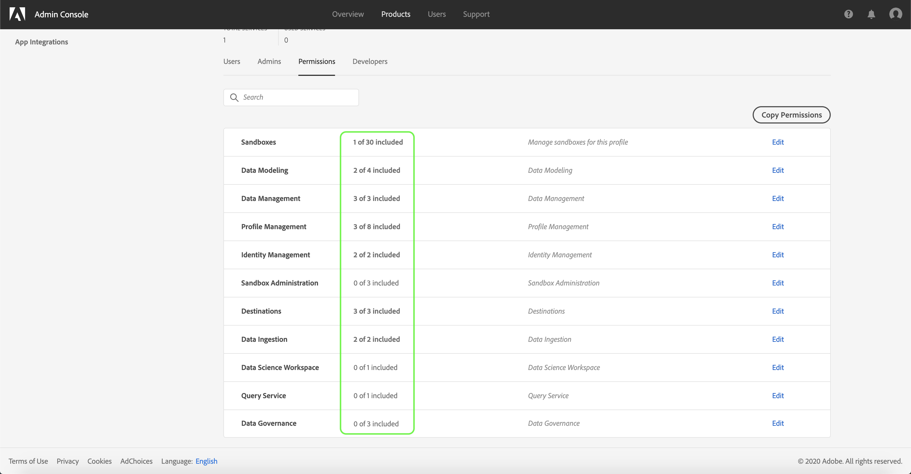

# Manage permissions for a product profile

Immediately after [creating a new product profile](#create-a-new-product-profile), you are prompted to configure the profile's permissions. If you are editing permissions for an existing profile, select the profile from the *Product Profiles* tab to open the profile's details page, then click **Permissions**.

Permissions are divided into categories and listed on this page. The list displays the category name, the number of permissions it contains (and how many are active), and its description.

Click any category on the list to open the *Edit Permissions* page.

The *Edit Permissions* page provides a workspace to add and remove permissions from the selected product profile. The left side of the screen displays a list of permission categories. Clicking a category changes the permissions that are displayed under *Available Permissions Items*.

To add a permission, click the **plus (+)** icon next to the permission's name. Alternatively, you can click **Add all** to add all permissions under the current category to the profile. Added permissions appear under *Included Permission Items*.

> **Note**: The *Included Permissions Items* list only displays added permissions from the currently selected category.

To remove a permission, click the **X** icon next to the permission's name, or select **Remove all** to remove all permissions under the current category. Removed permissions reappear under *Available Permission Items*.

Continue going through the available categories and adding any desired permissions. When finished, click **Save**.

The *Permissions* tab for the product profile reappears, and shows that the selected permissions are now active.

