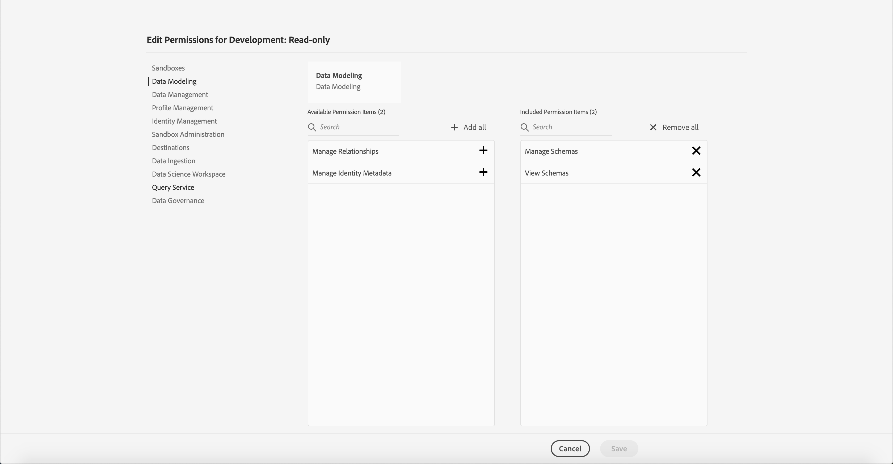
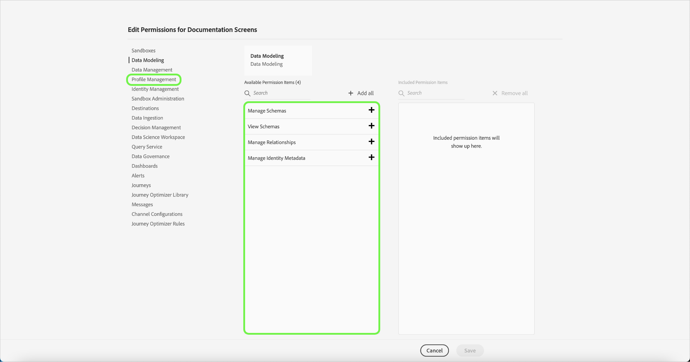
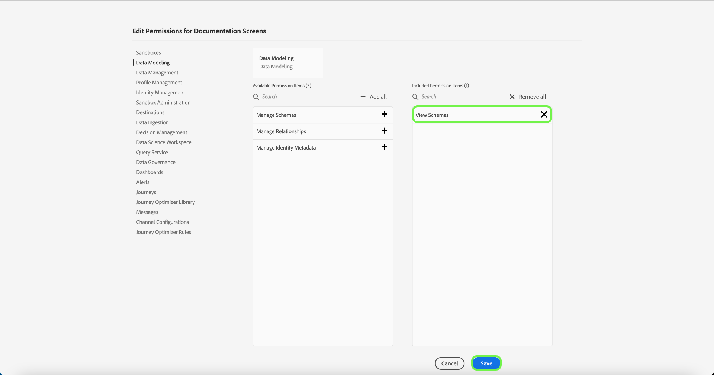
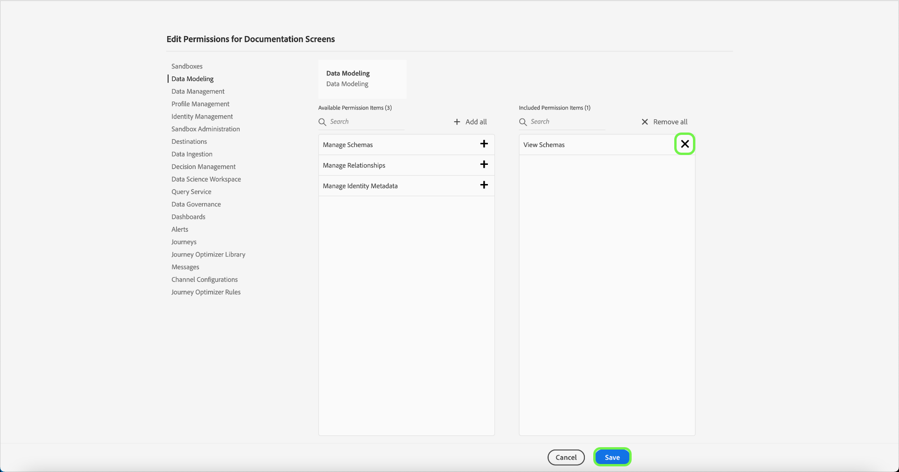

# Manage permissions for a product profile

Immediately after [creating a new product profile](#create-a-new-product-profile), you are prompted to configure the profile's permissions. If you are editing permissions for an existing profile, select the profile from the **[!UICONTROL Product Profiles]** tab to open the profile's details page, then select **[!UICONTROL Permissions]**.

Permissions are divided into categories and listed on this page. The list displays the category name, the number of permissions it contains (and how many are active), and its description.

Select any category on the list to open the **[!UICONTROL Edit Permissions]** page.

The **[!UICONTROL Edit Permissions]** page provides a workspace to add and remove permissions from the selected product profile. The left side of the screen displays a list of permission categories. Selecting a category changes the permissions that are displayed under **[!UICONTROL Available Permissions Items]**.

For example, to update permissions for Data Modeling, select **[!UICONTROL Data Modeling]**.

To add a permission, select the plus **(+)** icon next to the permission's name. Alternatively, you can select **[!UICONTROL Add all]** to add all permissions under the current category to the profile. Added permissions appear under **[!UICONTROL Included Permission Items]**.

>[!NOTE]
>
>The **[!UICONTROL Included Permissions Items]** list only displays added permissions from the currently selected category.

To remove a permission, select the **X** icon next to the permission's name, or select **[!UICONTROL Remove all]** to remove all permissions under the current category. Removed permissions reappear under **[!UICONTROL Available Permission Items]**.

Continue going through the available categories and adding any desired permissions. When finished, select **[!UICONTROL Save]**.

The **[!UICONTROL Permissions]** tab for the product profile reappears, and shows that the selected permissions are now active.

## Next steps

With permissions established, you can proceed to the next step to [manage details and services for a product profile](details-and-services.md)
