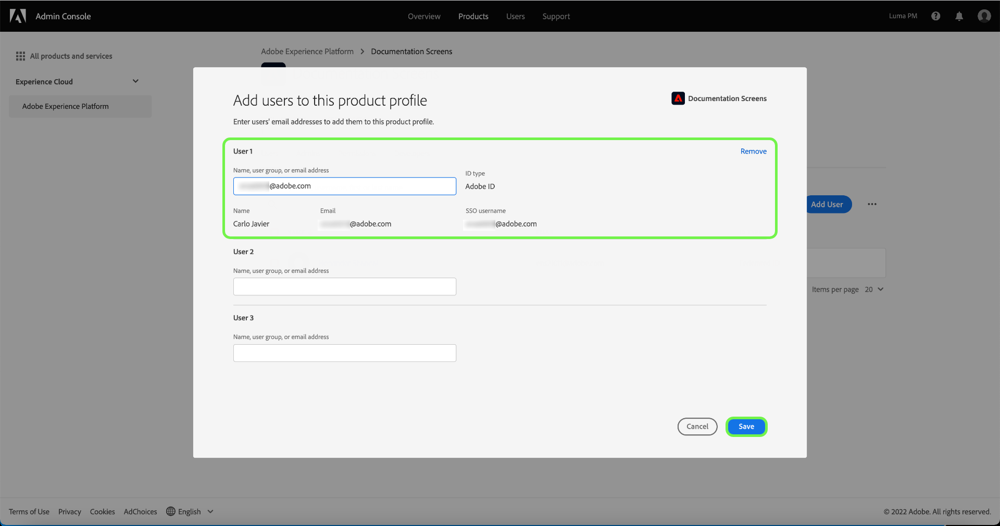

# Manage users for a product profile

To assign or remove users from a product profile, open the profile's details page and navigate to the **[!UICONTROL Users]** tab. From here, select **[!UICONTROL Add User]**.

![The product profile details page showing the users listed in the [!UICONTROL Users] tab.](../images/add-user.png)

The **[!UICONTROL Add User]** dialog appears. Using the search field, you can lookup users to add either by name or by email. As you type, matching users will appear in an autocomplete window below the textbox.

>[!NOTE]
>
>If a user does not appear in the autocomplete window, enter their complete email address in the search bar. An invite will be sent to the email with instructions on setting up an Adobe ID account.

Once you have selected a user, select **[!UICONTROL Save]** to add them to the product profile.

The following video is intended to support your understanding of managing admins for a product profile.

>[!VIDEO](https://video.tv.adobe.com/v/333860/?learn=on)

## Next steps

 Now that you have learned how to control access to Platform features through the [!DNL Admin Console], see the appendix section in the [access control overview](../home.md) to learn more about each individual permission and the Platform functionalities they grant access to.
