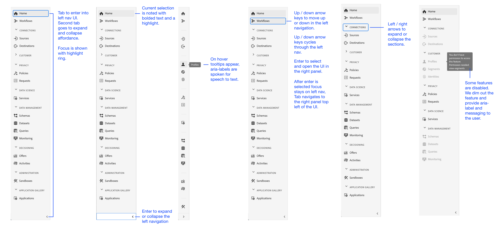

# Custom accessibility solutions for Experience Platform

Adobe Experience Platform is continuously enhanced to meet the needs of all types of users and adhere to the worldwide standards that include individuals with visual, auditory, mobility, or other impairments. This document outlines custom accessibility solutions within the Experience Platform user interface.

## Homepage and UI overview

The Experience Platform user interface meets required contrast ratios for normal text, graphics, and UI components. The colors of the user interface have also been chosen to support accessibility for all users, including those with visual disabilities. 

In Platform, UI elements that are clickable or actionable with a pointed can also be engaged using a keyboard. This includes the left navigation, video players, tables, and more.

Experience Platform strives to meet the Web Accessibility Initiative - Accessible Rich Internet Applications (WAI-ARIA) web standards, including the addition of ARIA labels to UI elements.

## Left navigation

The left navigation within the Experience Platform UI is keyboard accessible and provides color contrast in normal, hover, and selection states that meet accessibility standards.

When using the left navigation, the following functionality improves accessibility: 
* From the Home screen, users can tab into the left navigation. Selecting `Shift + tab` returns the user to the Home screen.
* With the left navigation in focus, selecting tab takes users to the expand and collapse affordance at the bottom of the navigation panel. The ability to expand or collapse the left navigation is activated with the Enter (Return) key.
* With the left navigation in focus, up and down arrow keys navigate to each item in the navigation and continuously cycles (in other words, the focus does not shift away until the user tabs away from the left navigation).
* Focus is shown for navigation items when selected. The current selection is shown with a highlight and bolded text.
* Sections within the left navigation can be expanded and collapsed using the left and right arrow keys. 
* When selecting a left navigation item, the Enter (Return) key will open the selected UI item in the right panel, however focus remains in left navigation until the user tabs away.
* Some features within Platform are not enabled for all users. These items appear in the navigation but are not able to be selected. When navigating with a keyboard, these items will be skipped during arrow navigation and the user will not be able to select the item using the Enter (Return) key.
* All items in the left navigation have [ARIA-labels]((https://www.w3.org/WAI/standards-guidelines/aria/)).

## Embedded video dialog

Videos can be viewed within Experience Platform by using keyboard navigation to highlight and select an available video link. This opens an embedded video dialog within the Platform UI.

## Video dialog keyboard accessibility

The embedded video dialog can also be navigated using the keyboard. The following table outlines the complete keyboard navigation available for the embedded video dialog.

|Dialog Element|Keyboard accessibility|Description|
|---|---|---|
|Play & Pause|Tab Spacebar|Use the tab key to set focus on play button. The spacebar begins video playback and pauses video playback.|
|Scrubber|Tab Left arrow Right arrow|When video is playing, use tab key to focus scrubber. With the scrubber in focus, left and right arrow keys skip video playback ahead and back 5 seconds, respectively.|
|Mute|Tab Spacebar|Use the tab key to focus the mute volume element. Use the spacebar to mute or unmute video playback.|
|Volume|Tab Left arrow Right arrow|Use tab key to focus on volume element. Left and right arrow keys move volume up and down, respectively.|
|[!UICONTROL Closed Captions] ("cc")|Tab Enter Up arrow Down arrow|Tab to [!UICONTROL Closed Captions] ("cc") element. Use the enter key to open the menu, and up and down arrows keys to select a language for captions. The enter key confirms your selection.|
|[!UICONTROL Quality]|Tab Enter Up arrow Down arrow|Use tab to focus the [!UICONTROL Quality] element. Use enter to open the menu and the up and down arrow keys to select video quality. The enter key confirms your selection.|
|Full Screen|Tab Spacebar or Enter Escape|Use tab to focus the full screen element. Use the spacebar or enter key to activate full screen view. The escape ("esc") key exits full screen mode.|
|Close|Tab Spacebar or Enter|Use tab to focus the close button. Use the spacebar or enter key to exit the video dialog.|

>[!NOTE]
>
>At any time during playback, the escape ("esc") key can be used to close the embedded video dialog.

## File drag and drop

In Experience Platform, all file selection drag and drop zones are keyboard accessible. Using the tab button to highlight [!UICONTROL Choose files] and using enter or spacebar to select the button, invokes the file selection UI for the users operating system.

After a file has been uploaded, a delete icon becomes keyboard navigable to remove the selected file and upload a new one. Users can use the tab key to focus on the delete icon and enter or spacebar to select it. Once the file is removed, the [!UICONTROL Choose files] button is automatically in focus and able to be selected.

Alternatively, if the file that is uploaded is not in the correct format, an error message appears with an error icon displayed to alert the user and the [!UICONTROL Choose files] button is automatically in focus and selectable.

Using a mouse to select the drag and drop zone also invokes the file selection UI, or a mouse user can select a file and drag onto the zone to begin uploading.

## Table browse

All tables within the Experience Platform user interface are keyboard accessible. Browsing and interacting with table rows and columns is possible through a series of keyboard shortcuts:

* Table header, arrow down to enter the browse table. Table headers are selectable when navigating via the Tab key, and you can change the sorting order by pressing Space.
* Arrow up / down moves down through the rows in the table
* Row selected/focused, enter key on row provides details in right rail
* Select enter to select item in the row (screen reader will alert user if new window will open)
* Row selected/focused use arrow keys to move through each item in the row

### Browse table keyboard accessibility

|Keyboard accessibility|Description|
|---|---|
|HOME (Function + left arrow)|When row focused, takes users to the first item in the row|
|END (Function + right arrow)|When row focused, takes users to the last item in the row|
|Page up|Page up key traverses 10 rows up in the table (per page)|
|Page down|Page down key traverses 10 rows down in the table (per page)|
|Control + HOME|goes to first time in table|
|Control + END|goes to first time in table per page|

## Schema Editor UI

The Schema Editor UI is made accessible by the following functionality:

* The Schema Editor supports keyboard navigation, including use of the tab key to navigation through the UI elements.
* Tab enters the search field, then into the schema tree.
* Schema tree supports the use of arrow keys to navigate through the schema tree UI
  * Up and down arrows can be used to traverse the tree.
  * Left and right arrows can be used to expand and collapse nodes or move between inline actions on the schema tree.
* The Enter (Return) key activates individual node details in the detail panel on the right.
* The Home key returns to the top of the tree.
* The End key navigates to the bottom of the tree.
* Schema tree includes [ARIA-labels]((https://www.w3.org/WAI/standards-guidelines/aria/)). for screen readers

## Segment Builder UI

When using the Segment Builder UI to create, edit, and interact with segments within Experience Platform, the following features improve accessibility:

* The Segment Builder UI is accessible via keyboard navigation.
* Screen readers should recognize markup tags for headings, and can announce the heading along with its level, or provide additional audible cues such as a beep. 
* Other assistive technologies can change the visual display of a page, using properly coded headings to display an outline or alternate view.

## Query Service Editor

The following accessibility features are available in the Query Service editor:

* Color contrast in the Query Service editor UI meets accessibility compliance.
* Keyboard navigation is supported outside of the editor UI. The editor UI is an embedded Code Mirror.

## System View tab in Sources and Destinations

When browsing the [!UICONTROL System View] tab in Sources and Destinations, the following functionality improves accessibility:

* Tab sets focus on first source connection card
  * Second tab will focus on button inside of card
  * Enter will activate the call to action button inside the card
* Enter on connection card, activates more details in the right panel
  * If right rail activated, tab will focus on right rail options
  * If more than 1 sources connection card tab will move down the connections
  * Up/down arrow keys move up/down from the card lists
  * Tab tabs to middle Profile card
  * Tab tabs to destinations card(s)
  * Tab tabs to right panel UI