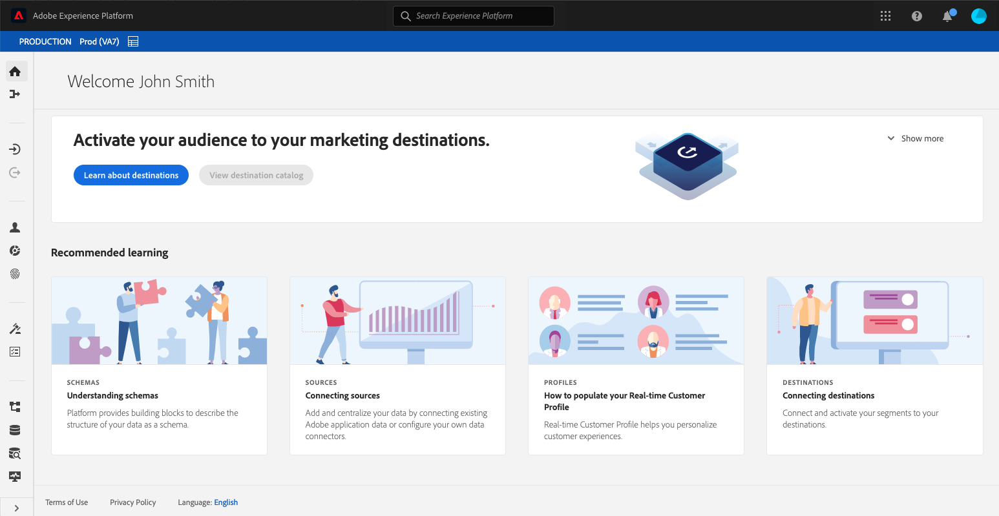
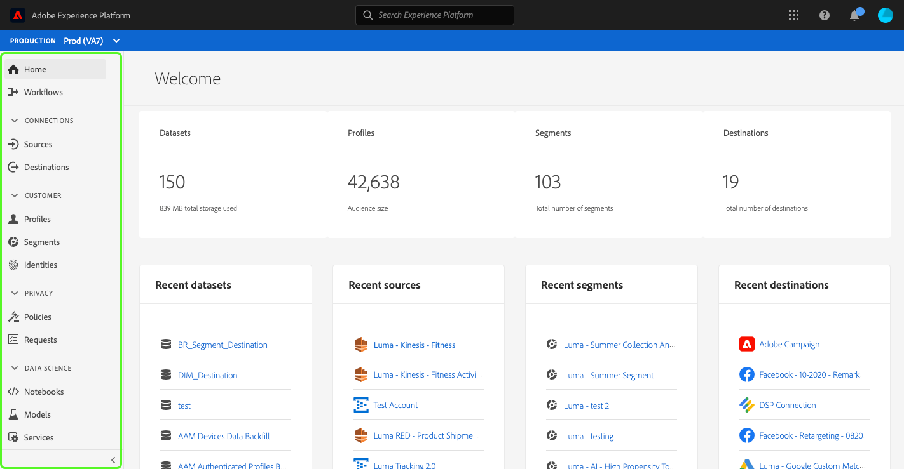
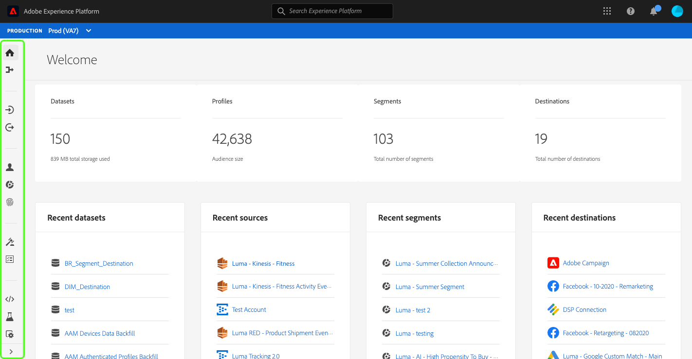
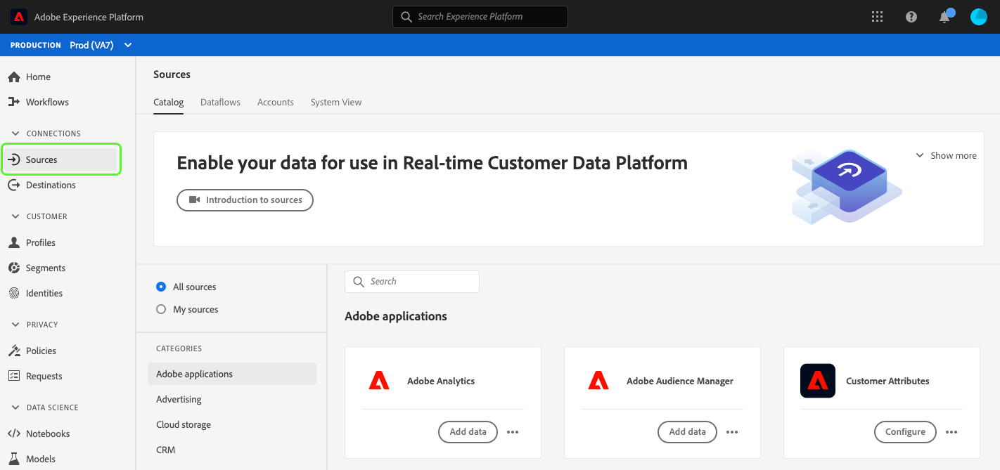
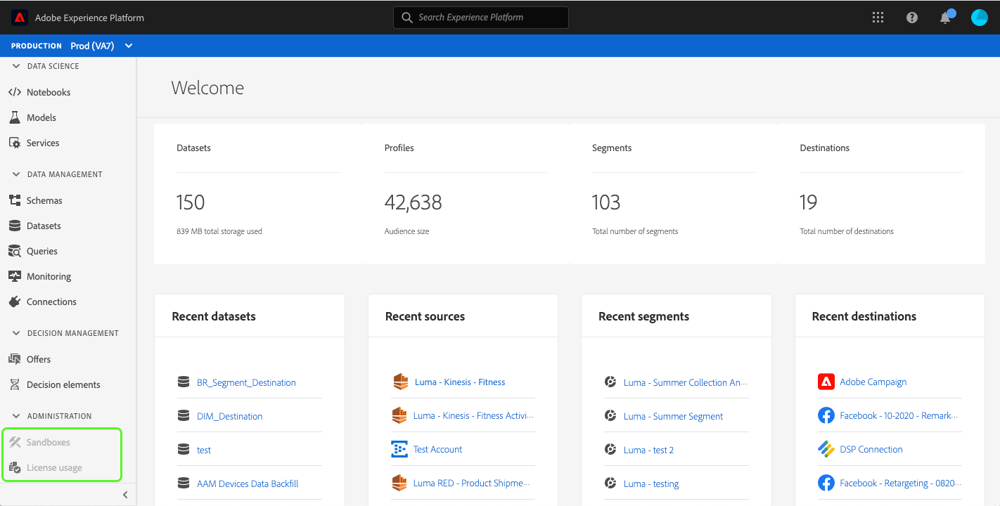
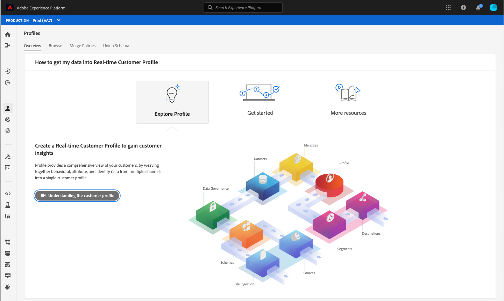
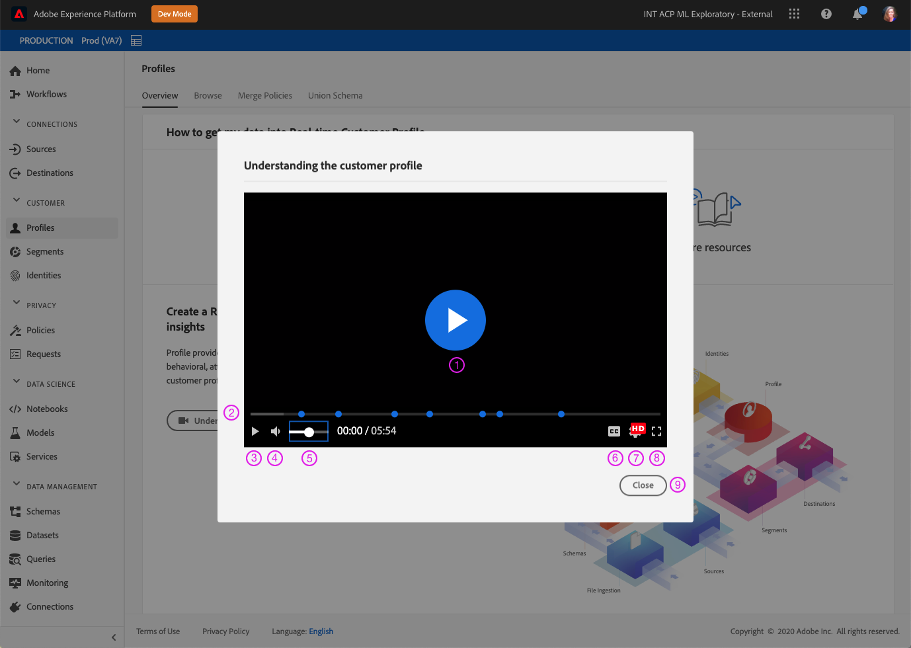
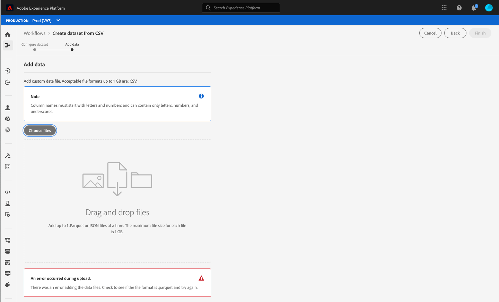
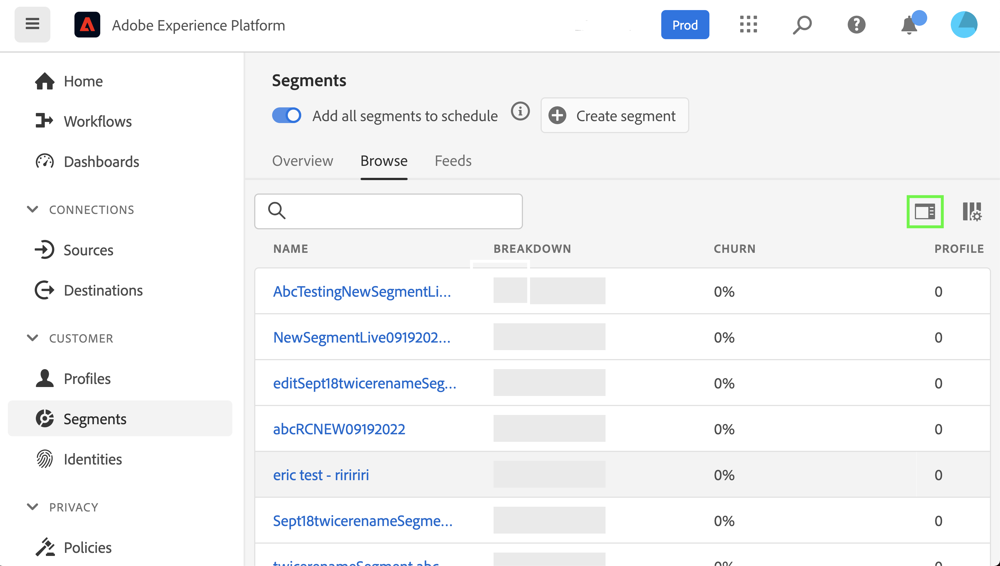
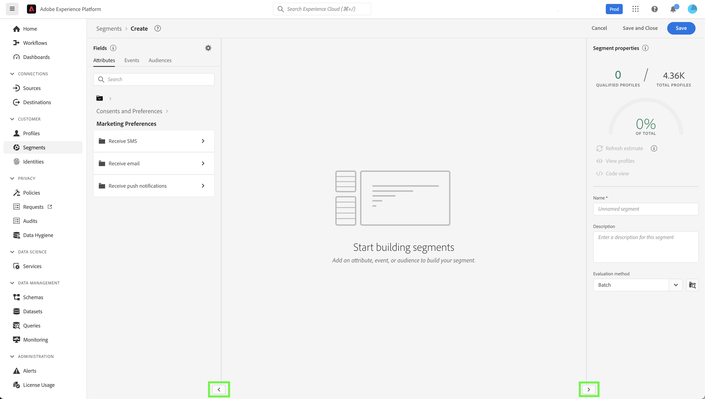

# Custom accessibility solutions for Experience Platform

Adobe Experience Platform is continuously enhanced to meet the needs of all types of users and adhere to the worldwide standards that include individuals with visual, auditory, mobility, or other impairments. This document outlines custom accessibility solutions within the Experience Platform user interface.

## Homepage and UI overview

The Experience Platform user interface meets required contrast ratios for normal text, graphics, and UI components. The colors of the user interface have also been chosen to support accessibility for all users, including those with visual disabilities. 

In Platform, UI elements that are clickable or actionable with a pointer can also be engaged using a keyboard. This includes the left navigation, video players, tables, and more.

Experience Platform strives to meet international accessibility standards, including the Web Content Accessibility Guidelines 2.1 Level A and Level AA and the Web Accessibility Initiative - Accessible Rich Internet Applications (WAI-ARIA) web standards.

## Left navigation

The left navigation within the Experience Platform UI is keyboard-accessible and provides color contrast in normal, hover, and selection states that meet accessibility standards.

From the Home screen, users can tab into the left navigation. Selecting **Shift + Tab** returns the user to the Home screen. 

With the left navigation in focus, **Tab** takes users to the expand and collapse interaction. The ability to expand or collapse the left navigation is activated with **Enter (Return)**.

With the left navigation in focus, up and down arrow keys navigate to each item in the navigation and cycle continuously (in other words, the focus does not shift away until the user tabs away from the left navigation). Focus is shown for navigation items when selected. The current selection is shown with a highlight and bolded text. When selecting a left navigation item, **Enter (Return)** opens the selected UI item in the right panel, however focus remains in left-navigation until the user tabs away.

Some features within Platform are not enabled for all users. These items appear in the navigation but are not able to be selected. When navigating with a keyboard, these items are skipped during arrow navigation and cannot be selected using **Enter (Return)**.

## Embedded video dialog

Videos can be viewed within Experience Platform by using keyboard navigation to highlight and select an available video link. This opens an embedded video dialog within the Platform UI.

## Video dialog keyboard accessibility

The embedded video dialog can also be navigated using the keyboard. The following table outlines the complete keyboard navigation available for the embedded video dialog.

|Dialog Element|Keyboard accessibility|Description|
|---|---|---|
|Play & Pause|Tab Spacebar|Use **Tab** to set focus on play button. **Spacebar** begins video playback and pauses video playback.|
|Scrubber|Tab Left arrow Right arrow|When video is playing, use **Tab** to focus scrubber. With the scrubber in focus, **left and right arrow keys** skip video playback ahead and back 5 seconds, respectively.|
|Mute|Tab Spacebar|Use **Tab** to focus the mute volume element. Use **spacebar** to mute or unmute video playback.|
|Volume|Tab Left arrow Right arrow|Use **Tab** to focus on volume element. **Left and right arrow keys** move volume up and down, respectively.|
|[!UICONTROL Closed Captions] ("cc")|Tab Enter Up arrow Down arrow|**Tab** to [!UICONTROL Closed Captions] ("cc") element. Use **Enter** to open the menu, and **up and down arrow keys** to select a language for captions. **Enter** confirms your selection.|
|[!UICONTROL Quality]|Tab Enter Up arrow Down arrow|Use **Tab** to focus the [!UICONTROL Quality] element. Use **Enter** to open the menu and the **up and down arrow keys** to select video quality. **Enter** confirms your selection.|
|Full-screen|Tab Spacebar or Enter Escape|Use **Tab** to focus the full-screen element. Use **spacebar or Enter** to activate full-screen view. **Escape** ("esc") exits full-screen mode.|
|Close|Tab Spacebar or Enter|Use **Tab** to focus the close button. Use **spacebar or Enter** key to exit the video dialog.|

>[!NOTE]
>
>At any time during playback, the escape ("esc") key can be used to close the embedded video dialog.

## File drag and drop

In Experience Platform, all file selection drag-and-drop zones are keyboard-accessible. Using **Tab** to highlight **[!UICONTROL Choose files]** and using **Enter or spacebar** to select it invokes the operating system's file selection UI.

After a file has been uploaded, a delete icon becomes keyboard-navigable to remove the selected file and upload a new one. Users can use **Tab** to focus on the delete icon and **Enter or spacebar** to select it. Once the file is removed, **[!UICONTROL Choose files]** is automatically in focus and able to be selected.

Alternatively, if the file that is uploaded is not in the correct format, an error icon is displayed along with an error message and the **[!UICONTROL Choose files]** button is in focus and selectable.

Using a mouse to select the drag-and-drop zone also invokes the file selection UI, or a mouse user can select a file and drag onto the zone to begin uploading.

## Table browse

All tables within the Experience Platform user interface are keyboard-accessible. Browsing and interacting with table rows and columns is possible through a series of keyboard shortcuts:

* From the table header, use the **down arrow** to browse the table. Table headers are selectable when navigating via **Tab**, and you can change the sorting order using **spacebar**.
* **Up and down arrow keys** moves up and down through the rows in the table.
* When a row is selected or in focus, using **Enter** on the row provides details in the right rail.
* When a row is selected or in focus, use **arrow keys** to move through each item in the row.
* Use **Enter** to select an item in the row. Users with screen readers are alerted if a new window must open.
* When you zoom to 200% or more, you can see the **rail inspector** icon as the right rail collapses to provide more viewing space for the table.

### Browse table keyboard accessibility

|Keyboard accessibility|Description|
|---|---|
|HOME (Function + left arrow)|When row focused, takes users to the first item in the row|
|END (Function + right arrow)|When row focused, takes users to the last item in the row|
|Page up|Traverses 10 rows up in the table (per page)|
|Page down|Traverses 10 rows down in the table (per page)|
|Control + HOME|Goes to first row in table|
|Control + END|Goes to first wor in table per page|

## Schema Editor UI

The Schema Editor UI is made accessible by the following functionality:

* The Schema Editor supports keyboard navigation, including use of **Tab** to navigation through UI elements.
* **Tab** enters the search field, then into the schema tree.
* Schema tree supports the use of arrow keys to navigate through the schema tree UI
  * **Up and down arrows** can be used to traverse the tree.
  * **Left and right arrows** can be used to expand and collapse nodes or move between inline actions on the schema tree.
* **Enter (Return)** activates individual node details in the detail panel on the right.
* The **Home** key returns to the top of the tree.
* The **End** key navigates to the bottom of the tree.
* The schema tree also includes ARIA labels for screen readers.

## Segment Builder UI

When using the Segment Builder UI to create, edit, and interact with segments within Experience Platform, the following features improve accessibility:

* The Segment Builder UI is accessible via keyboard navigation.
* Screen readers should recognize markup tags for headings and can announce the heading along with its level.
* Other assistive technologies can change the visual display of a page, using properly coded headings to display an outline or alternate view.

You can now collapse or expand the left and right rails of the segment builder canvas to gain more screen space. This feature is particularly helpful as it offers full function capability at 200% zoom. 

## Query Service Editor

The following accessibility features are available in the Query Service editor:

* Color contrast in the Query Service editor UI meets accessibility compliance.
* Keyboard navigation is supported outside of the editor UI. The editor UI is an embedded Code Mirror.

## System View tab in Sources and Destinations

When browsing the **[!UICONTROL System View]** in Sources and Destinations, the following functionality improves accessibility:

* **Tab** sets focus on the first source connection card
  * **Tab** again to focus on the button inside of the card
  * Select **Enter** to activate the call to action button inside the card
* Selecting **Enter** on the connection card also activates more details in the right rail
  * When the right rail is activated, focus is set to that area. **Tab** focuses on **Close** for the right rail pane. Selecting **Tab** again moves the focus through the right-rail panel
  * If there is more than one source connection card, **Tab** moves through the connections
  * Use **arrow keys (up, down, left, and right)** to move through the list of sources
  * Select **Tab** to set focus on the right-rail panel
