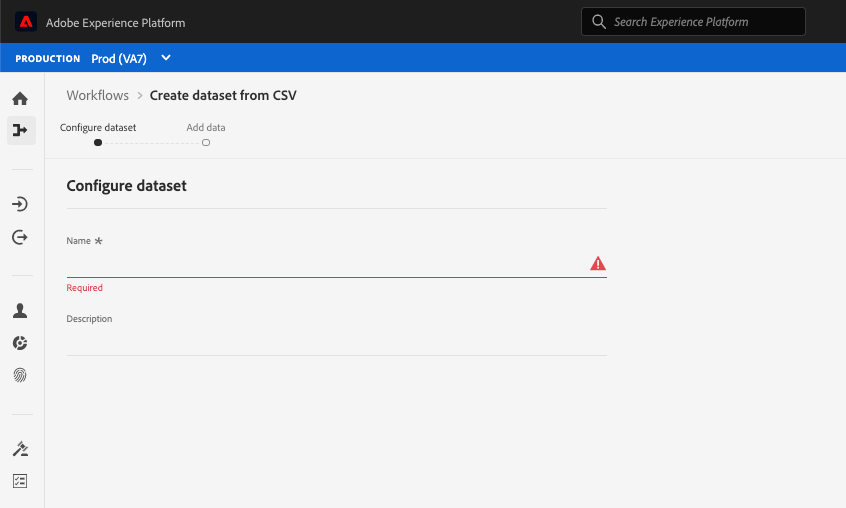

# Accessibility features in Experience Platform

Adobe Experience Platform is committed to providing accessible and inclusive features to all individuals, including users working with assistive devices such as speech recognition software and screen readers. This document outlines the general accessibility features supported by Platform, including keyboard navigation, semantic structure, sufficient contrast between foreground elements and background elements, and support for assistive technologies.

## Assistive technologies

Users with disabilities frequently rely on hardware and software, known as assistive technologies, to access digital content and to use software products. Adobe Experience Platform supports several types of assistive technologies (AT) such as screen readers, zoom, and voice recognition software by following accessibility best practices such as using semantic code, text equivalents, labels, and ARIA where needed. Interactive elements within the Experience Platform user interface (UI) use corresponding labels, accessible names, and roles that identify both their purpose and their current state. This ensures that assistive technologies, such as screen readers, can read out the labels and other information to users so that they can easily interact with the application controls.

## Keyboard accessibility

Experience Platform strives to support full keyboard accessibility.

The following navigational elements facilitate accessibility: 
* The Tab key moves between UI elements, sections, and menu groups.
* Arrow keys move within menu groups to set focus to individual active elements. 
* Shift + Tab moves backwards through the tab order. 
* The Return (Enter) and Spacebar keys activate selected items. 
* The escape key (ESC) acts as a cancel button to close a dialog when present.
* Experience Platform displays a blue border around a selected element to display a clear indication of which UI element currently has focus. 

## Color palettes & contrast

Experience Platform strives for [WCAG 2.1 AA](https://www.w3.org/TR/WCAG/) conformance, including requirements for color contrast. The Experience Platform UI provides enough contrast in the application to ensure an accessible viewing experience for users with low vision or color deficiencies.

## Required field validation

When adding data, creating schemas, or defining segments, required fields are indicated both visually, using an asterisk next to the text label of a field, and programmatically. These fields trigger validation when you enter invalid data in fields and upon saving. If a required field does not pass validation, it is outlined in red with an error icon and a written description of the issue that needs to be fixed also appears.

