# Managing Tags guide

Tags allow you to manage metadata taxonomies in order to classify business objects for easier discovery and categorization. Tags can help identify important taxonomical attributes for the audiences your teams will work with, so they can find them more quickly, and also group common audiences together across a descriptor. You should identify common tag categories such as geographical regions, business units, product lines, projects, teams, time ranges (quarters, months, years), or anything else that can help apply meaning and ease audience discovery for your team. 

## Create a tag {#create-tag}

To create a new tag, select **[!UICONTROL tags]** in the left navigation, then select the desired tag category.

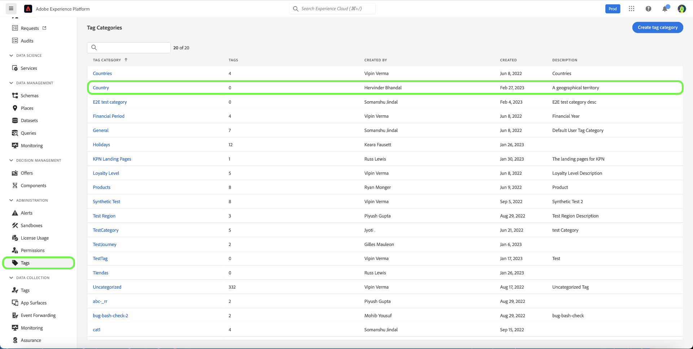

Select **[!UICONTROL Create tag]** to create a new tag.

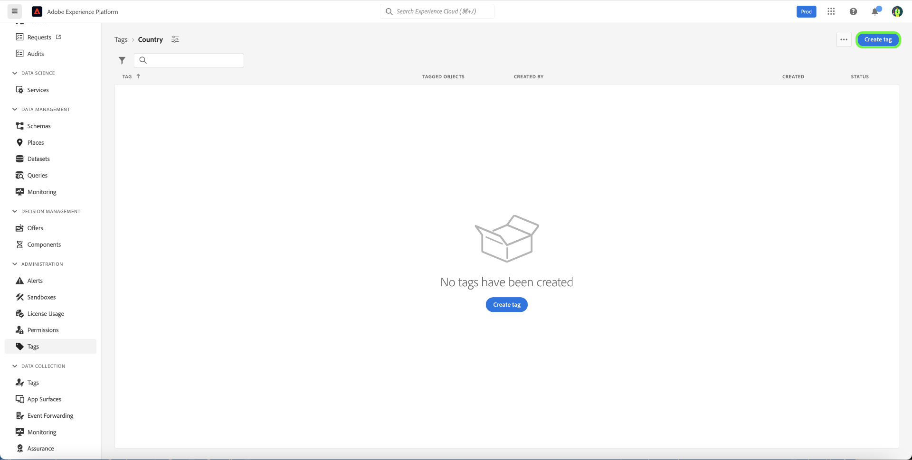

The **[!UICONTROL Create tag]** dialog appears, prompting you to enter a unique tag name. When you're finished, select **[!UICONTROL Save]**.

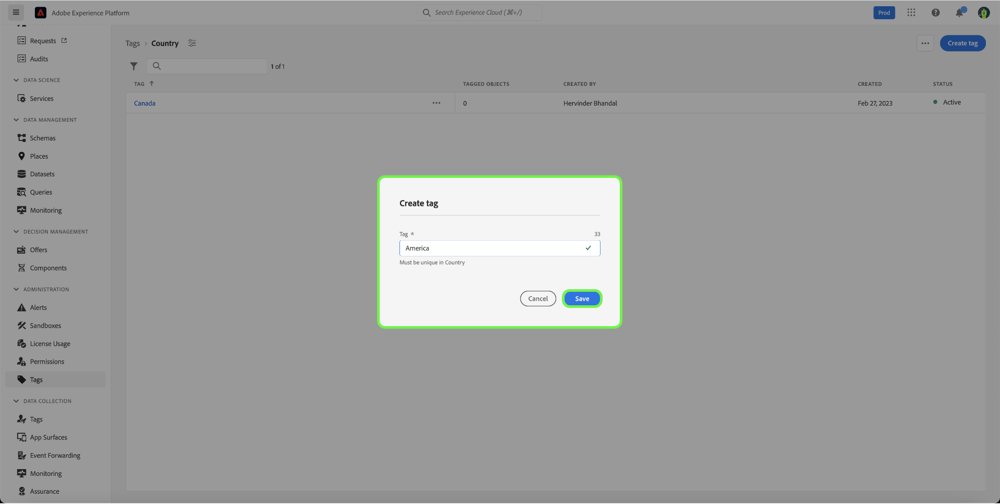

The new tag is successfully created, and you are redirected to the tags screen, where you will see the newly created tag appear in the list.

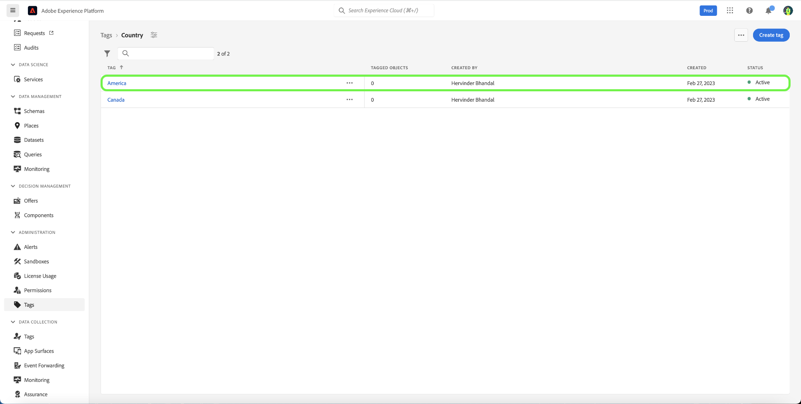

## Edit a tag {#edit-tag}

Editing a tag helps when there are misspellings, naming convention updates, or terminology updates. Editing a tag will maintain the tag's association with any objects where they are currently applied.

To edit an existing tag, in the tag category list, select the ellipsis (`...`) next to the tag's name that you want to edit. A dropdown displays controls to edit, move, or archive the tag. Select **[!UICONTROL Edit]** from the dropdown.

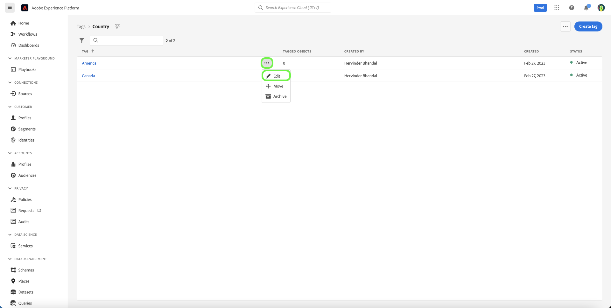

The **[!UICONTROL Edit tag]** dialog appears, prompting you to edit the tag name. When you're finished, select **[!UICONTROL Save]**.

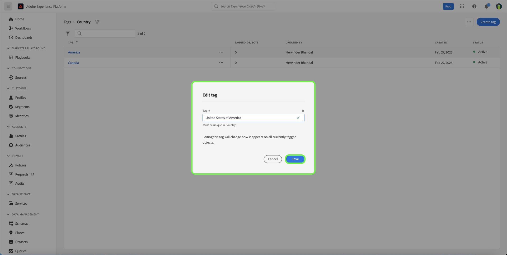

The tag name is successfully updated, and you are redirected to the tags screen, where you will see the updated tag appear in the list.

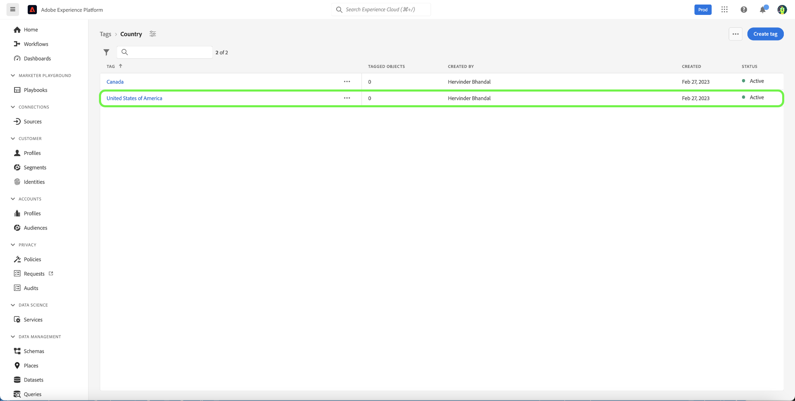

## Move a tag between categories {#move-tag}

Tags can be moved to other tag categories. Moving a tag will maintain the tag's association with any objects where they are currently applied.

To move an existing tag, in the tag category list, select the ellipsis (`...`) next to the tag's name that you want to move. A dropdown displays controls to edit, move, or archive the tag. Select **[!UICONTROL Edit]** from the dropdown.

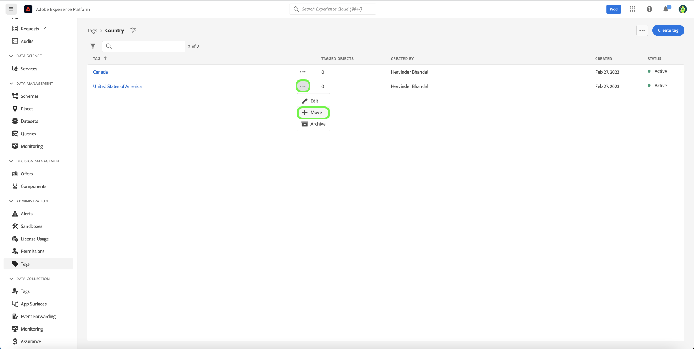

The **[!UICONTROL Move tag]** dialog appears, prompting you to select the tag category into which the selected tag should be moved. 

You can scroll and select from the list, or alternatively, use the search feature to enter the category name. When you're finished, select **[!UICONTROL Move]**.

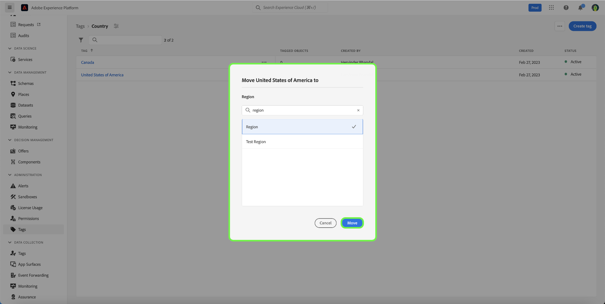

The tag is successfully moved, and you are redirected to the tags screen, where you will see the updated tag list, where the tag no longer appears.

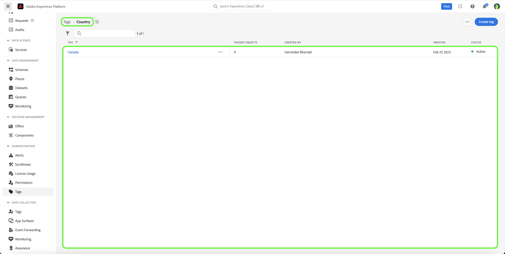

The tag will now appear in the tag category previously selected.

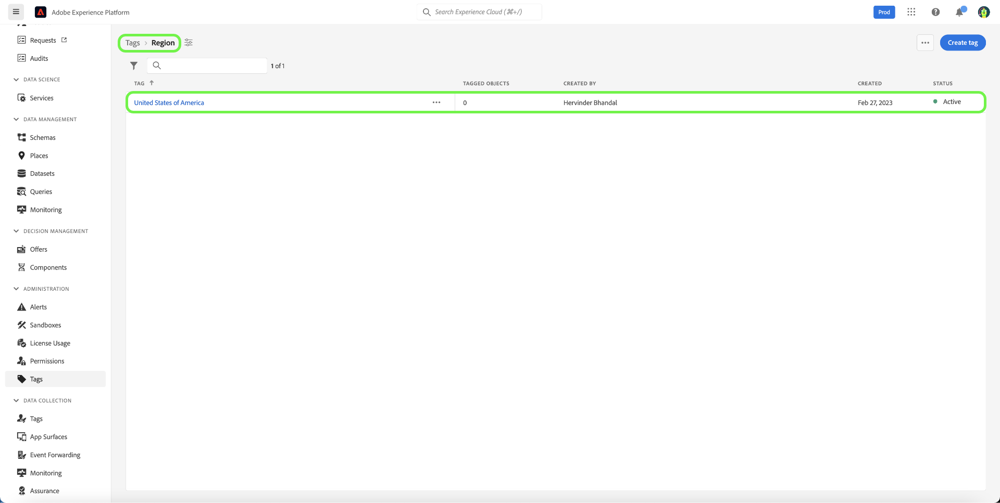

## Archive a tag {#archive-tag}

The status of a tag can be switched between active and archived. Archived tags are not removed from objects where they have already been applied, but they can no longer be applied to new objects. For each tag, the same status is reflected in all objects. This is particularly helpful when you wish to maintain current tag-object associations but don't want the tag to be used in the future. 

To archive an existing tag, in the tag category list, select the ellipsis (`...`) next to the tag's name that you want to archive. A dropdown displays controls to edit, move, or archive the tag. Select **[!UICONTROL Archive]** from the dropdown.

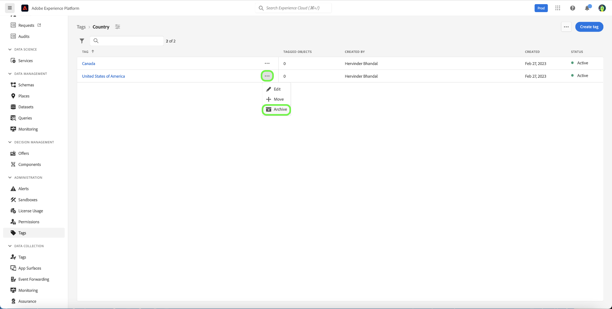

The **[!UICONTROL Archive tag]** dialog appears, prompting you to confirm the tag archive. Select **[!UICONTROL Archive]**.

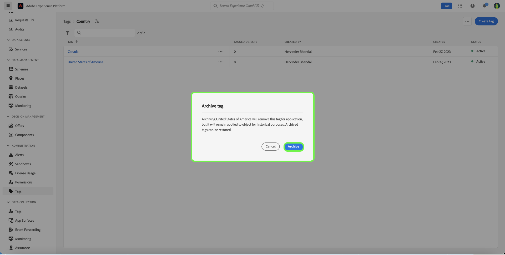

The tag is successfully archived, and you are redirected to the tag screen. You will see the updated tag list now shows the tag's status as `Archived`.

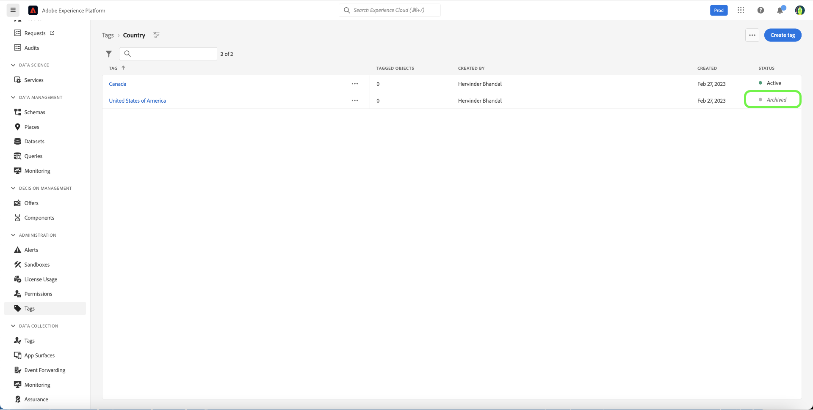

## Restore an archived tag {#restore-archived-tag}

If you wish to apply an `Archived` tag to new objects, the tag must be in an `Active` state. Restoring an archived tag will return a tag to it's `Active` state.

To restore an archived tag, in the tag category list, select the ellipsis (`...`) next to the tag's name that you want to restore. A dropdown displays controls to restore, or delete the tag. Select **[!UICONTROL Restore]** from the dropdown.

The **[!UICONTROL Restore tag]** dialog appears, prompting you to confirm the tag restoration. Select **[!UICONTROL Restore]**.

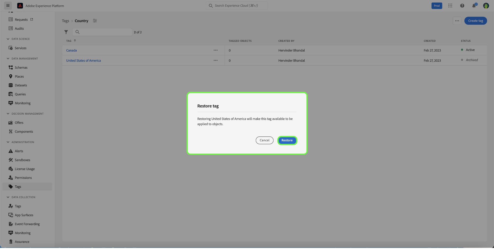

The tag is successfully restored, and you are redirected to the tag screen. You will see the updated tag list now shows the tag's status as `Active`.

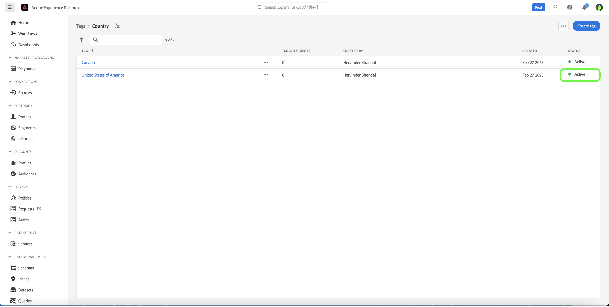

## Delete a tag {#delete-tag}

>[!NOTE]
>
>Only tags that are in an `Archived` state and are not associated with any objects can be deleted.

Deleting a tag will remove it from the system completely.

To delete an archived tag, in the tag category list, select the ellipsis (`...`) next to the tag's name that you want to delete. A dropdown displays controls to restore, or delete the tag. Select **[!UICONTROL Delete]** from the dropdown.

The **[!UICONTROL Delete tag]** dialog appears, prompting you to confirm the tag deletion. Select **[!UICONTROL Delete]**.

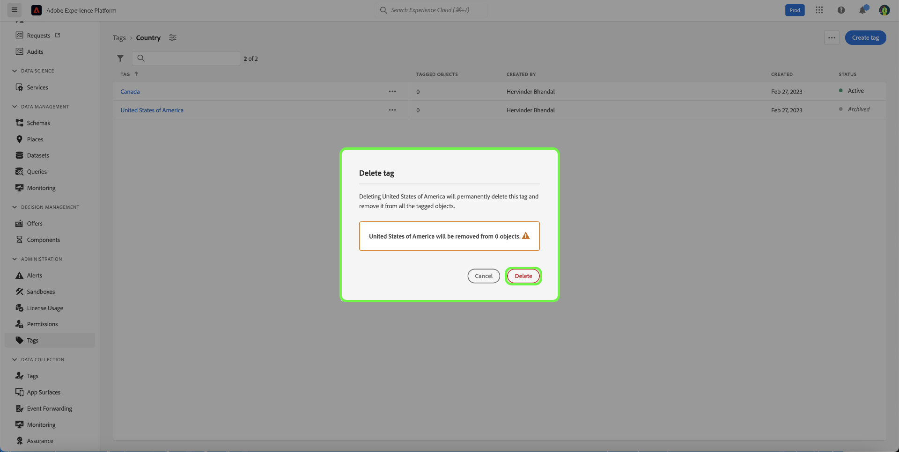

The tag is successfully deleted, and you are redirected to the tag screen. The tag no longer appears in the list and has been completely removed.

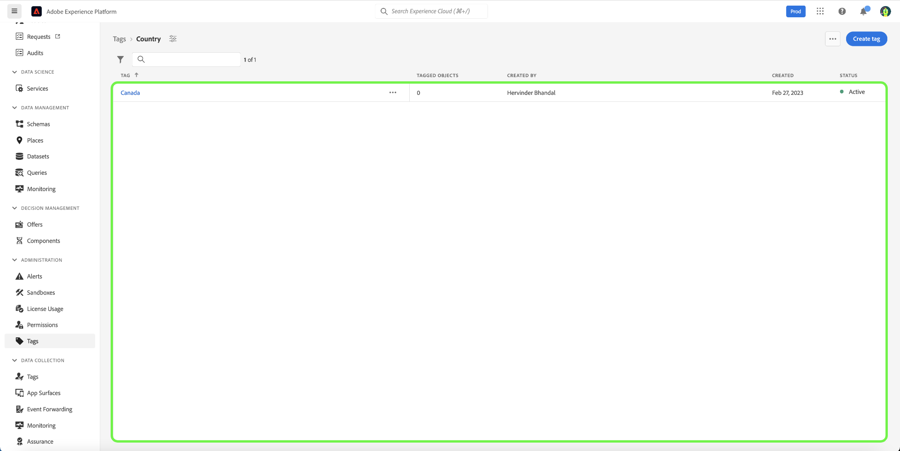

## Viewing tagged objects {#view-tagged}

Each tag has a detail page that can be accessed from the tags inventory. This page lists all objects that currently have that tag applied, allowing users to see related objects from different apps and capabilities in a single view.

To view the tagged objects list, find the tag within a tag category, and select the tag.  

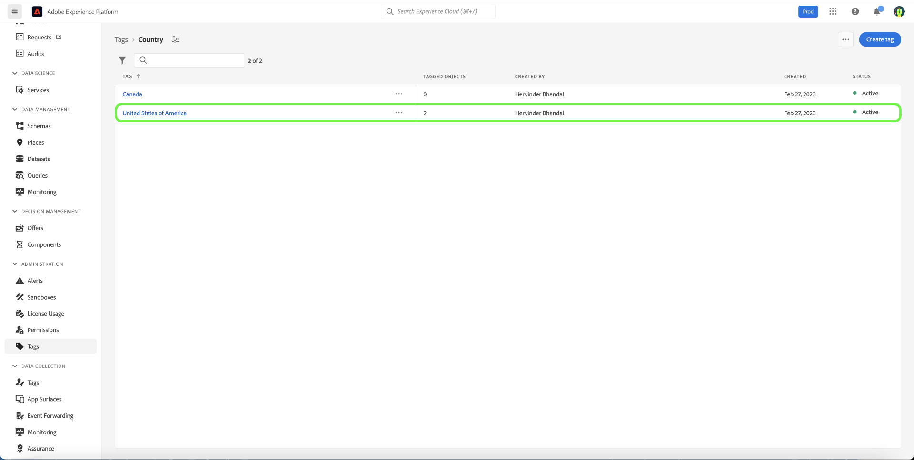

The [!UICONTROL Tagged objects] page appears, showing you an inventory of tagged objects.

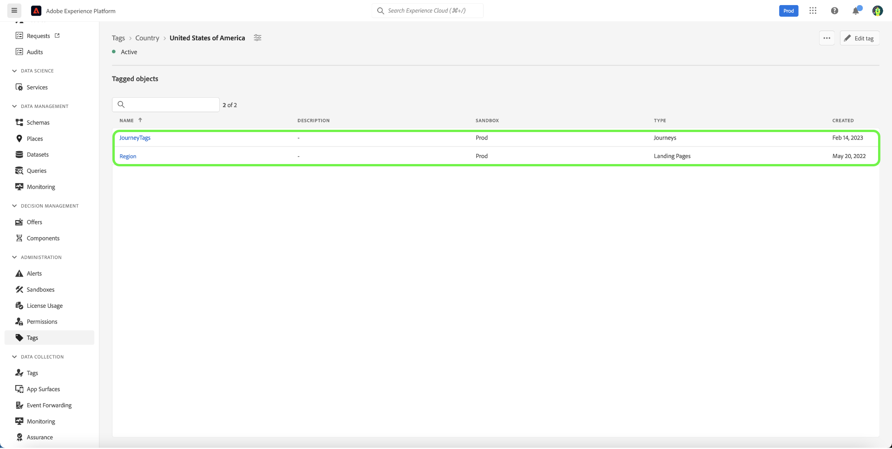

## Next steps

You have now learnt how to manage tags. For a high-level overview of tags in Experience Platform, please refer to the [tags overview documentation](../overview.md).
