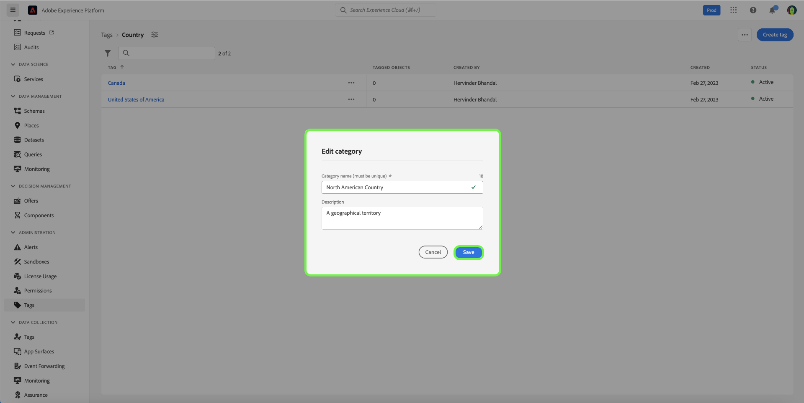

# Tag categories guide

Tag categories group tags into meaningful sets to provide more context and to better clarify the purpose of the tag. Any tag that has a category will have the tag name preceded by the name of the category, then a colon.

## Create a tag category {#create-tag-category}

To create a new category, select **[!UICONTROL tags]** in the left navigation, then select [!UICONTROL Create tag category].

The **[!UICONTROL Create tag category]** dialog appears, prompting you to enter a unique Category name and optional description. When you're finished, select **[!UICONTROL Save]**.

The new tag category is successfully created, and you are redirected to the tag creation page, where you can assign new tags. For more information about creating tags, refer to the [managing tags](./managing-tags.md#create-a-tag-create-tag) document.

## Edit tag category {#edit-tag-category}

>[!NOTE]
>
>Editing or renaming a tag category maintains the tag's association with any objects where they are currently applied.

To edit a tag category, select **[!UICONTROL tags]** in the left navigation, then select the tag category you want to edit.

In the tag category, select the ellipsis (`...`) next to [!UICONTROL Create Tag]. A dropdown displays controls to edit category or delete, select **[!UICONTROL Edit category]**.

The **[!UICONTROL Edit category]** dialog appears, prompting you to update the category name and optional description. When you're finished, select **[!UICONTROL Save]**.

The tag category is successfully updated, and you are redirected to the tag category. 

## Delete tag category {#delete-tag-category}

>[!NOTE]
>
>Before a tag category can be deleted, it must be empty and free of tags.

To delete a tag category, select **[!UICONTROL tags]** in the left navigation, then select the tag category you want to delete.

In the tag category, select the ellipsis (`...`) next to [!UICONTROL Create Tag]. A dropdown displays controls to edit category or delete, select **[!UICONTROL Delete category]**.

The **[!UICONTROL Delete category]** dialog appears, prompting you to confirm tag category deletion. Select **[!UICONTROL Delete]** to confirm.

The tag category is successfully deleted, and you are redirected to the tag category inventory page. The tag category no longer appears in the list and has been completely removed.

## Next steps

You have now learnt how to manage tag categories. You can proceed to the next step to [managing tags](./managing-tags.md).
