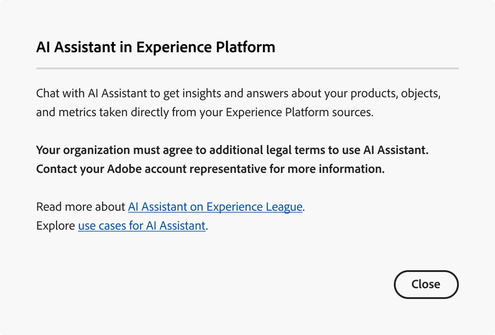
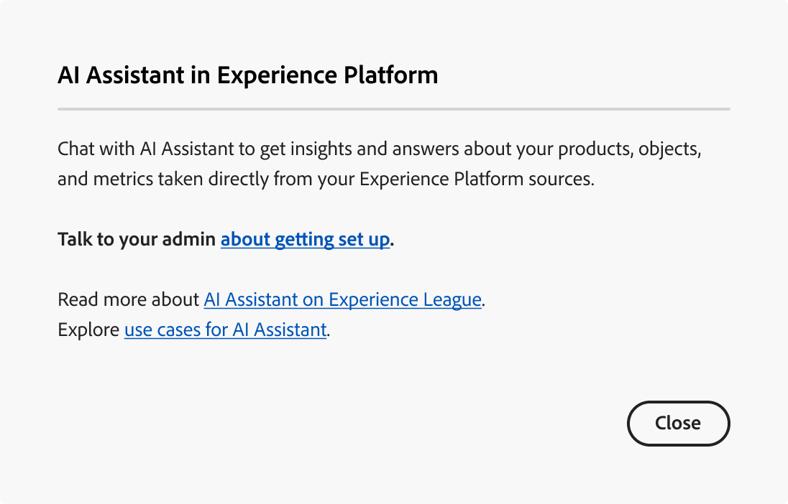
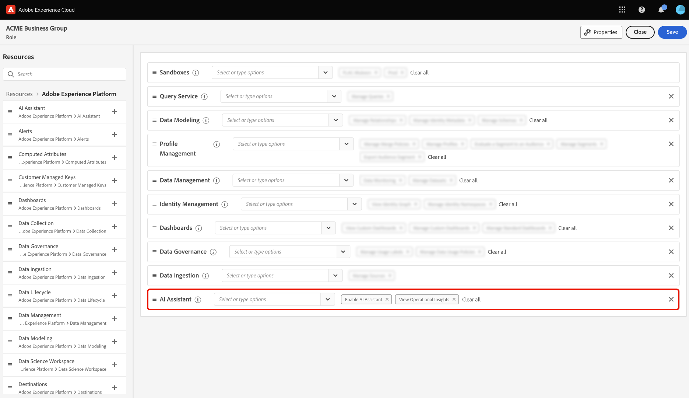
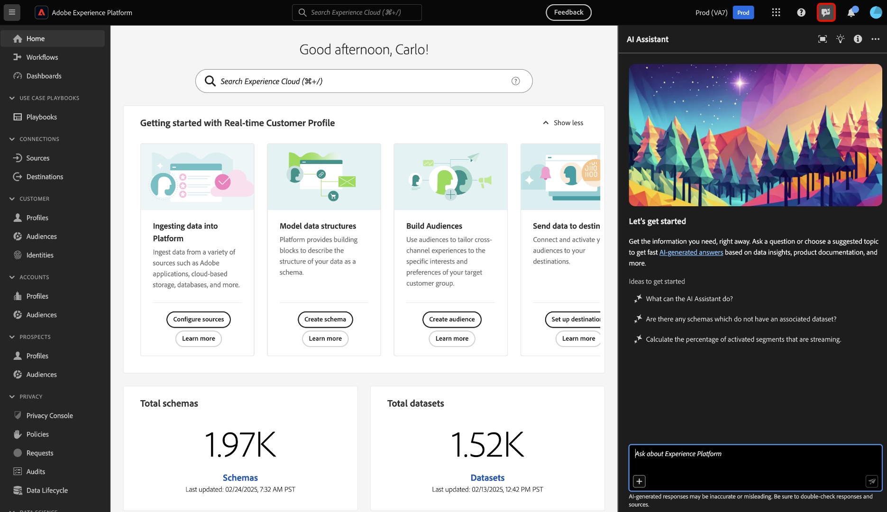

# Access AI Assistant in Experience Platform

You can access AI Assistant across several applications in Adobe Experience Cloud.

>[!IMPORTANT]
>
>If you receive a pop up message in permissions UI that informs you that your organization must first agree to additional legal terms in order to gain access to AI Assistant, then contact your Adobe account team for guidance on these terms.

## Get started {#get-started}

You must complete two prerequisite steps before you can access AI Assistant.

1. Your organization must first agree to legal terms. For more information, contact your Adobe Account Team.
2. Your administrators must grant you sufficient permissions to access AI Assistant.

If you do not have either of these two prerequisite steps completed, then you will see the following messages when you select the AI Assistant chat icon in the Experience Platform UI.

>[!BEGINTABS]

>[!TAB Your organization cannot use AI Assistant]

You will see the following message if you are using an organization that is not legally eligible to use AI Assistant. In this scenario, you must contact your Adobe account team to resolve access.

>[!TAB You do not have the right permissions]

If your organization is legally eligible to use AI Assistant and you still cannot access the feature, then you will see the following message on Experience Platform UI. This scenario means that you do not have the sufficient permissions to access the feature and you must contact your administrators to resolve permissions.

>[!ENDTABS]

## Get access to AI Assistant

Access to AI Assistant is governed by the following parameters:

* **Access the application:** You can access AI Assistant in Adobe Experience Platform, Adobe Real-Time CDP, Adobe Journey Optimizer, and [Customer Journey Analytics](https://experienceleague.adobe.com/en/docs/analytics-platform/using/ai-assistant).
<!-- * **Contractual access:** Your company must agree to certain [!DNL GenAI]-related legal terms before your organization can use AI Assistant. Contact your organization's administrator or your Adobe Account Team if you are not able to access AI Assistant.  -->
* **Permissions:** Use the [Permissions UI](../access-control/abac/ui/permissions.md) to grant or revoke access to AI Assistant in your organization. In order to use AI Assistant, a given user must belong to a role that is provisioned with the **Enable AI Assistant** and **View Operational Insights** permissions.
  * As an administrator, you can add the **Enable AI Assistant** to a given role and add a user to that role, to allow them to access AI Assistant in your organization. **Note**: This permission allows the said user to access AI Assistant, it does not grant them any administrative capacities to then give others access to AI Assistant.
  * As an administrator, you can add the **View Operational Insights** to a given role and add a user to that role, to allow them to use AI Assistant's operational insights capabilities.

Use the [permissions UI](../access-control/abac/ui/roles.md) to grant permissions to use AI Assistant in Experience Platform and Journey Optimizer. For information on how to access AI Assistant in Customer Journey Analytics. Read the documentation in [Customer Journey Analytics](https://experienceleague.adobe.com/en/docs/analytics-platform/using/ai-assistant).

Once you have the necessary permissions, you can access AI Assistant by selecting the AI Assistant icon on the top header of the application that you are using.

Watch the following video to learn how to configure access to AI Assistant for your organizations and users.

>[!VIDEO](https://video.tv.adobe.com/v/3436470/?learn=on)

## Next steps

Once you have complete access to AI Assistant, you can proceed to using the feature during your workflows, read the [AI Assistant UI guide](./ui-guide.md) for more information.
