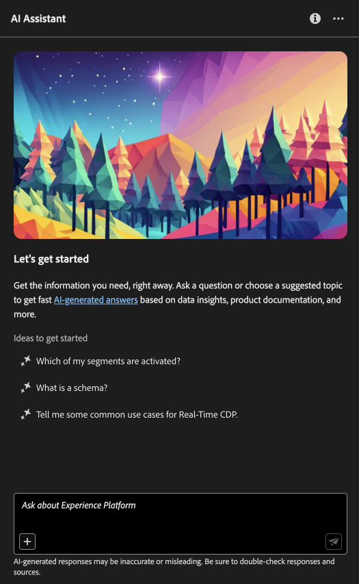

# AI Assistant in Adobe Experience Platform

Read this document to learn about AI Assistant in Adobe Experience Platform.

AI Assistant in Adobe Experience Platform is a conversational experience that you can use to accelerate your workflows in Adobe applications. You can use AI Assistant to better understand product knowledge, troubleshoot problems, or search through information and find operational insights. AI Assistant supports Experience Platform, Real-Time Customer Data Platform, Adobe Journey Optimizer and Customer Journey Analytics.

>[!IMPORTANT]
>
>You must agree to a user agreement before you can use AI Assistant. The user agreement also contains the public beta agreement. This is so that you can use additional AI Assistant features as they roll out in a beta capacity.

+++Select to view user agreement interface

+++

## Understanding AI Assistant {#understanding-ai-assistant}

AI Assistant responds to your submitted questions by querying a database and then translating data from the database into a human-readable answer.

This internal representation of underlying data is also known as the **[!DNL Knowledge Graph]** - a comprehensive web of concepts, data, and metadata for a given answer. 

The [!DNL Knowledge Graph] consists of sub-graphs that are referenced whenever queries submitted:

* Customer operational insights.
* Customer operational insights across various meta-stores.
* Experience League documentation.

There are two classes of questions to consider before querying AI Assistant:

### Product knowledge {#product-knowledge}

Product knowledge refers to concepts and topics grounded in Experience League documentation. Product knowledge questions can be further specified into the following sub-groups:

| Product knowledge | Examples |
| --- | --- |
| Pointed learning | <ul><li>What is the difference between an identity and a primary or foreign key?</li><li>How is profile richness calculated?</li></ul> |
| Open discovery | <ul><li>How can I export this dataset?</li><li>Are there schemas for healthcare customers?</li></ul> |
| Troubleshooting | <ul><li>Why can't I turn on a schema owned by Adobe for profile?</li><li>Why can't I delete a segment?</li></ul> |

{style="table-layout:auto"}

### Operational insights {#operational-insights}

>[!IMPORTANT]
>
>Operational insights answers are in beta. Anyone that has access to the **View Operational Insights** permission will have access to operational insights answers.

Operational insights refer to answers AI Assistant generates about your meta data objects (attributes, audiences, dataflows, datasets, destinations, journeys, schemas, and sources), including counts, lookups, and lineage impact. It does not look at any data within the sandbox. 

* How many datasets do I have?
* How many schema attributes have never been used?
* Which audiences have been activated?

You can ask AI Assistant questions about your operational insights in the following domains: 

* Attributes
* Audiences
* Dataflows
* Datasets
* Destinations _(Questions regarding accounts and some questions about dataflow cannot be answered at this time.)_
* Journeys
* Schemas _(Questions regarding field groups cannot be answered at this time.)_
* Sources _(Questions regarding accounts cannot be answered at this time.)_

For operational insights questions, answers may not reflect the current state of the UI. The data that backs these questions is updated once every 24 hours. For example, changes that users make in Real-Time CDP during the daytime are synced with the data stores at night, and then they become available for user questions in the morning. You will need to log into a sandbox to inquire about specific data related to objects.

### Feature scope {#feature-scope}

Currently, the scope of AI Assistant is as follows:

* [Product knowledge](./home.md#product-knowledge): AI Assistant can answer product knowledge questions for Experience Platform, Real-Time Customer Data Platform and Adobe Journey Optimizer. You can also delve into product knowledge topics for Customer Journey Analytics, but only through the Customer Journey Analytics UI.
* [Operational insights](./home.md#operational-insights): You can ask AI Assistant with questions on operational insights on the following data objects: attributes, audiences, dataflows, datasets, destinations, journeys, schemas, and sources.

## Next steps

Now that you have a general understanding of AI Assistant, you can now proceed and use AI Assistant during your workflows. Refer to the following documentation for more information:

* [AI Assistant UI guide](./ui-guide.md)
* [Privacy, Security, and Governance in AI Assistant](./privacy.md)
* [FAQ](./faq.md)
