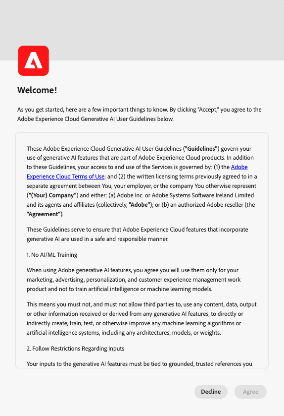
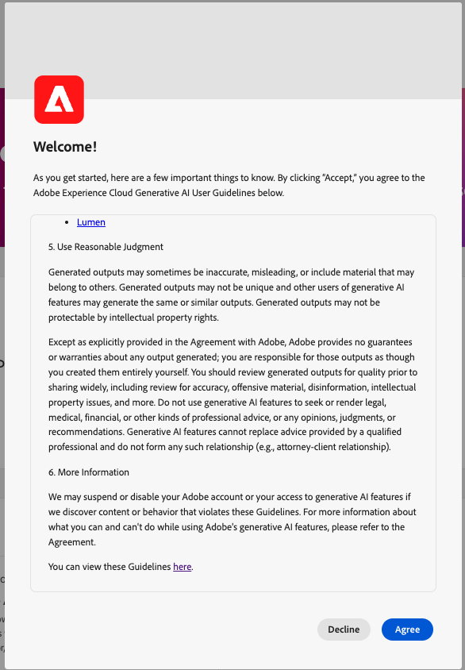

# AI Assistant in Adobe Experience Platform

The following video is intended to support your understanding of AI Assistant.

>[!VIDEO](https://video.tv.adobe.com/v/3429845?learn=on)

Read this document to learn about AI Assistant in Adobe Experience Platform.

AI Assistant in Adobe Experience Platform is a conversational experience that you can use to accelerate your workflows in Adobe applications. You can use AI Assistant to better understand product knowledge, troubleshoot problems, or search through information and find operational insights. AI Assistant supports Experience Platform, Real-Time Customer Data Platform, Adobe Journey Optimizer and Customer Journey Analytics.

>[!IMPORTANT]
>
>You must agree to a [user agreement](https://www.adobe.com/legal/licenses-terms/adobe-dx-gen-ai-user-guidelines.html) before you can use AI Assistant. The user agreement also contains the public beta agreement. This is so that you can use additional AI Assistant features as they roll out in a beta capacity.

+++Select to view user agreement interface

+++

## Understanding AI Assistant {#understanding-ai-assistant}

AI Assistant responds to your submitted questions by querying a database and then translating data from the database into a human-readable answer.

This internal representation of underlying data is also known as the **[!DNL Knowledge Graph]** - a comprehensive web of concepts, data, and metadata for a given answer. 

The [!DNL Knowledge Graph] consists of sub-graphs that are referenced whenever queries submitted:

* Customer operational insights.
* Customer operational insights across various meta-stores.
* Experience League documentation.

There are two classes of questions to consider before querying AI Assistant:

### Product knowledge {#product-knowledge}

Product knowledge refers to concepts and topics grounded in Experience League documentation. Product knowledge questions can be further specified into the following sub-groups:

| Product knowledge | Examples |
| --- | --- |
| Pointed learning | <ul><li>What is the difference between an identity and a primary or foreign key?</li><li>What are lookalike audiences?</li></ul> |
| Open discovery | <ul><li>How can I export this dataset?</li><li>Are there schemas for healthcare customers?</li></ul> |
| Troubleshooting | <ul><li>Why can't I turn on a schema owned by Adobe for profile?</li><li>Why can't I delete a segment?</li></ul> |

{style="table-layout:auto"}

Watch the following video for additional information on AI Assistant product knowledge:

>[!VIDEO](https://video.tv.adobe.com/v/3438032/?learn=on)

### Operational insights {#operational-insights}

Operational insights refer to answers AI Assistant generates about your meta data objects (attributes, audiences, dataflows, datasets, destinations, journeys, schemas, and sources), including counts, lookups, and lineage impact. It does not look at any data within the sandbox. 

* How many datasets do I have?
* How many schema attributes have never been used?
* Which audiences have been activated?

You can ask AI Assistant questions about your operational insights in the following domains: 

| Domain | Supported metadata | Unsupported metadata |
| --- | --- | --- |
| Attributes | <ul><li>Attribute name search</li><li>Attribute - schema relationship</li><li>Attribute - dataset relationship</li><li>Attribute - audience relationship</li><li>Attribute - destination relationship</li></ul> | <ul><li>Attribute class</li><li>Audit</li><li>Deprecation status</li><li>Labels</li><li>Value stored in attributes</li></ul> |
| Audiences | <ul><li>Audience count</li><li>Audience type (streaming or batch)</li><li>Creation/modification dates</li><li>Activation status</li><li>Profile count</li><li>Duplicate audiences</li><li>Audience definition search</li><li>Audience - audience relationship</li><li>Audience - attribute relationship</li><li>Audience - dataset relationship</li><li>Audience - destination relationship</li><li>Name search</li><li>Name and ID search | <ul><li>Audience overlaps</li><li>Audience activation</li><li>Audience - campaign relationships</li><li>Audit</li><li>Create/modification</li><li>Labels</li><li>Profile qualification trends</li></ul> |
| Dataflows | <ul><li>Dataflow counts</li><li>Dataflow status</li><li>Dataflow - dataset relationship</li><li>Dataflow - source relationship</li></ul>| <ul><li>Creation/modification</li><li>Dataflow-batch relationships</li><li>Ingest profile count</li></ul> |
| Datasets | <ul><li>Dataset count</li><li>Profile enable status</li><li>Creation/modification date</li><li>Dataset - schema relationship</li><li>Dataset - audience relationship</li><li>Dataset - attribute relationship</li><li>Dataset - dataflow relationship</li><li>Name search </li><li>Name and ID search</li></ul> | <ul><li>Audit</li><li>Created by</li><li>Dataset - batch relationship</li><li>Dataset creation/modification</li><li>Dataset size</li><li>Number of profiles</li><li>Number of rows</li><li>Value search</li></ul> |
| Destinations | <ul><li>Configured destination counts</li><li>Destination - audience relationship</li><li>Destination attribute relationship</li></ul> | <ul><li>Account set up</li><li>Account credential information</li><li>Unique profiles activated</li></ul> |
| Journeys | <ul><li>Counts</li><li>Name search</li><li>Name and ID search</li><li>Journey status</li><li>Triggered status (audience vs. events)</li><li>Creation/modification dates</li><li>Recurring frequency</li></ul> | <ul><li>Attributes - journey relationships</li><li>Audit</li><li>Creation/modification</li><li>Created by</li><li>Events</li><li>Journey - dataset</li><li>Journey - schema</li><li>Offers</li><li>Profile qualification trends</li><li>Step events</li></ul> |
| Schemas | <ul><li>Schema counts</li><li>Creation/modification date</li><li>Schema - attribute relationship</li><li>Schema - dataset relationship</li><li>Schema - audience relationship</li><li>Profile enable status</li><li>Name search</li><li>Name and ID search</li></ul> | <ul><li>Audit</li><li>Creation/modification</li><li>Created by</li><li>Field groups</li><li>Identities</li><li>Identity namespaces</li><li>Labels</li><li>Number of profiles</li></ul> |
| Sources | <ul><li>Account counts</li><li>Account status</li><li>Active/inactive dataflows for each account</li><li>Source connector - dataflow relationship</li><li>Source account - dataflow relationship</li></ul> | <ul><li>Account credentials information</li><li>Account set up</li><li>Data ingestion metrics</li><li>Number of profiles</li><li>Source - batch relationships</li></ul> |

{style="table-layout:auto"}

For operational insights questions, answers may not reflect the current state of the UI. The data that backs these questions is updated once every 24 hours. For example, changes that users make in Real-Time CDP during the daytime are synced with the data stores at night, and then they become available for user questions in the morning. You will need to log into a sandbox to inquire about specific data related to objects.

Watch the following video for additional information on AI Assistant operational insights:

>[!VIDEO](https://video.tv.adobe.com/v/3444031?learn=on&enablevpops)

### Feature scope {#feature-scope}

Currently, the scope of AI Assistant is as follows:

* [Product knowledge](./home.md#product-knowledge): AI Assistant can answer product knowledge questions for Experience Platform, Real-Time Customer Data Platform and Adobe Journey Optimizer. You can also delve into product knowledge topics for Customer Journey Analytics, but only through the Customer Journey Analytics UI.
* [Operational insights](./home.md#operational-insights): You can ask AI Assistant with questions on operational insights on the following data objects: attributes, audiences, dataflows, datasets, destinations, journeys, schemas, and sources.

## Next steps

Now that you have a general understanding of AI Assistant, you can now proceed and use AI Assistant during your workflows. Refer to the following documentation for more information:

* [AI Assistant UI guide](./ui-guide.md)
* [Feature access](./access.md)
* [Question guide](./questions.md)
* [Privacy, Security, and Governance in AI Assistant](./privacy.md)
* [FAQ](./faq.md)
