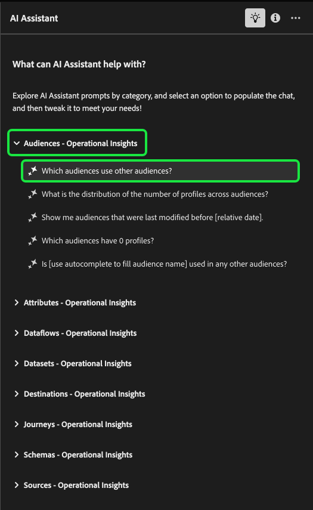

# Question guide for AI Assistant

Read this document to for a set of example questions that you can use when querying AI Assistant. 

You can also use this document to learn tips on [how to phrase your questions](#phrasing-your-questions) to get optimal responses from AI Assistant.

## Objective-based questions {#objectives-questions}

The following example questions are grouped by objectives that you can accomplish when using AI Assistant:

| Objective | Description | Example |
| --- | --- | --- |
| Learning concepts and continuing workflows | <ul><li>As a novice user, you can use AI Assistant to learn Real-Time CDP and Adobe Journey Optimizer concepts and onboard yourself to products and features that you are unfamiliar with.</li><li>As an experienced user, you can use AI Assistant to solve an edge case that may be blocking your workflow. |<ul><li>How do I set up a dashboard in Journey Analytics?</li><li>Tell me some use-cases for Real-Time CDP.</li></ul> |
| Troubleshooting | Use AI Assistant to learn how to debug basic errors that you may encounter in your workflow. | <ul><li>What does this error {ERROR_MESSAGE} mean?</li><li>Why am I not able to delete the audience named "Luma: Email Audience"?</li></ul> |
| Sandbox hygiene | Use AI Assistant to identify any duplicates or unused objects so you can efficiently maintain your sandbox. | <ul><li>Can you show me audiences that are similar?</li><li>Are there any schemas which do not have an associated dataset?</li></ul> |
| Value analysis | Use AI Assistant to identify your most used data objects and assess any performance indicators or find the most valuable data objects. | <ul><li>How many profiles are in our "Luma: Email Audience" segment definition?</li><li>When were audiences activated to Experience Cloud Audiences destination?</li></ul> |
| Search | Use AI Assistant to find supported Experience Platform objects such as audiences, datasets, destinations, schemas, and sources. | <ul><li>List the audiences containing "Luma" in the name that were created in the last quarter.</li><li>What attributes are in the "Luma: Custom Actions" XDM schema?</li></ul> |
| Impact analysis | Use AI Assistant to identify data objects that have been used in certain workflows so that you can assess the impact of any changes. | <ul><li>Which audiences use `homeAddress.city` in "Luma: PersonProfiles" schema?</li><li>Which datasets are the `consents.marketing.push.val` profile attribute stored in?</li></ul> |

{style="table-layout:auto"}

## Operational insights by entity and product knowledge questions{#objects-questions}

The following questions are grouped by data objects and are classified as either [operational insights](./home.md#operational-insights) or [product knowledge](./home.md#product-knowledge).

* **Audiences - Operational insights**
  * Which audiences use other audiences?
  * What is the distribution of the number of profiles across audiences?
  * Show me audiences that were last modified before {RELATIVE_DATE}.
  * Which audiences have 0 profiles?
  * Is {USE_AUTO_COMPLETE_TO_FILL_AUDIENCE_NAME} used in any other audiences?
* **Attributes - Operational insights**
  * Which audiences have xdm attribute {ATTRIBUTE_PATH} in their segment definition?
  * How many XDM schema attributes are not used in any audiences?
  * Which schemas have xdm attribute {ATTRIBUTE_PATH} in them?
  * Which XDM attributes are activated?
  * Which XDM attributes are used in audiences with more than 10 profiles?
* **Dataflows - Operational insights**
  * Which dataflows contribute to {USE_AUTO_COMPLETE_TO_FILL_DATASET_NAME} dataset?
  * Which source dataflows are not being used or do not have data coming in anymore?
  * List the source dataflows that I have.
  * Which dataflows are configured for each source connector?
* **Datasets - Operational insights**
  * How many datasets have been ingested using the same schema?
  * Which source connector is associated with {USE_AUTO_COMPLETE_TO_FILL_DATASET_NAME} dataset?
  * Which datasets are used in each audience?
  * Which schemas are not used in any datasets?
  * How many datasets do I have?
* **Destinations - Operational insights**
  * Which destinations are in an active state?
  * Which destination accounts have 0 audiences activated?
  * How many audiences are activated for each destination?
  * Which destinations have highest number of activated audiences?
* **Journeys - Operational insights**
  * How many journeys do I have?
  * Which journeys have been created in {RELATIVE_DATE} (e.g. the last week) or {RELATIVE_DATE} (e.g. before/after/on specific date)?
  * Show me the list of journeys that were modified in {RELATIVE_DATE} (e.g. the last week) or {RELATIVE_DATE} (e.g. before/after/on specific date)?
  * List the live journeys I have.
  * List the audiences which are used in live journeys.
* **Sources - Operational insights**
  * Which sources are in an active state?
  * Which source connector is associated with dataset {USE_AUTO_COMPLETE_TO_FILL_DATASET_NAME}.
  * Which source connector has the highest number of associated accounts?
  * Show me the dataflows and their associated source connectors.
* **Pointed learning - Product knowledge (Real-Time CDP and Journey Optimizer)**
  * What are lookalike audiences?
  * How are User Groups related to Roles?
  * When should I use a data type vs a field group?
  * What is the difference between an identity and a primary or foreign key?
* **Troubleshooting - Product knowledge (Real-Time CDP and Journey Optimizer)**
  * What can AI Assistant help with?
  * Can I delete a profile enabled schema after data is ingested?
  * Why can't I delete an audience?
  * How long does it take for audiences to be evaluated and results to be available for targeting?

## Phrasing your questions {#phrasing-your-questions}

You must phrase your questions to AI Assistant with clarity and context in order to get as accurate a response as a possible. Refer to the following list of tips for guidance on how to ask a clear question with context:

* State your task and/or question in a concise manner.
* Avoid ambiguous language or overly complex syntax to facilitate comprehension.
* Provide relevant context regarding your task and/or question as context can help AI Assistant generate more relevant responses.

Read the tables below for further guidance on best practices to follow when asking questions to AI Assistant.

The following tables outline best practices you can follow when using AI Assistant:

| Do | Example |
| --- | --- |
| <ul><li>Be specific about the object or information that you want to retrieve or analyze.</li><li>Try placing your data object names in quotes. If you only know a part of the object name, you may also specify that in the question.</li><li>Use [object auto-complete](./ui-guide.md#use-auto-complete) to help AI Assistant better understand the context of your query.</li></ul> | <ul><li>Which datasets use the "Luma - Loyalty" schema?</li><li>Show me the activated segments which have "Luma" in their names. Rank them by profile count.</li></ul> |
| <ul><li>Avoid ambiguity and use clear language</li><li>Use precise terminology to ensure better clarity in your query.</li><li>When asking questions regarding Adobe Experience Platform, try to use terminology specific to Experience Platform to improve relevance of responses.</li></ul> | <ul><li>How many profiles do I have in "ACME Audience".</li><li>Show me the top 5 XDM attributes used in activated audiences.</li></ul> |
| <ul><li>Provide context or specify a criteria to filter your results.</li><li>Use a filter criteria in the questions to limit the volume of data in the response.</li></ul> | <ul><li>Show me audiences that have not been activated and were created more than 6 months ago and have never been modified.</li><li>Show me audiences activated to "ACME Destination" and have more than 10000 profiles.</li></ul> |

{style="table-layout:auto"}

| Don't | Example |
| --- | --- |
| Use vague or ambiguous language. | <ul><li>Give me information about datasets.</li><li>How many users do I have in "ACME Audience"?</li><li>Show segments.</li><li>List attributes.</li></ul>|
| Make incomplete requests. | "Luma - Loyalty Dataset" |
| Assume knowledge without contexts. | <ul><li>Audiences in the last 6 months.</li><li>Build a query for me.</li></ul>|
| Formulate overly complex queries. | Provide a comprehensive analysis of data lineage across all objects and their dependencies. |
| Omit criteria or parameters. | Show me datasets. |

{style="table-layout:auto"}

## Dataset Observability {#dataset-observability}

AI Assistant can now answer questions about specific dataset metrics such as storage size and row count.

* What are my biggest datasets by size?
* What are my biggest dataset by rows?
* How many datasets are empty?
* Which datasets are empty?

Additionally, you can convey similar intent through a number of different variations to the four aforementioned questions.

+++Select to view accepted variations of dataset observability questions

* What are the top five datasets by size?
* Which dataset has the largest number of rows?
* How many datasets have no data in them?
* List the datasets with size >10 MB?
* List the datasets with rows less than 10.
* Can you show me the datasets that are completely empty?
* Which dataset is the largest by storage size?
* What's the smallest dataset in terms of row count?
* How many of my datasets have data and how many are empty?
* What's the row count for the dataset named {DATASET_NAME}?
* How does the size of {DATASET_NAME} compare to my other datasets?
* What is the size of {DATASET_NAME}?
* How many rows does {DATASET_NAME} has?
* What is the size and row count of {DATASET_NAME}?
* Can you list the largest and smallest datasets by storage size?

+++

You can also refine your data observability questions with a qualifier to filter your query by a certain time period:

* Datasets receiving batches in last (x) days
* Datasets not receiving batches in last (x) days
* Datasets with the most data ingested in last (x) days
* Record count for a specific dataset in the last (x) days

+++Select to view accepted variations of dataset observability questions

* How many datasets received batches in the last (x) days?
* Which datasets have received batches in the past (x) days?
* Can you list the datasets that had data ingested in the last (x) days?
* How many datasets received new batches in the previous (x) days?
* What are the datasets that were updated with new data in the last (x) days?
* List datasets that had batch activity within the last (x) days.
* How many datasets did not receive batches in the last (x) days?
* Which datasets have not received any batches in the past (x) days?
* Can you identify datasets with no data ingestion in the last (x) days?
* How many datasets did not receive updates in the last (x) days?
* What datasets have been inactive for the past (x) days?
* List datasets that did not get new batches in the last (x) days.
* When was last time when data was ingested on dataset (x)?
* What are Top 10 datasets in which the most data was ingested  in last (x) days?
* What are the top 10 datasets by data volume ingested in the last (x) days?
* Which 10 datasets had the largest data ingestion in the last (x) days?
* Show the top 10 datasets with the highest data ingestion in the previous (x) days.
* What are the top datasets by data received in the last (x) days?
* List the top 10 datasets that ingested the most data in the past (x) days.
* How many records were received in dataset (x), in the last (y) days?
* How many records did dataset (x) receive in the last (y) days?
* What is the record count ingested for dataset (x) in the past (y) days?
* Can you provide the number of records added to dataset (x) over the last (y) days?
* How much data was received by dataset (x) in the last (y) days?
* What is the volume of records ingested for dataset (x) in the previous (y) days?

+++

## Examples of unsupported questions {#unsupported-questions}

The following is a list of examples of questions that are currently not supported by AI Assistant.

+++Select to view examples of unsupported questions

### Operational insights

* How many profiles in this sandbox live in California? (**Note**: for similar questions, you must provide a specific criteria to give enough context for your request, in this case, the specific criteria is "live in California").
* What are the segments this profile {PROFILE_INFO/ATTRIBUTE_VALUE} is in?
* How many profiles in the dataset have an email?
* Which dataset constitutes to maximum number of profiles in this sandbox ?
* Which dataset has the highest number of records?
* How many segments have been deleted in {RELATIVE_DATE}?
* Which of my datasets has the largest size?
* Give me a profile in the {AUDIENCE_NAME}. 
* What is the total number of profiles in my sandbox
* How many identity namespaces are associated with the audience {AUDIENCE_NAME}?
* Show me a report of all the audience segments that were evaluated today
* How many segments have overlapping profiles?
* How many batches are being loaded into {DATASET_NAME}
* How many active offers do I have?
* How many active campaigns do I have?
* Where are my sources of data coming from?
* What is the biggest dataset or data source?
* Can I get the list of users who have created these schemas?

### Troubleshooting

* Why is this batch {BATCH_NAME/BATCH_ID} still processing?
* Why is no one qualifying for this audience {AUDIENCE_NAME}?
* I am not able to see Customer AI, why and how do I fix it?
* I am not able to see Dataset preview, why and how do I fix it?
* Why can't I delete {SEGMENT/DATASET/SCHEMA_NAME}?
* Do I have access to Query Service?

### Task and automation

* Write a query that gives me one record from the {DATASET_NAME}.
* Write a sample API call to /schemas/{schemaId}/fields/{fieldPath}/values.
* Set up a source/destination for me. 
* Create an audience for me with criteria {USER_SPECIFIC_CRITERIA}.

+++

## Next steps

By reading this document, you now have an understanding on how to optimize your questions for AI Assistant. For information on how to use the feature during your workflows, read the [AI Assistant UI guide](ui-guide.md).
