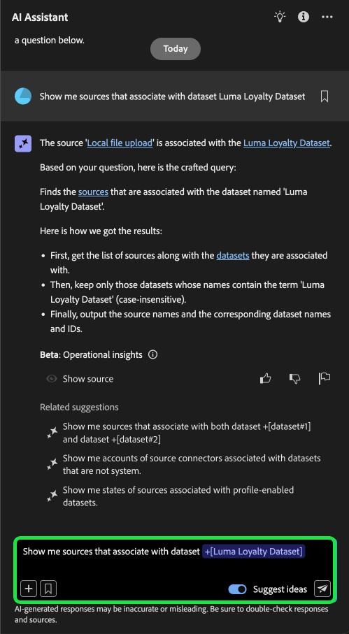

# AI Assistant UI Guide

Read this guide to learn how you can use AI Assistant in the Adobe Experience Platform UI.

## Access AI Assistant in the Experience Platform UI

To launch AI Assistant, select the **[!UICONTROL AI Assistant icon]** from the top header of the Experience Platform UI.

The AI Assistant interface appears, immediately providing you with information to get started. You can use the options provided under [!UICONTROL Ideas to get started] to answer questions and commands such as:

* [!UICONTROL Which of my audiences are activated?] 
* [!UICONTROL What is a schema?]
* [!UICONTROL Tell me some common use cases for Real-Time CDP]

## AI Assistant UI guide

>[!NOTE]
>
>The following workflow is an example that uses the experience event schema creation process to illustrate how you can use AI Assistant when using the Experience Platform UI.

Consider a use case in which you are creating a **Device Trade in Event Schema**. During the experience event schema creation process, you come across the `eventType` field. "At this point, you have the option to either exit your workflow and refer to the [basics of a schema composition](../xdm/schema/composition.md) documentation, or you can use AI Assistant to retrieve answers to your questions and find additional resources through the documentation links recommended by AI Assistant."

To begin, enter your question in the text box provided. In the example below, AI Assistant is provided the question: "**What is the eventType field in an ExperienceEvent schema?**"

AI Assistant then queries its knowledge base and computes an answer. After a few moments, AI Assistant returns an answer and related suggestions that you can use as follow up prompts.

After receiving a response from AI Assistant, you can select from a number of options to decide how you want to proceed.

### AI Assistant features {#features}

This section outlines the different features of AI Assistant that you can use during your workflows on Experience Platform.

### View operational data objects {#view-operational-data-objects}

Depending on your query, AI Assistant provides additional information pertaining to the data in your sandbox. To view how the response to your query applies to your particular sandbox, select **[!UICONTROL In your sandbox].** 

When viewing data pertaining to your sandbox, AI Assistant may provide direct links to specific UI pages that display your queried data.

+++Select to view example

In this example, AI Assistant returns additional information regarding the existing XDM schemas in your sandbox, including their total count and the five most commonly used fields.

+++

### View citations {#view-citations}

You can verify responses returned to you by AI Assistant by reviewing citations available with every product knowledge answer.

+++Select to view an example of how to display sources

To view citations and validate AI Assistant's response, select **[!UICONTROL Show sources]**. 

AI Assistant updates the interface and provides you with links to documentation that corroborate the initial response. Additionally, when citations are enabled, AI Assistant updates the response to include footnotes to indicate the specific parts of the answer that reference the provided documentation. 

+++

### Operational insights {#operational-insights}

You must be in an active sandbox in order for AI Assistant to sufficiently respond to a question about your operational insights.

+++Select to view an example of an operational insights question

In the example below, AI Assistant is asked the following query: **"Show me dataflows that were created using the Amazon S3 source"**.

AI Assistant then responds with a table listing your dataflows and their corresponding IDs. To view the whole table of data, select the expand icon on the top right.

An expanded view of the table appears, providing you with a more comprehensive list of dataflows based on the parameters of your query.

When prompted with an operational insights question, AI Assistant provides an explanation of how it computed the answer. In the example below, AI Assistant outlines the steps it took in order to identify the dataflows that were created using the [!DNL Amazon S3] source.

You can also provide filters and modifications to your questions, and you can instruct AI Assistant to render its findings based on the filters that you include. For example, you can ask AI Assistant to show you a trend of the count of segment definitions in the order of their created date, remove segment definitions with zero total profiles, and use month names instead of integers when displaying the data.

**Note:** Operational insights answers are currently in beta. Select the tooltip icon in the AI Assistant user interface to view the Beta notice and for a link to the documentation.

+++

### Verify operational insights responses {#verify-responses}

You can verify each response related to operational insights questions using an SQL query that AI Assistant provides.

+++Select to view example of verifying operational insights responses

After receiving an answer for an operational insights question, select **[!UICONTROL Show sources]** and then select **[!UICONTROL View source query]**.

When queried with an operational insights question, AI Assistant provides an SQL query that you can use to verify the process that it took to compute its answer. This source query is for verification purposes only and is not supported on Query Service.

+++

### Use entity auto-complete {#use-entity-auto-complete}

You can use the autocomplete function to receive a list of data objects that exist in your sandbox. Autocomplete recommendations are available for the following domains: audiences, schemas, datasets, journeys, sources, and destinations.

+++Select to view an example of auto-complete

You can use autocomplete by including the plus symbol (**`+`**) in your query. As an alternative, you can also select the plus sign (**`+`**) located at the bottom of the text input box. A window appears with a list of recommended data objects from your sandbox.

+++

### Use multi-turn {#use-multi-turn}

You can use AI Assistant's multi-turn capabilities to have a more natural conversation during your experience. AI Assistant is able to answer follow-up questions, given. that context can be inferred from an earlier interaction.

+++Select to view an example of multi-turn

In the example below, AI Assistant is first asked for the total number of dataflows and then is asked to list the 10 most recent dataflows.

+++

### Start a new conversation

You can change topics with AI Assistant by resetting and starting a new conversation.

+++Select to view an example of resetting your conversation

To reset, select the ellipses (**`...`**) on the AI Assistant interface and then select **[!UICONTROL Start new conversation]**. This informs AI Assistant that you intend on changing topics and can be particularly helpful when troubleshooting queries that are either failing or referencing incorrect information.

+++

### Use discoverability {#use-discoverability}

You can use AI Assistant's discoverability feature to view a list of the general subjects, grouped into entities, that AI Assistant supports.

+++Select to view example of discoverability

To view discoverability, select the lightbulb icon on the top header of the AI Assistant interface. 

Next, select a category and then select a prompt from the list provided. You can use this feature to get a better idea of the types of questions that AI Assistant can answer. You can also update the pre-existing prompts with specific details that pertain to your sandbox using free text or [autocomplete](#use-auto-complete).

+++

### Use question autocomplete {#use-question-autocomplete}

You can use AI Assistant's question autocomplete feature to select a question from a list of recommendations from AI Assistant. 

+++Select to view example of question autocomplete

To view the panel of suggested questions, type at least seven (7) characters in the input box. Next, select the question that is relevant to you from the menu that appears.

You may need to update placeholders in some instances where a suggested question involves operational insights. For example, you may need to add the specific name of a dataset or an audience if the suggestion from AI Assistant includes placeholders.

Placeholders are highlighted in blue. Select the placeholder to start updating its value. For best results on numerical placeholders, ensure that you use digits instead of text. You can also use the entity autocomplete feature to update the placeholder values. You cannot a send a question that has unfilled placeholders.

**NOTE**: Suggestions are enabled by default. Select the **[!UICONTROL Suggest ideas]** toggle to disable the feature.

+++

### Use related suggestions {#use-related-suggestions}

You can use the related suggestions section of every AI Assistant response to continue your conversation.

+++Select to view example of related suggestions

Related suggestions are returned with every response from AI Assistant. To continue your conversation, select any of the suggestions in the related suggestions section.

Similar to placeholders in question autocomplete, you will need to update placeholders that are included in related suggestions before you can submit the query.

+++

## Provide feedback {#feedback}

You can provide feedback of your experience with AI Assistant using the options provided with answer.

To provide feedback, select either thumbs up, thumbs down, or a flag after receiving a response from the AI Assistant, and then input your feedback in the provided text box. 

+++Select to view more examples

>[!BEGINTABS]

>[!TAB Thumbs up]

Select the thumbs up icon to provide feedback on what went well with your experience with the AI Assistant.

>[!TAB Thumbs down]

Select the thumbs down icon to provide feedback on what could be improved upon based on your experience with the AI Assistant. During this step, you can also provide specific comments regarding your experience. Feedback provided in the comments is reviewed daily.

>[!TAB Flag]

Select the flag icon to provide further reports on your experience using the AI Assistant.

>[!ENDTABS]

+++
