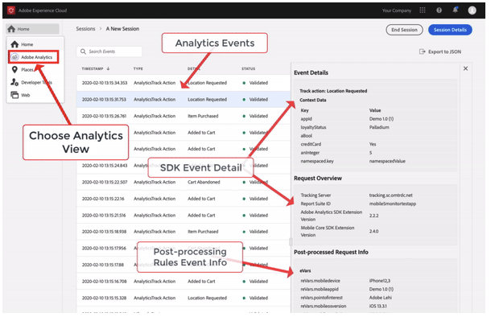

# Adobe Analytics view in Assurance

The Adobe Experience Platform Assurance integration with Adobe Analytics provides a richer view of SDK events to users debugging and validating their Adobe Analytics implementation. The view now shows lifecycle and action/state events sent to Adobe Analytics from the [Adobe Experience Platform SDK](../../adobe-analytics/index.md). The view also features "response" detail that provides information on how the events were processed after the application of each respective report suite's processing rules.

## Getting started

Before continuing, please ensure you have the following services:

- The [Adobe Experience Platform Data Collection UI](https://experience.adobe.com/#/data-collection/)
- [Adobe Experience Platform Assurance](https://experience.adobe.com/assurance)

To learn how to install Assurance in your application, please read the [implementing Assurance guide](./implement-assurance.md).

## Post-processed status

After the SDK makes a network request with Adobe Analytics, the status will tell you if Assurance was able to retrieve the post-processing information for the Adobe Analytics request.

Please note that in order to retrieve post-processing information, the logged-in user must have access to the corresponding report suite.

| Status | Description |
| :----- | :---------- |
| `Queued` | The network request is fetching the post-processing information. |
| `Processed` | The network request was successful, and the post-processing information is received. |
| `Delayed` | The maximum number of requests retries to fetch the post-processing information has been exceeded. |
| `Error` | An error caused the network request to fail. More details about the error are displayed in the event details view. |
| `Unauthorized` | The user does not have access to the Adobe Analytics report suite. |
| `Unavailable` | The Adobe Analytics request does not have a corresponding `AnalyticsResponse` event. |
| `No Debug Flag` | The current Adobe Analytics or Assurance SDK version might not support the Analytics Debugging feature. For more information, please read the [Troubleshooting guide](../troubleshooting.md). |
| `Expired` | The `AnalyticsTrack` or `LifecycleStart` event is older than 24 hours. |

## Event details view

For an Analytics track event, the detailed view contains the following valuable parts:

- An originating SDK Analytics request event.
- OOTB meta and context data from the request, such as report suite ID, SDK extension versions, OOTB context data, and so on.
- Post-processed information on the Analytics event that contains the mapping of revars, evars, props, and so on.
