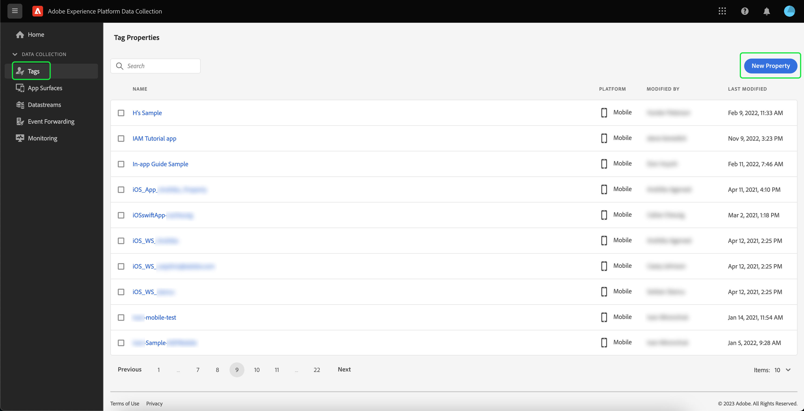
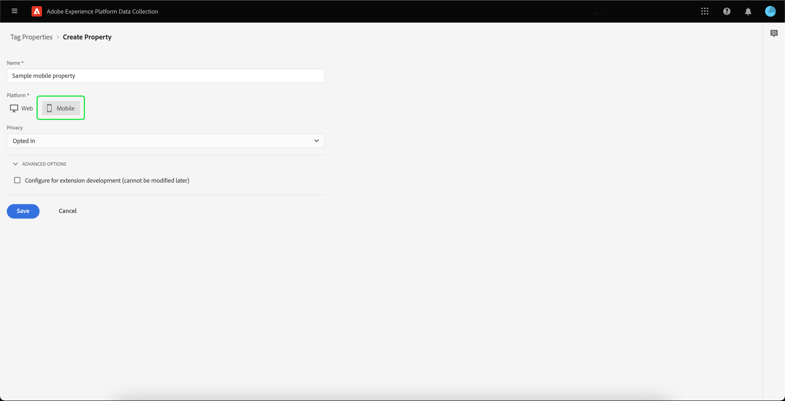
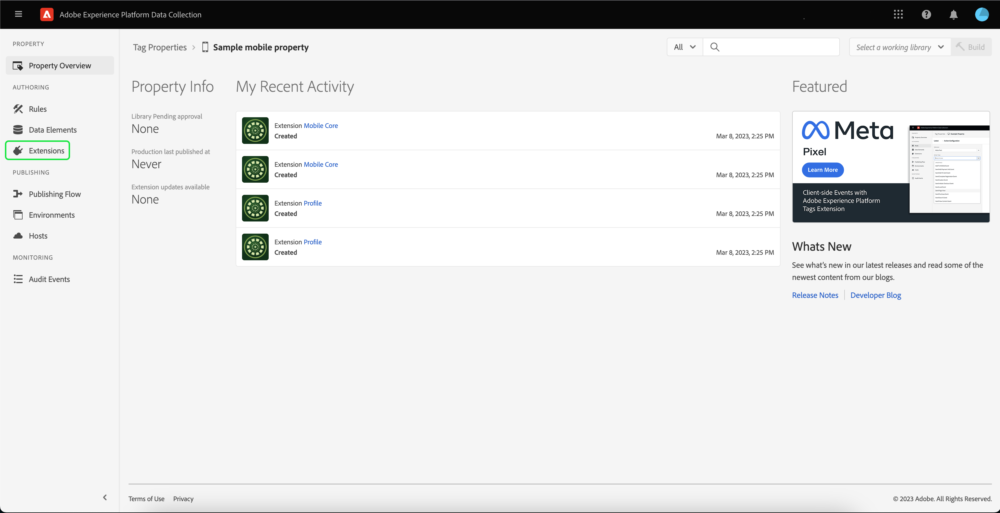
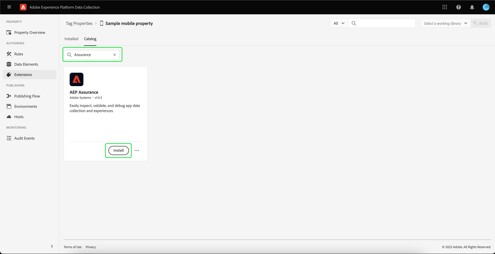

# Implementing Adobe Experience Platform Assurance extension

This tutorial explains how to install and implement the Platform Assurance extension in the Mobile SDK. For instructions on adding the Assurance extension to your application, please read the [Adobe Experience Platform Assurance extension overview](https://developer.adobe.com/client-sdks/documentation/platform-assurance-sdk/#add-the-aep-assurance-extension-to-your-app).

## Getting started

In order to install and implement the Assurance extension, you will need access to the following services:

- The [Adobe Experience Platform Data Collection UI](https://experience.adobe.com/#/data-collection/)
- [Adobe Experience Platform Assurance](https://experience.adobe.com/assurance)

## Create a mobile property

>[!NOTE]
>
>If you already have a mobile property, you can proceed to the next step.

In the Data Collection UI, select **[!UICONTROL Tags]**. A list of mobile and web properties appears, with information about the properties that belong to your organization. Select **[!UICONTROL New property]** to create a new property.

The **[!UICONTROL Create Property]** page appears. Enter the name for your new property and select **[!UICONTROL Mobile]** as your platform. After inserting your details, select **[!UICONTROL Save]** to create the mobile property.

>[!NOTE]
>
>The mobile property's **[!UICONTROL Privacy]** setting does **not** affect Assurance's data collection.

## Install the Assurance extension

Select the mobile property that you want to install the Assurance extension in. 

The **mobile property details** page appears. Select **[!UICONTROL Extensions]** to bring up a list of the extensions that are currently associated with your mobile property.

Select **[!UICONTROL Catalog]** to see a list of extensions that you can add to the mobile property. Using the filter, locate the **[!UICONTROL AEP Assurance]** extension, and select **[!UICONTROL Install]**.

## Next steps

Now that you've installed the Assurance extension in your mobile property, you can start using Assurance within your applications. To learn how to add the Assurance extension to your application, please read the [Adobe Experience Platform Assurance extension overview](https://developer.adobe.com/client-sdks/documentation/platform-assurance-sdk/#add-the-aep-assurance-extension-to-your-app). To learn how to use Assurance, please read the [using Assurance guide](./using-assurance.md).
