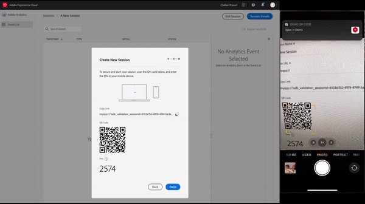
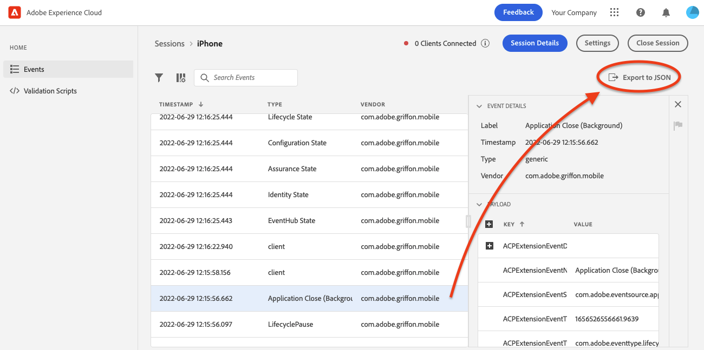

# Using Adobe Experience Platform Assurance

## Log in

1. Visit the [Adobe Experience Platform Assurance UI](https://experience.adobe.com/assurance)
2. Log in using your Adobe ID credentials for the Experience Cloud.

   If you do not know your Adobe ID credentials, contact your Adobe administrator or see [how to log in](https://docs.adobe.com/content/help/en/core-services/interface/manage-users-and-products/getting-started-experience-cloud.html).

## Creating sessions

1. Select **Create Session** in the top right.
2. In the **Create New Session** dialog, review instructions, and proceed by selecting **Start**
3. Enter a name to identify the session, then provide a **Base URL** (deep linking URL for your app). After providing these details, select **Next**.

>[!NOTE]
>
>The Base URL is the root definition used to launch your app from a URL. A session URL is generated by which you may initiate the Assurance session. An example value might look like: `myapp://default` In the **Base URL** field, type your app's base deep link definition.

## Connecting to a session

After you've created a session, you can begin connecting to it by following these steps:

1. Ensure that you see a the Create New Session dialog now shows you a link, a QR code, and a PIN. 
2. Complete one of the following tasks:
   * Use your device camera app to scan the QR code and to open your app OR
   * Copy the link and open in your app.
3. When your app launches, you should see the a PIN entry screen overlaid.
4. Type in the PIN from the previous step and press **Connect**.
5. Verify that your app is connected to Assurance when Adobe Experience Platform icon (red Adobe "A") is displayed on your app.

## Exporting a session

To export an Assurance session, on your app’s sessions details page, select **Export to JSON** in a session:

The export option respects search filter results and only exports events displayed in the event view. For example, if you searched for “track” events and then select Export to JSON, only the “track” event results are exported.