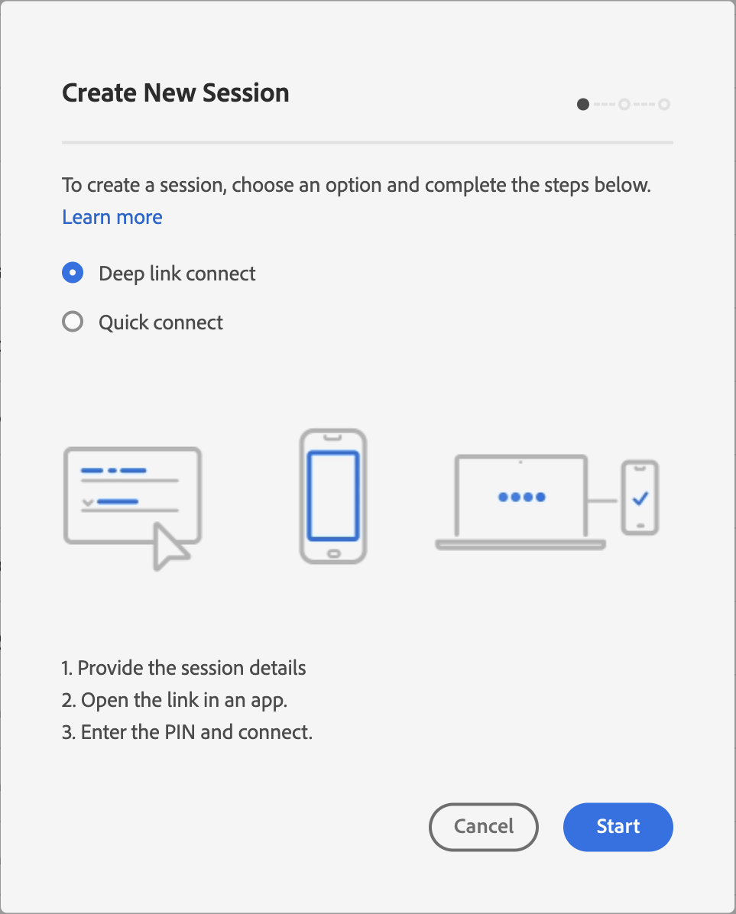
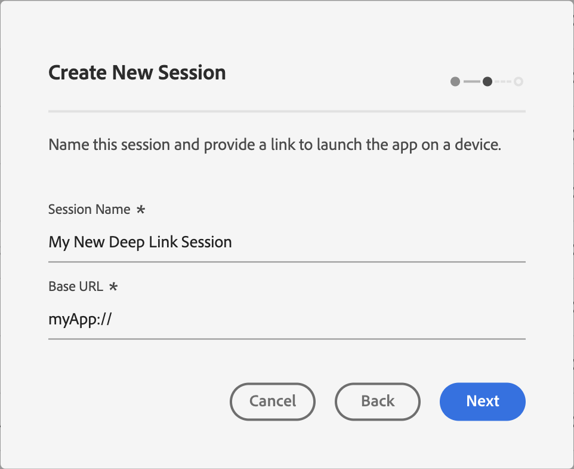
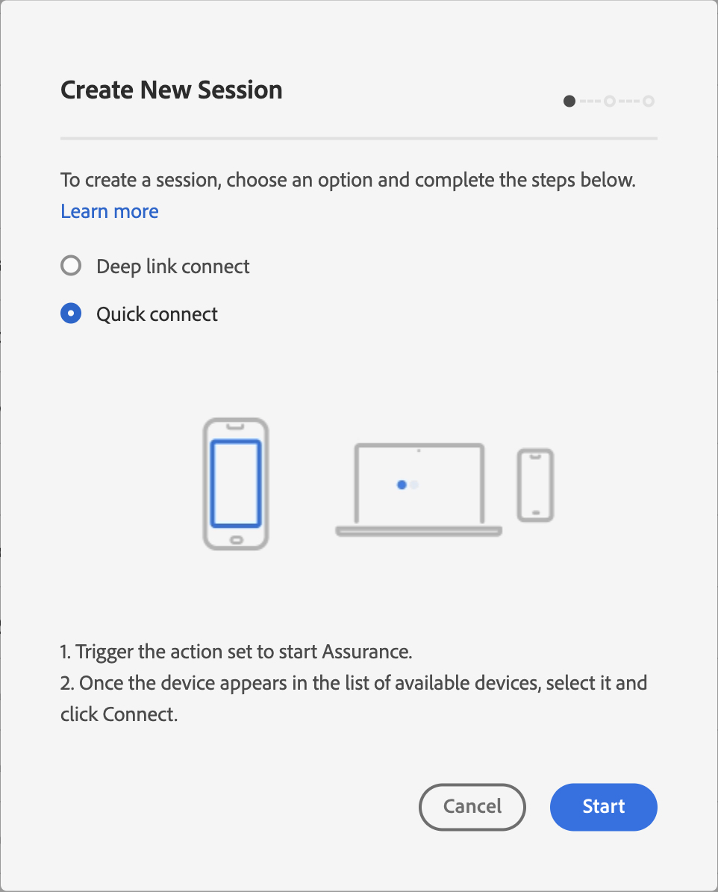
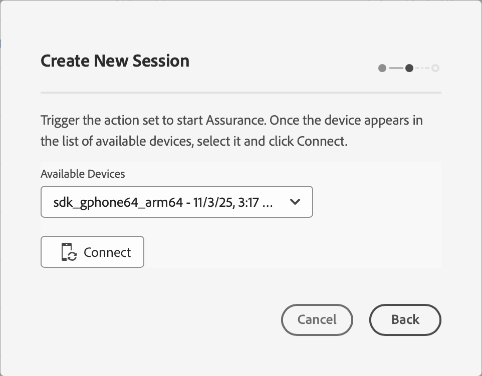
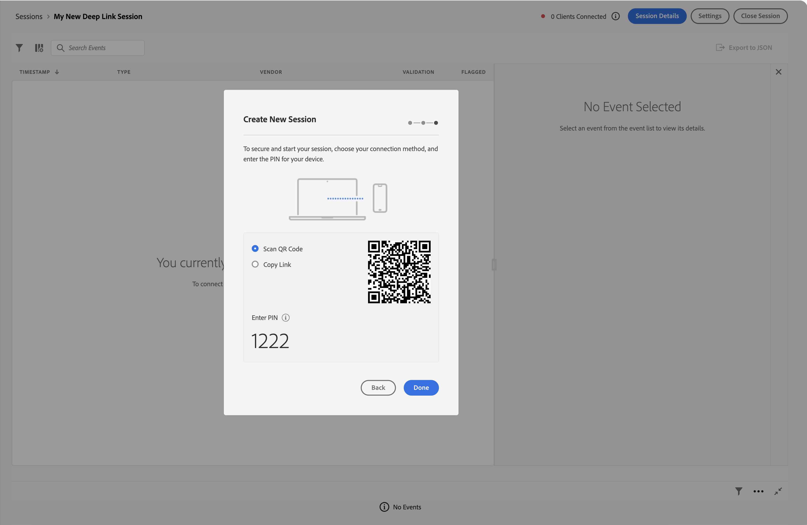

# Using Adobe Experience Platform Assurance

This tutorial explains how to use Adobe Experience Platform Assurance. For instructions on how to install and implement the Adobe Experience Platform Assurance extension, please read the tutorial on [implementing the Assurance extension](./implement-assurance.md).

## Create sessions

After logging into the [Assurance UI](https://experience.adobe.com/assurance), you can select **[!UICONTROL Create Session]** to begin creating a session.

The **[!UICONTROL Create New Session]** dialog appears with two options for creating a session:

### Deep link connect

Select this option to generate a unique session URL, QR code, and PIN. Scan the QR code or manually open the session link in your app, then enter the PIN to establish the connection.

Select **[!UICONTROL Deep link connect]** and proceed by selecting **[!UICONTROL Start]**.

You can now enter a name to identify the session, then provide a **[!UICONTROL Base URL]** (deep linking URL for your app). After providing these details, select **[!UICONTROL Next]**.

>[!INFO]
>
>The Base URL is the root definition used to launch your app from a URL. A session URL is generated by which you may initiate the Assurance session. An example value might look like: `myapp://default` In the **[!UICONTROL Base URL]** field, type your app's base deep link definition.

### Quick connect

Trigger a connection from your app, and your device will appear in a list of available devices. Select **[!UICONTROL Quick connect]** to create the Assurance session.

#### Prerequisites

Before using Quick Connect, ensure your app has the required SDK versions and implementation:

**Android SDK Requirements:**

- Mobile Core v3.1.0 or later
- Adobe Journey Optimizer v3.1.0 or later
- Adobe Experience Platform Assurance v3.0.4 or later

**iOS SDK Requirements:**

- Mobile Core v5.2.0 or later
- Adobe Journey Optimizer v5.1.1 or later
- Adobe Experience Platform Assurance v5.0.0 or later

**Implementation:**

Your app must implement the [`startSession` API](https://developer.adobe.com/client-sdks/home/base/assurance/api-reference/#startsession-quick-connect) to trigger the Assurance connection. This API call is typically included in an action set or triggered within your app.

#### Creating a quick connect session

Select **[!UICONTROL Quick connect]** and proceed by selecting **[!UICONTROL Start]**, you'll see the device picker interface:

1. **Trigger the Assurance connection** - In your mobile app or implementation, trigger the action that initiates the Assurance connection using the `startSession` API. This will make your device discoverable.

2. **Select and connect your device** - Once your device appears in the list of available devices, select it and click **[!UICONTROL Connect]**.

## Connect to a session

The steps to connect depend on which session type you're using:

### Deep link connect sessions

For sessions created with **[!UICONTROL Deep Link Connect]**:

1. Navigate to your session details page (for existing sessions) or proceed from session creation to see the link, QR code, and PIN
2. Use your device's camera app to scan the QR code, or copy the link and open it in your app
3. When your app launches, you'll see the PIN entry screen overlaid. Enter the PIN and press **[!UICONTROL Connect]**

### Quick connect sessions

For sessions created with **[!UICONTROL Quick Connect]** (identifiable by a session URL that starts with `adobeassurance://`), the connection happens automatically through the device picker interface:

1. Navigate to your session details page (for existing sessions) or proceed from session creation
2. In the **[!UICONTROL Connect Device]** section, you'll see the device picker interface
3. Trigger the action set in your app to make the device discoverable
4. Select your device from the list and click **[!UICONTROL Connect]**

### Verifying Connection

You can verify that your app is connected to Assurance when the Adobe Experience Platform icon (red Adobe "A") is displayed on your app.

## Export a session

To export an Assurance session, on your app’s sessions details page, select **[!UICONTROL Export to JSON]** in a session:

The export option respects search filter results and only exports events displayed in the event view. For example, if you searched for “track” events and then select **[!UICONTROL Export to JSON]**, only the “track” event results are exported.