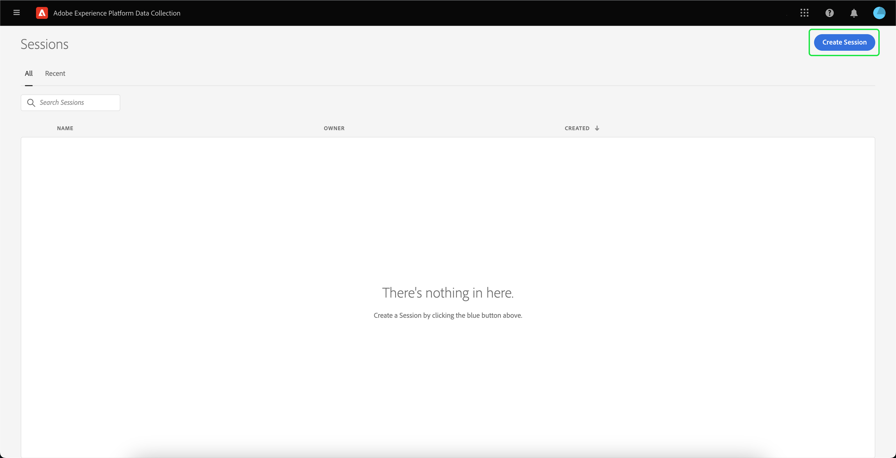
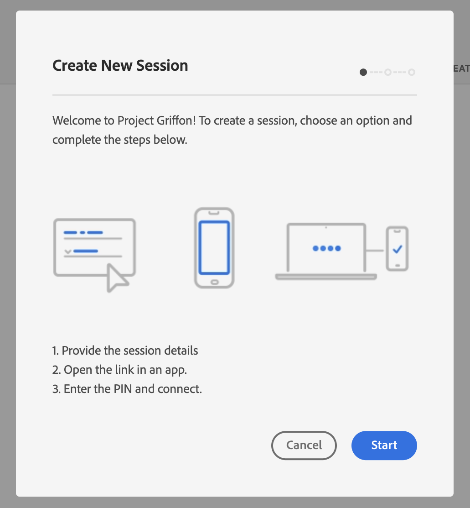
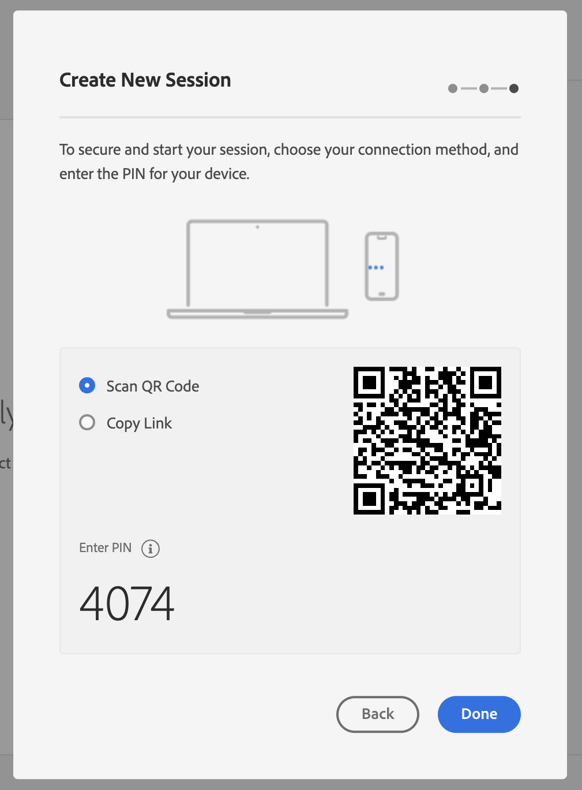
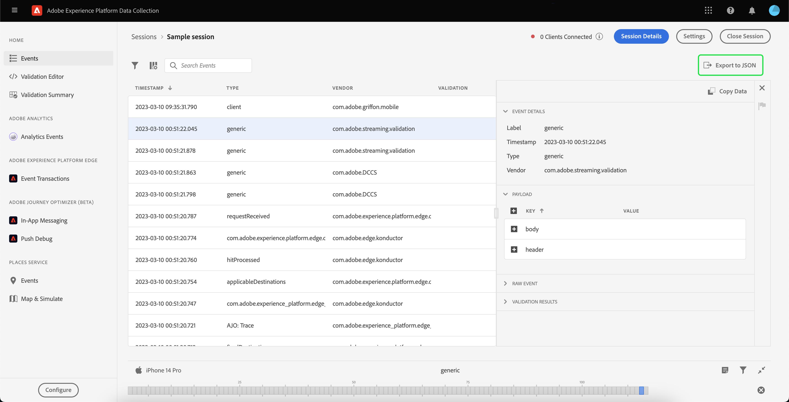

# Using Adobe Experience Platform Assurance

This tutorial explains how to use Adobe Experience Platform Assurance. For instructions on how to install and implement the Adobe Experience Platform Assurance extension, please read the tutorial on [implementing the Assurance extension](./implement-assurance.md).

## Create sessions

After logging into the [Assurance UI](https://experience.adobe.com/assurance), you can select **[!UICONTROL Create Session]** to begin creating a session.

The **[!UICONTROL Create New Session]** dialog appears. Please review the given instructions, and proceed by selecting **[!UICONTROL Start]**.

You can now enter a name to identify the session, then provide a **[!UICONTROL Base URL]** (deep linking URL for your app). After providing these details, select **[!UICONTROL Next]**.

>[!INFO]
>
>The Base URL is the root definition used to launch your app from a URL. A session URL is generated by which you may initiate the Assurance session. An example value might look like: `myapp://default` In the **[!UICONTROL Base URL]** field, type your app's base deep link definition.

## Connect to a session

After you've created a session ensure that you see the **[!UICONTROL Create New Session]** dialog now shows you a link, a QR code, and a PIN.

If this dialog appears, you can either use your device's camera app to scan the QR code and to open your app or copy the link and open in your app. When your app launches, you should see the PIN entry screen overlaid. Type in the PIN from the previous step and press **[!UICONTROL Connect]**.

You can verify that your app is connected to Assurance when the Adobe Experience Platform icon (red Adobe "A") is displayed on your app.

## Export a session

To export an Assurance session, on your app’s sessions details page, select **[!UICONTROL Export to JSON]** in a session:

The export option respects search filter results and only exports events displayed in the event view. For example, if you searched for “track” events and then select **[!UICONTROL Export to JSON]**, only the “track” event results are exported.
