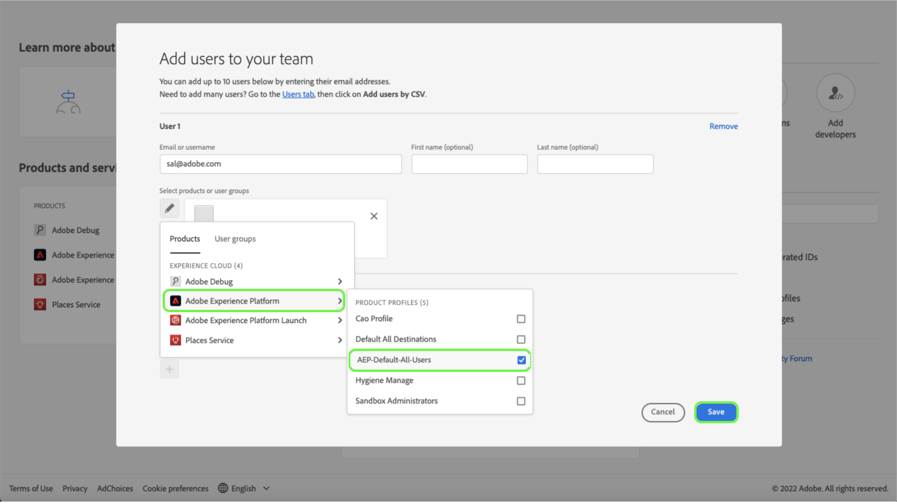

# User access

>[!WARNING]
>
>Please note that user access to Assurance is changing. As Assurance leaves beta (Project Griffon) to being generally available (as Assurance) to all Adobe Experience Cloud customers - access to Assurance will be managed through the [Admin Console](https://helpx.adobe.com/enterprise/using/admin-console.html).
>
>If you need assistance, please contact your company's Adobe Experience Cloud administrator.

To receive or to maintain uninterrupted access to Assurance, ensure that the following steps are completed in the Admin Console:

## Adding users to Experience Platform through a product profile

To add a user to a product profile, log into the Admin Console and select **Add users**.

The **Add users to your team** dialog appears. On this dialog, you can enter the details of the user you want to add. Enter the user's email address, first name (optional) and last name (optional).

Select the pencil icon to choose the products and user groups. From here, select **Adobe Experience Platform**, then **AEP-Default-All-Users**, followed by **Save**.

