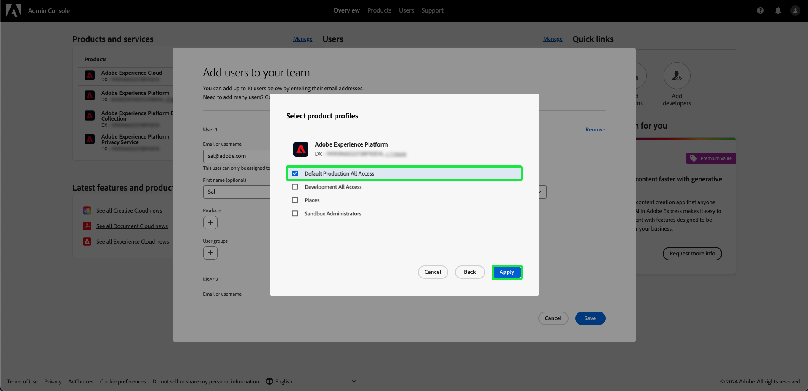

# User access

Give users access to [!UICONTROL Assurance] by adding them to any product profile in Adobe Experience Platform by completing the following steps in the [Adobe Admin Console](https://adminconsole.adobe.com/): 

## Adding users to Adobe Experience Platform through a product profile {#adding-product-profile}

To add a user to a product profile, log into the [Adobe Admin Console](https://adminconsole.adobe.com/). From the **[!UICONTROL Overview]** tab of the Admin Console UI, select **[!UICONTROL Add users]**.

The **[!UICONTROL Add users to your team]** dialog appears. Enter the email or username of the person you want to add, then select **[!UICONTROL Add as a new user]**.

Two text boxes appear to enter an optional **[!UICONTROL First name]** and an optional **[!UICONTROL Last name]**. The **[!UICONTROL SSO username]** is auto-filled, along with the **[!UICONTROL Country]** inside the dropdown. Ensure both of these options are correct and make any needed adjustments. Once everything is correct, select **[!UICONTROL Products]**.

The **[!UICONTROL Select product]** dialog appears. Select the Adobe Experience Platform.

The **[!UICONTROL Select product profiles]** dialog appears, with a list of product profiles. Select any product profile, then select **[!UICONTROL Apply]**. You may add additional products and product profiles by repeating these steps.

Double check everything is correct for the user. From here you can add additional users, or save your changes by selecting **[!UICONTROL Save]**.

