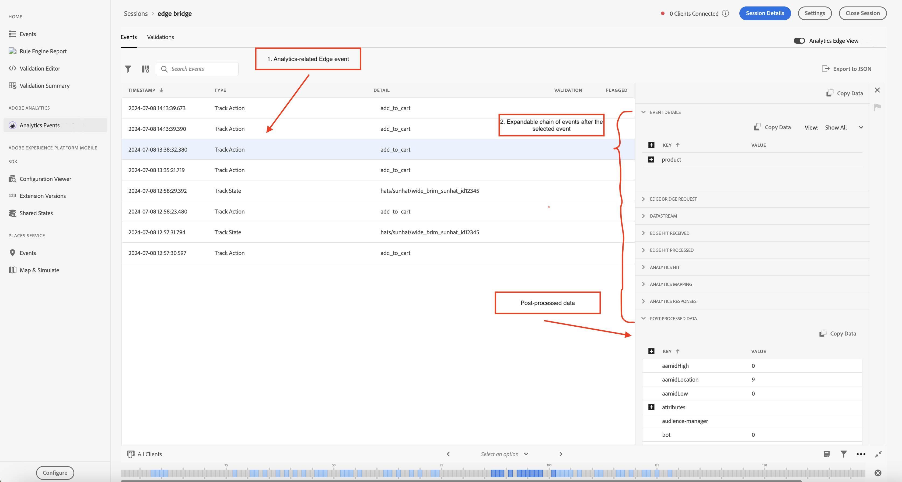
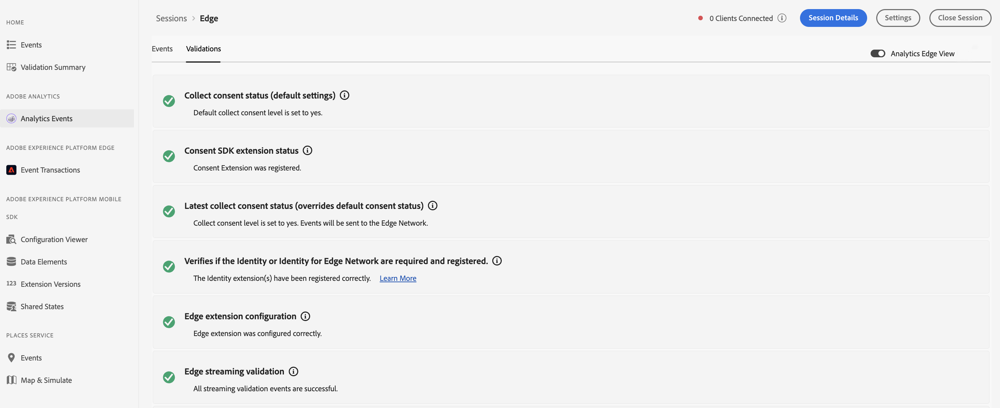
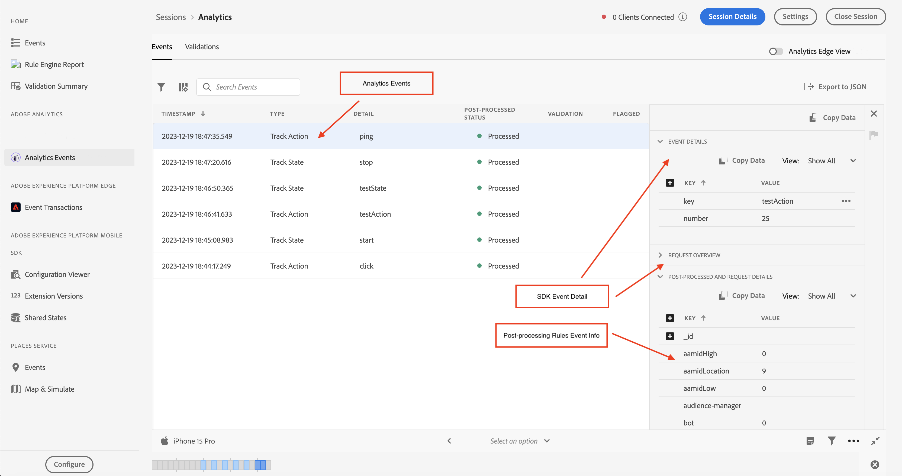

# Adobe Analytics Events view in Assurance

The Analytics Events provides a richer view of SDK events to users debugging and validating their Adobe Analytics implementation. The view shows events sent to Adobe Analytics from the [Adobe Experience Platform Edge Network SDK](https://developer.adobe.com/client-sdks/edge/edge-network/) as well as the [Adobe Experience Platform Mobile SDK](https://developer.adobe.com/client-sdks/solution/adobe-analytics/). The view also features a details panel, which provides context on how the event was processed by the client SDK and by the upstream services after it left the device.

## Getting started

To use this view, complete the following steps:

1. [Set up Adobe Experience Platform Assurance](../tutorials/implement-assurance.md).
2. [Create and connect to an Assurance session](../tutorials/using-assurance.md).
3. In the Assurance UI from the left navigation **Home** view menu, select **Analytics Events**. If you don't see this option, select **Configure** in the bottom left of the window, add the **Analytics Events**, and select **Save**.

## Analytics Edge view

Use the Analytics Edge view if you are using **Edge Network** or **Edge Bridge** mobile extensions. This view is enabled when the "Analytics Edge View" toggle switch in the top right corner is activated, displaying the Analytics events sent via Edge network in your current session. This includes all events that have been fired by Lifecycle extension, Edge extension, and/or Edge Bridge extension.

The Analytics Edge view contains information on Analytics-related Edge events and Lifecycle events dispatched by the client. By choosing an event in the list, the event detail view panel on the right displays the events that were processed by the client SDK and by the upstream service after they left the device. This allows you to easily view the chain of events that resulted from a call.

The **Post-Processed Data** event in the list confirms that the data has been successfully processed and sent to the Adobe Analytics. If this event or any processed data is missing, users can expand each event in the list to view detailed debugging information.

### Analytics Edge Event details view

For an Edge request event or an Analytics track event, the detailed view contains the following information:

* Event Details: An originating SDK edge request event.
* Edge Bridge Request: An event exclusively for the Edge Bridge Extension workflow.
* Datastream: An event represented for datastream for this session.
* Edge Hit Received: Represents the hit received from Edge.
* Edge Hit Processed: Represents the hit processed in Edge.
* Analytics Hit: Represents the hit received from Analytics.
* Analytics Mapping: Represents the data mapping status in Analytics.
* Analytics Responsed: The response status from Analytics. 
* Post-process Data: Information on the event that contains the mapping of revars, evars, and props.

### Analytics Edge Validation

The Analytics Edge validation view allows you to easily see the results on validation scripts related to Analytics Edge session. Errors displayed by validators may contain links to where they should be fixed or display events that are in an error state.

## Analytics Events View

Use the Analytics Event View if you are using the **Adobe Analytics** mobile extension. This view allows you to easily see Analytics Events sent from your connected client, including Track Action, Track State, and Lifecycle events. This view is active when the "Analytics Edge View" toggle on the top right is disabled.

By selecting one of the Analytics events in the event table, details of how the event was processed can be viewed on the right panel.

### Post-processed status

After the SDK makes a network request with Adobe Analytics, the status will tell you if Assurance was able to retrieve the post-processing information for the Adobe Analytics request. The Analytics Events view must remain active while the post-processing status is in operation after the request has been triggered.

Please note that in order to retrieve post-processing information, the logged-in user must have access to the corresponding report suite.

| Status | Description |
| :----- | :---------- |
| `Queued` | The network request is fetching the post-processing information. |
| `Processed` | The network request was successful, and the post-processing information is received. |
| `Delayed` | The maximum number of requests retries to fetch the post-processing information has been exceeded. |
| `Error` | An error caused the network request to fail. More details about the error are displayed in the event details view. |
| `Unauthorized` | The user does not have access to the Adobe Analytics report suite. |
| `Unavailable` | The Adobe Analytics request does not have a corresponding `AnalyticsResponse` event. |
| `No Debug Flag` | The current Adobe Analytics or Assurance SDK version might not support the Analytics Debugging feature. For more information, please read the [Troubleshooting guide](../troubleshooting.md). |
| `Expired` | The `AnalyticsTrack` or `LifecycleStart` event is older than 24 hours. |

### Event details view

For an Analytics track event, the detailed view contains the following parts:

* An originating SDK Analytics request event.
* Meta and context data from the request, such as report suite ID, SDK extension versions, and context data.
* Post-processed information on the Analytics event that contains the mapping of revars, evars, and props.

### Analytics View Validation

The validation view allows you to easily see the results on validation scripts related to Analytics. Errors displayed by validators may contain links to where they should be fixed or display events that are in an error state.

