# Content Cards view in Assurance

The In-App Messaging view inside Adobe Experience Platform Assurance provides the ability to validate your app, monitor the content cards that are delivered to your device, and preview cards.

## Content Cards

At the top of the **[!UICONTROL Content Cards]** tab is a **[!UICONTROL Content Card]** dropdown. This lists all the content cards that have been received in the Assurance session. If a card is not in this list, it means the app never received it.

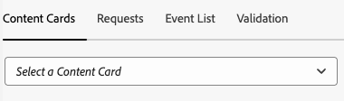

Selecting a content card will show a lot of information about that card as described in the sections below.

### Card Preview

In the right panel is a **[!UICONTROL Card Preview]** pane shows how a card renders across common templates — Small Image, Large Image, and Image Only.

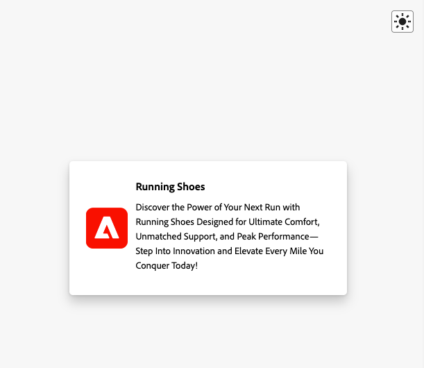

Use the **[!UICONTROL Theme]** toggle to view the card in light or dark mode.

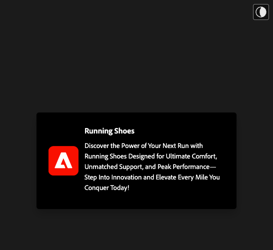

### Available Tabs

In the left section, the available tabs depend on the selected card. If the card includes rules, you’ll see three tabs: **[!UICONTROL Info]**, **[!UICONTROL Interactions]**, and **[!UICONTROL Analyze Rules]**. 

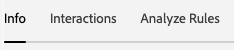

If the card does not include rules, you’ll see two tabs: **[!UICONTROL Info]** and **[!UICONTROL Interactions]**.

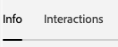

### Info Tab

The **[!UICONTROL Info]** tab shows **[!UICONTROL Card Properties]** section at the top, including badges for the **[!UICONTROL Current State]** (trigger, display, dismiss, disqualify) plus meta details like **[!UICONTROL Template]** (Small Image, Large Image, or Image Only), **[!UICONTROL Surface]**, and any custom key–value pairs.

Below that, the **[!UICONTROL Campaign Properties]** section  shows information loaded from Adobe Journey Optimizer (AJO). 

You can also select **[!UICONTROL View Campaign]** to open the card in AJO for inspection or editing.

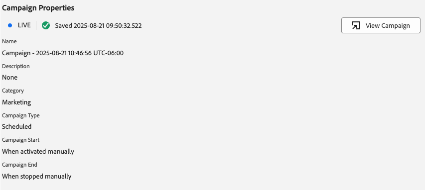

### Interactions Tab

The **[!UICONTROL Interactions]** tab summarizes each card’s lifecycle as a sequence of badges: it always starts with **[!UICONTROL trigger]**, followed by whichever outcome the rules produced—**[!UICONTROL display]**, **[!UICONTROL dismiss]**, or **[!UICONTROL disqualify]**.

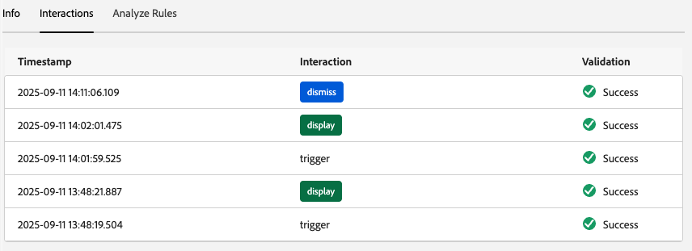

### Analyze Rules Tab

The **[!UICONTROL Analyze]** tab shows an events table with up to three rules columns—**[!UICONTROL Display]**, **[!UICONTROL Dismiss]**, and **[!UICONTROL Disqualify]**—based on the card’s rules. If the card defines only one rule, only that column appears. 

Each row represents a session event, and each column indicates whether the card’s rule matched for that event's conditions. A 0% score means no conditions matched; 100% is a full match (the rule would fire). 

If the event matches a condition, it will show a green checkmark. If the event does not match, it will show a red icon.

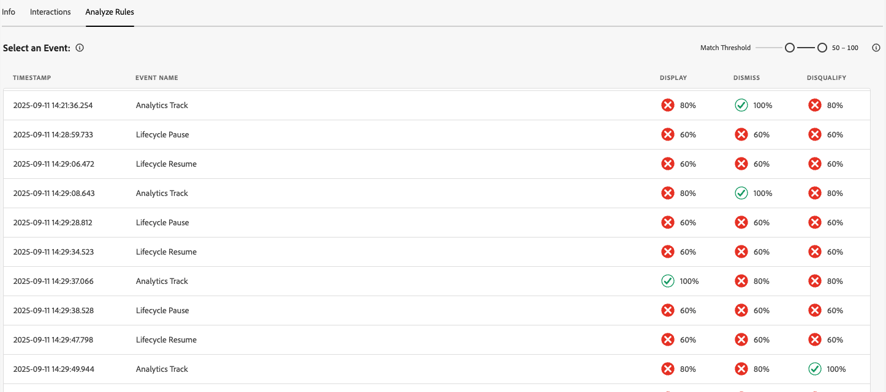

Use the **[!UICONTROL Match Threshold]** slider to filter events by minimum match percentage.

When you select an event, a details panel opens on the right with an accordion listing the three rules: **[!UICONTROL Display]**, **[!UICONTROL Dismiss]**, and **[!UICONTROL Disqualify]**. 

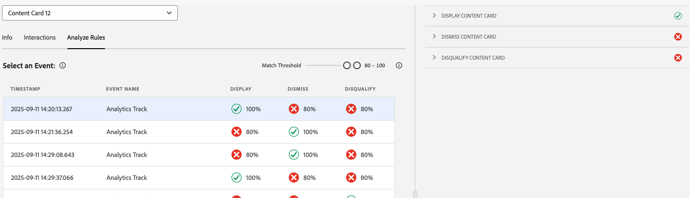

Expand any section to see the rule’s conditions, which conditions matched, and the calculated match percentage for that outcome.

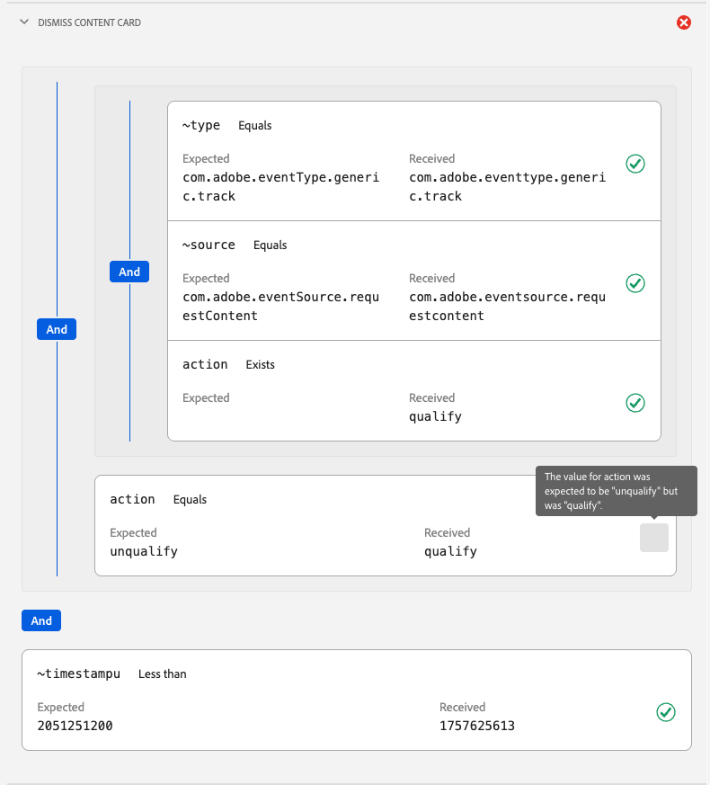

## Requests

The **[!UICONTROL Requests]** tab focuses on Adobe Journey Optimizer (AJO) propositions for Content Cards—proposition fetches and related interaction/notification calls. 

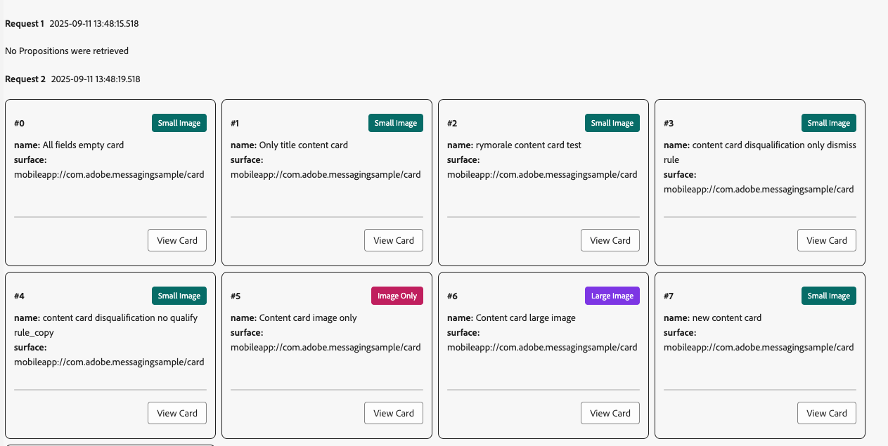

Use the **[!UICONTROL View Card]** button to go back to the info tab of a specific content card.

 
## Event List

The **[!UICONTROL Event List]** tab shows session events relevant to Content Cards, including AJO proposition requests/responses, card lifecycle events, and interaction tracking. You can search, filter, sort, and customize columns, as well as export results. 

Selecting an event opens a right-side details panel with the raw payload and key attributes; you can also flag events for follow‑up. This view is useful for correlating requests, rule outcomes, and interactions across the session.

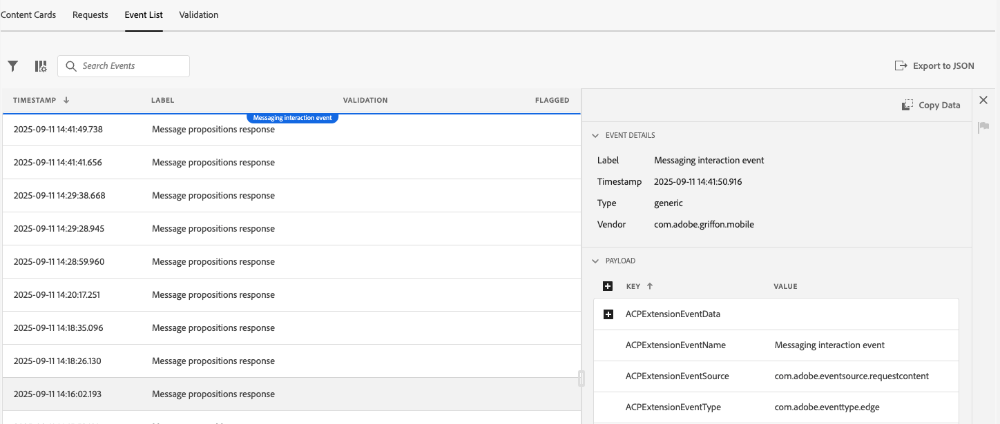

## Validation

The **[!UICONTROL Validation]** tab runs validations against your current session, checking to see if the app has been configured for Messaging correctly:

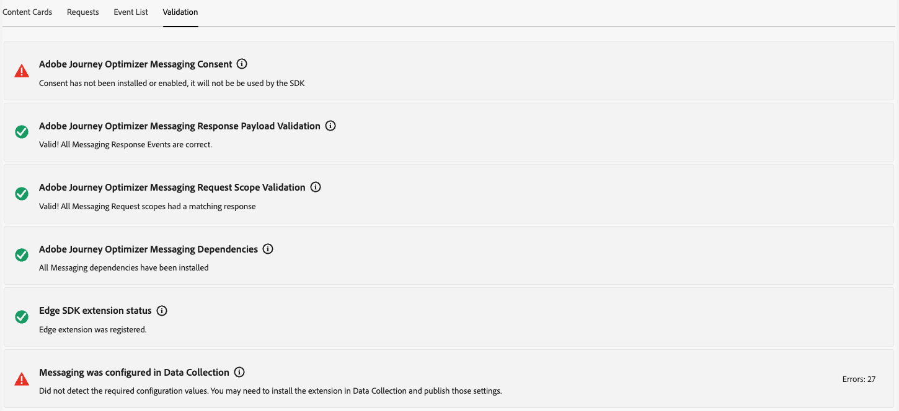
