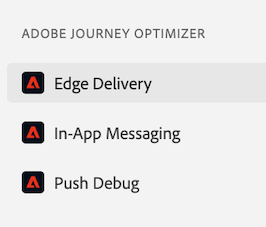

# Edge Delivery View in Assurance

The **[!UICONTROL Edge Delivery]** view inside **[!UICONTROL Adobe Experience Platform Assurance]** provides the ability to inspect and validate [!UICONTROL AJO Inbound] edge delivery of messages to your web and mobile apps. This view is particularly useful for troubleshooting the delivery of [!UICONTROL AJO Inbound] web and mobile campaigns and journeys.

## Getting started

Before continuing, please ensure you have access to the following services:

- The [Adobe Experience Platform Data Collection UI](https://experience.adobe.com/#/data-collection/)
- [Adobe Experience Platform Assurance](https://experience.adobe.com/assurance)

To learn how to install **[!UICONTROL Assurance]** in your application, please read the [implementing Assurance guide](../tutorials/implement-assurance.md).

## Use Assurance with Edge Delivery

Once you open an **[!UICONTROL Assurance]** session, you can add the **[!UICONTROL Edge Delivery]** view to **[!UICONTROL Assurance]**. At the bottom of the left panel, select **[!UICONTROL Configure]** to add the **[!UICONTROL Edge Delivery]** view and **Save** it.

Once added, select the **[!UICONTROL Edge Delivery]** view in the **[!UICONTROL Adobe Journey Optimizer]** section to validate Inbound edge delivery.

## Request list

On the main pane of the view, the list of edge delivery requests is displayed. This list shows all [!UICONTROL Inbound AJO] requests made to Experience Edge and processed by the **[!UICONTROL Inbound Delivery Service]**, including requests to retrieve personalization decisions, as well as track personalization proposition interactions (such as display, click, trigger, or dismiss).

Requests are ordered by timestamp, with the most recent requests at the top. In addition to the timestamp, the list also includes a Request ID column, as well as Request Type, which can be one of the following:

- **[!UICONTROL Experience Delivery]**: A request to retrieve personalization decisions
- **[!UICONTROL Experience Interactions]**: A request to track personalization proposition interactions
- **[!UICONTROL Experience Delivery & Interactions]**: A request to retrieve personalization decisions also including personalization proposition interactions
- **[!UICONTROL Preview Delivery]**: A request to retrieve Preview personalization decisions

Requests can also be filtered by entering a search term in the search bar at the top of the list. This is useful when filtering by specific values, like IDs.

## Detailed request views

Once a request is selected in the main view, detailed information about the selected request is displayed on the right. This view includes the following sections:

### Request overview

This section provides a high-level overview of the selected request, including [!UICONTROL Organization ID], [!UICONTROL Edge cluster], [!UICONTROL Request ID] and [!UICONTROL Request type], [!UICONTROL Sandbox ID], [!UICONTROL Sandbox name], [!UICONTROL Datastream ID], as well as the list of request surfaces in case of [!UICONTROL Experience Delivery] requests.  

### Profile

This section provides information about the profile data used when processing the request, including the identity map, segment membership, and consent settings.  
The [!UICONTROL Profile] section is very helpful when troubleshooting issues like delivery not working as expected due to missing or delayed segment membership or opt-out consent settings.

### Qualified activities

This section provides a list of activities that were qualified for the selected request, including the activity type, IDs, identity namespace, surfaces, schedule, and audiences. More detailed information about the activity can be found in the [raw execution trace section](#execution).

### Unqualified activities

This section provides a list of activities that were excluded from being qualified. In addition to the activity type, IDs, identity namespaces, surfaces, schedules, and audiences, this section also includes a list of reasons the activity was unqualified.

### Message details

This section provides detailed information about the messages that were delivered for the selected request. It includes message IDs, fragments, decision policies, [!UICONTROL Offer Decisioning] parameters, as well as the message selection context.

### Interactions

This section provides detailed information about the interactions that were tracked in the selected request. It includes the interaction type (under `propositionEventType`), as well as associated proposition metadata, such as activity metadata (under `scopeDetails.activity`) and proposition event token (in `scopeDetails.characteristics.eventToken`).

### Raw traces

This section provides the raw traces of the selected request. It includes the full trace of the request, including the actual request as it was received in **[!UICONTROL Inbound Delivery Service]**, execution trace, and response trace. This is useful for advanced troubleshooting like delivery not working as expected due to Delivery Service unavailability, missing or incorrect data, or for understanding the full flow of request processing.

#### Request

The request trace includes the full request as it was received by the **[!UICONTROL Inbound Delivery Service]** **[!UICONTROL Konductor]** upstream. It includes the request headers, body, and other metadata. For example, the XDM payload of the request can be inspected in the `event.body.xdm` field.

#### Execution

The execution trace includes the full trace of the request as it was processed by the **[!UICONTROL Inbound Delivery Service]**. It shows the execution context, activity qualification, message selection, and other processing steps. Any errors or warnings that occurred during the processing of the request can be found in `context.messages` and `context.exceptions` fields. Detailed activity qualification information can be found in the `context.qualifiedActivitiesDetailed` and `context.unqualifiedActivitiesDetailed` fields.

#### Response

The response trace includes the full response as it was returned by **[!UICONTROL Inbound Delivery Service]** downstream to **[!UICONTROL Konductor]**. It includes the response headers, body, and other metadata. The full response body can be inspected by copying the message with id `1` to the clipboard using the **[!UICONTROL Copy Value]** button and pasting it in a JSON viewer.

